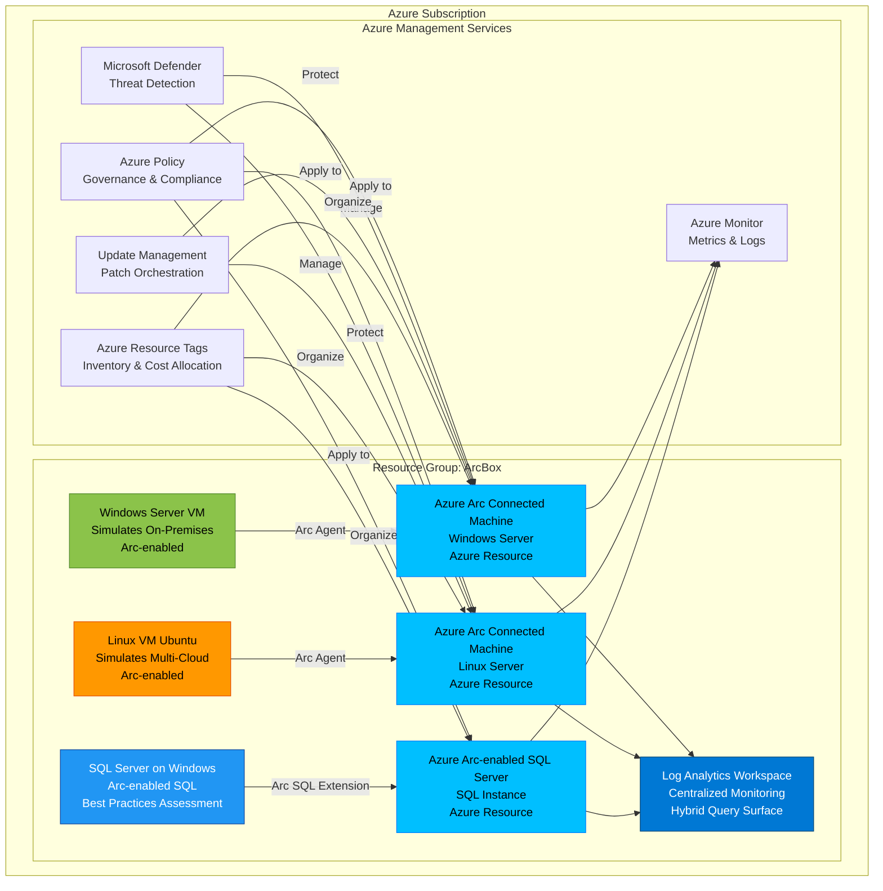

# Azure Arc Box - Talk Track

**Duration**: 20-25 minutes  
**Audience**: Cloud architects, infrastructure leads, hybrid cloud strategists, IT operations  
**Objective**: Demonstrate unified management of any infrastructure through Azure Arc

---

## 1. Executive Summary

Azure Arc Box is a sandbox environment for demonstrating how Azure Arc extends Azure management and governance to any infrastructure—on-premises, multi-cloud, and edge. In one deployment, you get Windows and Linux virtual machines that can be onboarded to Azure Arc-enabled Servers, plus SQL Server instances ready for Arc-enabled SQL configuration.

**Key Facts**:
- Deploys in 15-20 minutes via ARM template
- $15-30/day sandbox cost (Windows + Linux VMs)
- Demonstrates hybrid and multi-cloud management without owning physical infrastructure
- Unified management plane for servers, SQL, and applications across any location
- Integrates Azure Monitor, Azure Policy, Microsoft Defender, and Update Management with non-Azure infrastructure

This pattern implements the "any infrastructure, anywhere" vision of Azure Arc. It's ideal for proof-of-concepts, partner demonstrations, customer workshops, and learning environments where you need to show Arc capabilities without deploying to production infrastructure.

---

## 2. Business Problem

**The Challenge**: Organizations operate infrastructure across multiple environments—on-premises data centers, AWS, Google Cloud, edge locations, and Azure. This distributed reality creates critical management challenges:

- **Fragmented Operations**: Each environment requires its own management tools, security agents, and monitoring systems. Infrastructure teams log into multiple consoles, learn different APIs, and maintain separate automation scripts.
- **Inconsistent Security Posture**: Security policies enforced in Azure don't apply to on-premises servers. Compliance scanning happens through different tools with different standards. Patch management workflows vary by location.
- **Audit Complexity**: Demonstrating compliance across hybrid infrastructure requires aggregating evidence from AWS CloudTrail, Azure Monitor, on-premises SIEM systems, and third-party tools. Auditors see gaps in centralized logging and configuration tracking.
- **Cloud Migration Friction**: Organizations with 15+ year technology investments can't lift-and-shift everything to Azure. Yet managing legacy infrastructure with legacy tools prevents cloud-native operational improvements.
- **Multi-Cloud Reality**: Businesses acquire companies running on different clouds, regulatory requirements force data residency in specific regions, or application dependencies prevent consolidation. The "single cloud" dream isn't realistic.

**Real Impact**: A global manufacturing company operates 2,400 servers across 14 countries—1,200 on-premises, 800 in Azure, 300 in AWS, and 100 edge devices at factory floors. Their operations team maintains six different tools for patching, three security agent types, and separate inventory systems. A recent compliance audit required four weeks to aggregate evidence across all environments.

**The Root Cause**: Traditional cloud services only manage resources within their own boundaries. Azure Monitor watches Azure VMs. AWS Systems Manager handles EC2 instances. On-premises servers use SCCM or standalone agents. This creates operational silos that scale linearly with infrastructure diversity.

---

## 3. Business Value

Azure Arc delivers measurable value by extending Azure's control plane to any infrastructure:

**Unified Management Plane**: Manage on-premises, AWS, Google Cloud, and edge infrastructure using the same Azure tools your teams already know. View all servers in Azure Portal, query across environments with Azure Resource Graph, and deploy policies consistently. No new training, no new tools, no context switching.

**Consistent Security and Compliance**: Apply Azure Policy to servers regardless of location. Enforce "require TLS 1.2" or "disable unused services" across 3,000 servers with one policy assignment. Microsoft Defender for Cloud provides threat detection for all Arc-enabled infrastructure. Compliance dashboards show posture across your entire estate.

**Operational Efficiency**: Azure Update Management handles patching for Azure VMs and Arc-enabled servers through one interface. Azure Monitor collects metrics and logs from every environment into Log Analytics. Azure Automation runbooks remediate issues anywhere—trigger "restart IIS" on an on-premises server from an Azure-native workflow.

**Cloud Migration Enablement**: Organizations can modernize operations before migrating workloads. Arc-enable your on-premises servers today, gain cloud-native management, then migrate VMs to Azure later without changing operational tools. This reduces migration risk and provides immediate value.

**Multi-Cloud Governance**: Arc-enabled infrastructure in AWS or Google Cloud becomes first-class Azure citizens. Tag AWS EC2 instances using Azure tags, assign RBAC permissions through Microsoft Entra ID, and include them in Azure cost allocation views. Multi-cloud becomes manageable, not a nightmare.

**Edge Infrastructure Support**: Factory floors, retail stores, and remote sites with limited connectivity can run Azure Arc. Local Kubernetes clusters, servers, and applications get cloud-based management even with intermittent internet connectivity. Update policies when connected, enforce locally when offline.

---

## 4. Value-to-Metric Mapping

| Business Objective | Success Metric | Target | Measurement Method |
|-------------------|----------------|--------|-------------------|
| Reduce operational tool sprawl | Number of management consoles | Consolidate to 1 (Azure Portal) | Count distinct tools used by operations team |
| Improve security consistency | Policy compliance percentage | >95% across all environments | Azure Policy compliance dashboard |
| Accelerate patch deployment | Patch currency (% servers patched within SLA) | >90% within 7 days | Azure Update Management compliance report |
| Reduce audit preparation time | Hours to generate compliance report | <4 hours | Time from request to evidence delivery |
| Simplify multi-cloud operations | Mean time to deploy policy change | <30 minutes | Policy assignment to enforcement completion time |
| Enable cloud migration | Percentage of on-prem servers Arc-enabled | >80% before migration | Azure Resource Graph query for Arc resources |
| Improve incident response | Mean time to detect (MTTD) security events | <15 minutes | Microsoft Defender alert timestamp vs event timestamp |
| Lower licensing costs | Management agent consolidation savings | 30-50% reduction | Compare Arc cost vs per-seat agent licensing |

---

## 5. Conversation Starters

Use these questions to engage stakeholders and uncover hybrid cloud pain points:

**For Infrastructure Architects**:
- "How many different management tools do your teams use to operate infrastructure across on-premises, Azure, and other clouds?"
- "If you need to enforce a security policy across all servers—regardless of location—how long does that take today?"
- "What's your strategy for managing servers that will never migrate to the cloud?"

**For Security/Compliance Teams**:
- "How do you demonstrate consistent security posture when infrastructure spans multiple clouds and on-premises?"
- "Can you show me which servers across all environments are missing critical patches right now?"
- "How long does it take to generate compliance evidence across your hybrid infrastructure for an audit?"

**For Operations Teams**:
- "When a security vulnerability is announced, how do you identify affected servers across on-premises, AWS, and Azure?"
- "What happens when you need to run a remediation script on 500 servers spread across different environments?"
- "How many different monitoring dashboards do you check when investigating a production incident?"

**For CIO/IT Leadership**:
- "What percentage of your infrastructure will remain on-premises or in non-Azure clouds for the next 3-5 years?"
- "How much do you spend annually on per-server management and security agent licenses?"
- "What's preventing you from consolidating operational tools across your hybrid environment?"

---

## 6. Architecture Overview

Azure Arc Box deploys a self-contained demonstration environment that simulates hybrid infrastructure. It provisions Windows and Linux VMs within Azure, but configures them to operate as if they're external resources. These VMs are then onboarded to Azure Arc, showing how non-Azure infrastructure gains Azure management capabilities.



**Architecture Principles**:

1. **Any Infrastructure, Anywhere**: Arc agents run on Windows, Linux, physical servers, VMs, AWS EC2, Google Compute, and edge devices. Once onboarded, they're Azure resources.

2. **Consistent Control Plane**: Azure Resource Manager (ARM) becomes the management plane for all infrastructure. Resource Graph queries, RBAC assignments, and policy enforcement work identically for Azure VMs and Arc-enabled servers.

3. **No Data Egress for Telemetry**: Arc agents send only metadata and logs to Azure. Application data and workloads remain in their original location. Compliance requirements for data residency aren't violated.

4. **Extension-Based Capabilities**: Arc uses VM extensions to add services like Azure Monitor Agent, Microsoft Defender, Update Management, and dependency tracking. Extensions deploy to Arc-enabled servers just like Azure VMs.

5. **Offline Operations**: Arc-enabled servers can operate with intermittent connectivity. Policies and configurations are cached locally. Management operations queue and execute when connectivity resumes.

**What Gets Deployed in Arc Box**:
- Windows Server VM (simulates on-premises server)
- Ubuntu Linux VM (simulates multi-cloud server)
- SQL Server instance on Windows (demonstrates Arc-enabled SQL)
- Log Analytics workspace (central logging)
- Onboarding scripts and automation for Arc agent installation
- Sample Azure Policy assignments for demonstration

---

## 7. Key Azure Services

**Azure Arc**:
Azure Arc is the umbrella service that extends Azure management to any infrastructure. It projects non-Azure resources as Azure Resource Manager resources, enabling consistent management, governance, and security. Arc supports servers, Kubernetes clusters, SQL Servers, and application services.

**Azure Arc-enabled Servers**:
Installs the Azure Connected Machine agent on Windows or Linux servers running anywhere—on-premises, AWS, Google Cloud, edge locations. Once onboarded, the server appears in Azure Portal as a resource. You can apply Azure Policy, deploy VM extensions, assign RBAC roles, query with Resource Graph, and manage updates through Azure.

**Azure Arc-enabled SQL Server**:
Extends Arc capabilities specifically to SQL Server instances. Provides inventory visibility, license reporting, SQL best practices assessment, Microsoft Defender for SQL threat detection, and Azure Active Directory authentication. Works with SQL Server on physical servers, VMs, or containers anywhere.

**Log Analytics Workspace**:
Centralized repository for logs and metrics from Azure VMs, Arc-enabled servers, Kubernetes clusters, and application services. Supports Kusto Query Language (KQL) for cross-environment analysis. Provides a single query surface regardless of where infrastructure runs.

**Azure Policy**:
Governance service that enforces standards and assesses compliance at scale. With Arc, policies apply to non-Azure infrastructure. Examples: "Ensure Azure Monitor Agent is installed," "Audit servers without TLS 1.2," "Require specific tags on all resources." Built-in policies cover security, compliance, and operational standards.

**Azure Monitor**:
Comprehensive monitoring solution for infrastructure, applications, and networks. Collects metrics and logs from Arc-enabled servers using Azure Monitor Agent. Provides alerting, workbooks, and integration with Azure Automation for remediation. Unified monitoring across Azure and hybrid infrastructure.

**Microsoft Defender for Cloud**:
Unified security management and threat protection for hybrid and multi-cloud workloads. Defender for Servers provides vulnerability assessment, just-in-time VM access, file integrity monitoring, and adaptive application controls for Arc-enabled servers. Threat detection identifies malicious activity regardless of server location.

**Azure Update Management**:
Centralized patch management for Windows and Linux machines across Azure, on-premises, and multi-cloud. Schedule updates, view compliance dashboards, and enforce patch policies. Update Management works identically for Azure VMs and Arc-enabled servers.

---

## 8. Security & Compliance

**Identity and Access**:
Arc-enabled servers use managed identities for authentication to Azure services. No credentials stored on servers. RBAC controls who can onboard servers, deploy extensions, and view Arc resources. Microsoft Entra ID provides centralized identity across hybrid infrastructure.

**Data Protection**:
Arc agents use HTTPS for all communication with Azure. Only metadata (heartbeat, resource properties, logs) flows to Azure—application data remains on-premises. Metadata encrypts in transit and at rest. No inbound internet connectivity required; agents initiate outbound HTTPS to Azure endpoints.

**Compliance Frameworks**:
Arc-enabled servers integrate with Azure Policy compliance dashboards. Built-in policy initiatives map to standards: CIS Benchmarks, PCI-DSS, ISO 27001, NIST 800-53, Azure Security Benchmark. Compliance reporting spans Azure VMs and Arc infrastructure in one view.

**Threat Detection**:
Microsoft Defender for Servers provides advanced threat detection for Arc-enabled infrastructure. Detects anomalous process execution, suspicious network connections, credential theft attempts, and malware. Alerts appear in Microsoft Defender for Cloud portal with investigation workflows.

**Vulnerability Management**:
Defender vulnerability assessment scans Arc-enabled servers for missing patches, misconfigurations, and security weaknesses. Remediation recommendations prioritized by risk. Integration with Microsoft Defender Vulnerability Management provides asset inventory and exposure insights.

**Network Security**:
Arc doesn't require inbound internet connectivity. Agents connect outbound to `*.servicebus.windows.net`, `*.guestconfiguration.azure.com`, and `management.azure.com`. Integrate with corporate proxies and firewalls. Private Link support available for scenarios requiring private connectivity to Azure services.

---

## 9. Reliability & Scale

**High Availability**:
Arc agents operate independently on each server. If Azure connectivity is lost, servers continue running workloads normally. Policies cached locally remain enforced. When connectivity resumes, agents sync state with Azure. No single point of failure.

**Scale Characteristics**:
Azure Arc supports thousands of servers per subscription. Onboarding scripts can automate deployment to large server fleets using PowerShell, Bash, or configuration management tools (Ansible, Puppet, Chef). Resource Graph queries handle millions of resources across subscriptions.

**Performance Impact**:
Arc agent consumes minimal resources: <100MB RAM, <1% CPU under normal operation. Network bandwidth requirements: <1MB/hour for heartbeat and telemetry. Extension deployments (Azure Monitor Agent, Defender) add overhead but remain lightweight.

**Regional Considerations**:
Arc-enabled servers register with Azure regions but aren't bound to them. Metadata replicates across Azure regions automatically. If an Azure region fails, Arc-enabled servers continue operating. Management operations route to available regions transparently.

**Update Strategy**:
Arc agents auto-update by default. Microsoft releases updates monthly with security patches and feature improvements. Critical fixes deploy automatically. Organizations can control update schedules using maintenance windows or disable auto-update for change-controlled environments.

**Disaster Recovery**:
Arc-enabled servers aren't affected by Azure outages unless actively executing management operations. Local workloads run independently. If a server fails, re-onboard to Arc using same onboarding script. Server identity (Azure Resource ID) regenerates but policies and extensions redeploy automatically.

---

## 10. Observability

**Monitoring Strategy**:
Azure Monitor Agent (AMA) deployed via VM extension collects metrics, logs, and events from Arc-enabled servers. Data flows to Log Analytics workspace. Query across Azure VMs and hybrid infrastructure using KQL. No separate monitoring tools needed.

**Key Metrics to Track**:
- **Arc Agent Heartbeat**: Confirms connectivity between servers and Azure; gaps indicate network issues or agent failures
- **Policy Compliance State**: Percentage of Arc-enabled servers compliant with assigned policies; tracks drift
- **Extension Deployment Status**: Success rate for deploying Azure Monitor Agent, Defender, Update Management extensions
- **Update Compliance**: Percentage of servers with pending critical patches; baseline for patch management effectiveness
- **Log Ingestion Volume**: GB/day sent to Log Analytics from Arc-enabled servers; cost and capacity planning metric

**Logging Strategy**:
Enable diagnostic settings on Arc-enabled servers to send logs to Log Analytics. Collect:
- Windows Event Logs (Security, Application, System)
- Linux Syslog (auth, daemon, kernel messages)
- Performance counters (CPU, memory, disk, network)
- Custom logs (application-specific log files)

**Alerting Approach**:
Create Azure Monitor alert rules for Arc-enabled server metrics:
- "Arc agent disconnected for >30 minutes" (connectivity issue)
- "CPU utilization >90% for 15 minutes" (performance issue)
- "Critical Windows updates pending >7 days" (compliance issue)
- "Policy compliance state = Non-Compliant" (governance drift)

**Dashboards and Visualization**:
Azure Workbooks provide built-in views for Arc-enabled infrastructure:
- **Arc Inventory**: All Arc-enabled servers, OS version, location, compliance state
- **Update Compliance**: Servers by patch status, missing updates, deployment schedules
- **Policy Compliance**: Servers by policy compliance, non-compliant resources, policy assignments
- **Defender for Cloud**: Security alerts, vulnerability findings, security recommendations

**Sample KQL Queries**:

```kusto
// Find all Arc-enabled servers by OS type
Resources
| where type == "microsoft.hybridcompute/machines"
| extend OS = properties.osName
| summarize Count = count() by OS

// Show policy compliance for Arc servers
PolicyResources
| where type == "microsoft.policyinsights/policystates"
| where properties.resourceId contains "hybridcompute/machines"
| summarize Compliant = countif(properties.complianceState == "Compliant"),
            NonCompliant = countif(properties.complianceState == "NonCompliant")
    by PolicyName = properties.policyDefinitionName

// Identify Arc servers missing critical updates
UpdateSummary
| where TimeGenerated > ago(24h)
| where ResourceType == "hybridcompute/machines"
| summarize CriticalUpdates = countif(Classification == "Critical Updates" and UpdateState == "Needed")
    by Computer
| where CriticalUpdates > 0
```

---

## 11. Cost Levers

**Azure Arc-enabled Servers Pricing**:
- **Base Cost**: First 30 days after onboarding are FREE (evaluation period)
- **Standard Tier**: ~$5/server/month for core Arc functionality (management, policy, update management)
- **No charge** for Azure Policy evaluation, Resource Graph queries, RBAC assignments, or tagging

**Optional Add-On Costs**:
- **Microsoft Defender for Servers**: $15/server/month (Plan 2) or $5/server/month (Plan 1) for threat detection and vulnerability assessment
- **Azure Sentinel**: Log ingestion charges (~$2.50/GB) if forwarding security logs to SIEM
- **Azure Monitor Logs**: $2.50/GB ingested into Log Analytics workspace (first 5GB/day free per subscription)
- **Azure Update Management**: Included with Arc at no additional charge beyond base Arc cost
- **VM Insights**: Uses Azure Monitor Logs pricing; no separate charge for VM Insights capability

**Cost Optimization Strategies**:

1. **Selective Onboarding**: Start with critical servers requiring governance (production, regulated workloads). Development and test servers without compliance requirements can remain unenrolled, reducing Arc license costs by 40-60%.

2. **Log Data Retention**: Set Log Analytics workspace retention to 30 days instead of default 90 days. Archive older logs to Azure Storage ($0.01/GB/month) for compliance retention. Reduces Log Analytics costs by 60%.

3. **Defender Tiering**: Use Defender for Servers Plan 1 ($5/month) for non-production servers, Plan 2 ($15/month) for production. Plan 1 provides vulnerability scanning; Plan 2 adds threat detection and just-in-time access.

4. **Telemetry Filtering**: Configure Azure Monitor Agent to collect only required logs. Don't ingest verbose debug logs or high-volume application logs. Use agent-side filtering to reduce Log Analytics ingestion by 30-50%.

5. **Regional Placement**: Arc metadata storage doesn't incur egress charges, but Log Analytics ingestion from remote regions may. Place Log Analytics workspace in same region as majority of Arc-enabled servers to minimize network costs.

**Sample Cost Breakdown (100 Servers)**:
- Arc-enabled Servers (100 x $5): $500/month
- Microsoft Defender Plan 1 (100 x $5): $500/month
- Log Analytics ingestion (100 servers x 2GB/month x $2.50): $500/month
- **Total Monthly Cost**: ~$1,500 (~$15/server/month for full stack)

**Arc Box Sandbox Cost**:
- Windows Server VM (D2s_v3): ~$70/month ($2.30/day)
- Ubuntu Linux VM (B2s): ~$30/month ($1/day)
- Log Analytics workspace: ~$10/month (minimal ingestion)
- **Total Arc Box Cost**: ~$110/month (~$3.50/day) or $15-30/day if running 8 hours/day for demos

---

## 12. Deployment Narrative

**Pre-Deployment Checklist**:
1. Azure subscription with Contributor or Owner access
2. Resource group for Arc Box deployment (or use template to create)
3. Decision on Azure region (choose region closest to your location)
4. Administrator credentials for VMs (username and password)
5. Validate quota availability for D-series VMs (Windows VM requires 2 vCPUs)

**Step-by-Step Deployment**:

1. **Template Parameters** (5 minutes):
   - Navigate to Azure Portal → Create a resource → Template deployment
   - Upload `azuredeploy.json` from `patterns/azure-arc-box/`
   - Fill parameters: `resourceGroupName=rg-arcbox`, `location=australiaeast`, `prefix=arc`, `adminUsername=arcadmin`, `adminPassword=[secure]`
   - Review pricing estimate: ~$110/month for sandbox environment

2. **Infrastructure Provisioning** (10-12 minutes):
   - ARM template creates resource group, virtual network, Windows VM, Linux VM, and Log Analytics workspace
   - VMs provision with Arc agent prerequisites installed
   - Network security group rules allow outbound HTTPS to Azure Arc endpoints
   - Monitor deployment in Azure Portal Deployments section

3. **Arc Onboarding** (2-3 minutes):
   - Deployment output provides onboarding script URLs
   - Scripts execute automatically via VM custom script extensions
   - Windows Server onboards to Azure Arc-enabled Servers
   - Linux VM onboards to Azure Arc-enabled Servers
   - SQL Server instance onboards to Azure Arc-enabled SQL Server

4. **Validation** (2-3 minutes):
   - Navigate to Azure Portal → Azure Arc → Servers
   - Verify two Arc-enabled machines appear (Windows and Linux)
   - Check "Status: Connected" and "Last heartbeat: < 5 minutes ago"
   - Navigate to Azure Arc → SQL Servers
   - Verify SQL instance appears with connection status
   - Review resource properties, tags, and installed extensions

**Post-Deployment Configuration**:

1. **Policy Assignment** (5 minutes):
   - Assign built-in Azure Policy initiative "Configure Arc-enabled servers with Azure Monitor Agent" to resource group
   - Wait 15-30 minutes for policy evaluation and auto-remediation
   - Verify Azure Monitor Agent extension deploys to both Arc-enabled servers

2. **Enable Microsoft Defender** (3 minutes):
   - Navigate to Microsoft Defender for Cloud → Environment settings
   - Enable Defender for Servers Plan 1 on subscription
   - Arc-enabled servers automatically covered by Defender threat detection
   - View security recommendations within 1 hour

3. **Update Management Setup** (3 minutes):
   - Navigate to Azure Portal → Update Manager (preview)
   - Select Arc-enabled servers → Configure update settings
   - Create update schedule: "Install critical and security updates every Tuesday 2 AM"
   - First compliance scan completes within 24 hours

**Common Deployment Issues**:

- **VM quota limits**: If deployment fails with "cores quota exceeded," request quota increase for D-series VMs in target region or choose different region
- **Arc agent offline**: If Arc status shows "Disconnected," verify NSG allows outbound HTTPS to `*.guestconfiguration.azure.com` and `*.servicebus.windows.net`
- **Extension deployment failure**: If Azure Monitor Agent doesn't install, check VM has internet connectivity and Log Analytics workspace ID is correct in policy assignment
- **SQL onboarding missing**: If SQL Server doesn't appear in Arc SQL Servers, ensure SQL Server is running on Windows VM and Windows Firewall allows Arc agent communication

---

## 13. Demo Script: Say, Do, Show

**Scenario**: Demonstrate unified management of hybrid infrastructure using Azure Arc.

**Duration**: 15-20 minutes

---

### Scene 1: The Hybrid Infrastructure Challenge (3 minutes)

**SAY**:  
"Most organizations today operate infrastructure across multiple environments—on-premises data centers, AWS, Google Cloud, and Azure. Each environment uses different management tools, making consistent security and governance nearly impossible. Let me show you how Azure Arc solves this by extending Azure management to any infrastructure, anywhere."

**DO**:
- Open Azure Portal → Azure Arc → Overview
- Point to "Manage resources across environments" diagram showing on-premises, multi-cloud, and edge

**SHOW**:
- Azure Arc dashboard with zero resources (clean slate)
- Explain: "This is our centralized management plane. We're about to onboard servers running outside Azure."

---

### Scene 2: Deploy Arc Box Sandbox (2 minutes)

**SAY**:  
"For this demo, I've deployed Arc Box—a sandbox environment that simulates hybrid infrastructure. It includes a Windows server, a Linux server, and a SQL Server instance. These VMs are running in Azure, but they're configured to behave like external resources. This lets us demonstrate Arc without needing physical on-premises servers."

**DO**:
- Navigate to Resource Groups → rg-arcbox
- Show deployed resources: Windows VM, Linux VM, Log Analytics, VNet

**SHOW**:
- Virtual machines list
- Emphasize: "Notice these are regular VMs right now—not managed by Azure Arc. Let's onboard them."

---

### Scene 3: Onboard Servers to Azure Arc (3 minutes)

**SAY**:  
"Onboarding servers to Arc is straightforward. You install the Azure Connected Machine agent, which establishes outbound HTTPS connectivity to Azure. No inbound ports required. Let me show you what happens after onboarding."

**DO**:
- Navigate to Azure Arc → Servers
- Show two Arc-enabled machines: `arc-win-server` and `arc-linux-server`
- Click on Windows server → Overview

**SHOW**:
- Server details: OS, location, status "Connected", last heartbeat timestamp
- Properties: Resource ID, tags, subscription
- Explain: "This Windows server, running anywhere—on-premises, AWS, or in this case Azure—is now a first-class Azure resource. I can manage it using Azure tools."

---

### Scene 4: Apply Azure Policy to Hybrid Servers (4 minutes)

**SAY**:  
"One of Arc's most powerful capabilities is applying Azure Policy to servers regardless of location. Let's enforce a policy that ensures all servers have the Azure Monitor Agent installed."

**DO**:
- Navigate to Azure Policy → Assignments
- Show policy: "Configure Arc-enabled servers with Azure Monitor Agent"
- Click policy → Compliance tab

**SHOW**:
- Compliance state: "Compliant: 2/2 resources"
- Explain: "Azure Policy evaluated both Arc-enabled servers and confirmed the monitoring agent is installed. If it wasn't, policy would auto-remediate by deploying the extension."

**DO**:
- Navigate back to Azure Arc → Servers → Windows server → Extensions
- Show installed extensions: Azure Monitor Agent, Dependency Agent

**SHOW**:
- Extension list with status "Succeeded"
- Explain: "These extensions deployed automatically via policy. Same process works for servers in AWS, on-premises, or Google Cloud."

---

### Scene 5: Unified Monitoring Across Environments (3 minutes)

**SAY**:  
"Now that our Arc-enabled servers are sending telemetry to Log Analytics, we can query across all environments using Kusto Query Language—the same tool used for Azure VMs."

**DO**:
- Navigate to Log Analytics workspace → Logs
- Run query:
  ```kusto
  Heartbeat
  | where TimeGenerated > ago(1h)
  | where ResourceProvider == "Microsoft.HybridCompute"
  | summarize count() by Computer, OSType
  ```

**SHOW**:
- Query results showing Windows and Linux servers with heartbeat counts
- Explain: "This query shows all Arc-enabled servers that have checked in during the last hour. In production, this might include hundreds of servers across on-premises, AWS, and Azure—all visible in one query."

**DO**:
- Navigate to Azure Monitor → Workbooks → Gallery
- Open "Azure Arc Servers Inventory" workbook

**SHOW**:
- Workbook showing server count, OS distribution, Azure region, policy compliance
- Explain: "Pre-built workbooks provide instant visibility into your hybrid infrastructure. No custom dashboards required."

---

### Scene 6: Arc-enabled SQL Server Capabilities (2 minutes)

**SAY**:  
"Azure Arc also extends to SQL Server instances. Let me show you Arc-enabled SQL Server, which provides inventory visibility, best practices assessment, and Microsoft Defender threat detection for SQL."

**DO**:
- Navigate to Azure Arc → SQL Servers
- Click on SQL instance: `arc-sql-server\MSSQLSERVER`

**SHOW**:
- SQL Server details: version, edition, license type, host OS
- SQL Server Configuration: database count, memory allocated
- Navigate to Security → Microsoft Defender for Cloud
- Show: "Threat detection enabled" with sample security recommendations

**EXPLAIN**:
"Arc-enabled SQL Server provides license reporting for compliance audits, SQL best practices assessment to identify misconfigurations, and Defender threat detection for anomalous queries or unauthorized access attempts. This works for SQL Server running on physical servers, VMs, containers, or Kubernetes—anywhere."

---

### Scene 7: Multi-Cloud Governance in Action (2 minutes)

**SAY**:  
"Let's see how Arc enables consistent governance across multiple clouds. I'll show you how Resource Graph lets us query infrastructure spanning Azure, on-premises, and hypothetically AWS."

**DO**:
- Navigate to Resource Graph Explorer
- Run query:
  ```kusto
  Resources
  | where type == "microsoft.hybridcompute/machines"
  | extend OS = properties.osName, Status = properties.status
  | project name, OS, Status, location, resourceGroup
  ```

**SHOW**:
- Query results listing Arc-enabled servers with properties
- Explain: "In production, this query might return servers from on-premises data centers in Singapore, AWS EC2 instances in us-east-1, and Azure VMs in West Europe—all visible through one API. Operations teams don't need separate tools for each environment."

---

### Scene 8: Cost and Licensing Discussion (1 minute)

**SAY**:  
"Let's talk about cost. Azure Arc-enabled Servers cost about $5 per server per month for core management capabilities. Microsoft Defender adds $5-15/month for threat detection. Log Analytics ingestion is $2.50/GB. For 100 servers with moderate logging, expect around $15/server/month for the full stack—management, security, monitoring, and updates."

**DO**:
- Navigate to Cost Management + Billing → Cost analysis
- Show cost breakdown for Arc Box resource group

**SHOW**:
- Daily cost: ~$3.50/day for Arc Box sandbox
- Explain: "This sandbox costs about $100/month running 24/7, or $15-30/day if you start/stop VMs for demos. Compare that to managing hybrid infrastructure with multiple third-party tools—Arc consolidates costs and operational overhead."

---

### Closing: Business Value Recap (1 minute)

**SAY**:  
"Azure Arc solves the hybrid and multi-cloud management problem by extending Azure's control plane to any infrastructure. You get unified management, consistent security policies, centralized monitoring, and simplified compliance—all without rearchitecting existing applications or migrating workloads prematurely. Arc meets organizations where they are, enabling cloud-native operations for cloud-indifferent infrastructure."

**DO**:
- Show Azure Arc → Overview dashboard one final time

**SHOW**:
- Summary of Arc-enabled resources across servers, Kubernetes, and SQL
- Emphasize: "One portal, one set of tools, any infrastructure, anywhere."

---

## 14. Objection Handling

**Objection**: "We already have SCCM/Ansible/Puppet managing our servers. Why do we need Arc?"

**Response**: "Arc complements, not replaces, your existing configuration management tools. SCCM and Ansible handle OS-level configuration, application deployment, and patching workflows. Arc provides the control plane for governance, security, and observability. Think of it this way: Ansible provisions and configures servers; Arc ensures they comply with security policies, monitors their health, and provides unified inventory. Many customers use Arc alongside SCCM—Arc handles policy and monitoring, SCCM handles patching and software deployment. They integrate via shared data in Log Analytics."

---

**Objection**: "Our compliance requirements prevent sending data to the cloud. Arc won't work for us."

**Response**: "Arc addresses this concern specifically. Arc agents send only metadata—heartbeat, resource properties, configuration state, and logs you explicitly configure. Application data and workloads remain on-premises. For stricter requirements, Arc supports Azure Private Link, ensuring communication between Arc agents and Azure flows through private connectivity, never traversing the public internet. Additionally, Arc operates locally when disconnected—policies cached on servers enforce compliance even without Azure connectivity. We have customers in regulated industries (healthcare, finance, government) using Arc successfully within compliance boundaries."

---

**Objection**: "What happens if Azure goes down? Do our on-premises servers stop working?"

**Response**: "No. Arc-enabled servers are not dependent on Azure for workload operation. If Azure connectivity is lost, servers continue running applications normally. Arc agents cache policies locally and enforce them independently. The only impact is you can't execute new management operations (deploy extensions, change policies) until connectivity resumes. Think of Arc as a management plane, not a data plane. Your applications don't flow through Azure—only management commands do. When connectivity returns, agents sync state and resume normal management."

---

**Objection**: "We're planning to migrate everything to Azure within 24 months. Why invest in Arc now?"

**Response**: "Arc accelerates that migration. Here's how: First, onboarding servers to Arc immediately gives you cloud-native monitoring and policy enforcement without migrating VMs. Your operations teams learn Azure tools in production before migration, reducing risk. Second, Azure Migrate and Azure Site Recovery integrate with Arc-enabled servers, simplifying migration workflows. Third, Arc provides dependency mapping via Azure Monitor, showing which applications communicate with which servers—critical data for migration planning. Finally, Arc-enabling on-premises servers now provides immediate operational value (unified monitoring, automated patching, security threat detection) while you're waiting for migration budget, approvals, or application readiness. You're not paying for Arc and leaving value on the table—you're improving operations today and enabling migration tomorrow."

---

**Objection**: "Our multi-cloud strategy includes AWS and Google Cloud. Arc is a Microsoft product—why would AWS infrastructure integrate with Azure?"

**Response**: "You're right to consider multi-cloud governance challenges. Arc specifically addresses this. AWS EC2 instances, Google Compute VMs, and on-premises servers onboard to Arc using the same agent and process. Once onboarded, they're managed identically—same policies, same monitoring, same RBAC controls. Arc doesn't require migrating workloads to Azure; it extends Azure's management plane to non-Azure infrastructure. Think of it as bringing Azure management to your resources, not bringing your resources to Azure. Customers with strategic multi-cloud deployments use Arc to avoid operating separate management stacks in each cloud. One control plane, consistent governance, regardless of where compute runs. This is especially valuable for organizations with acquisitions—inherit a company running on Google Cloud, onboard their infrastructure to Arc, and manage it through your existing Azure Portal without forcing migration."

---

**Objection**: "What about licensing? Do we need Windows Server licenses or SQL Server licenses for Arc-enabled servers?"

**Response**: "Arc doesn't change your existing licensing. If you're running Windows Server on-premises, you still need Windows Server licenses from your EA or licensing agreement—Arc doesn't include OS licenses. However, Arc provides valuable license management benefits: Arc-enabled SQL Server tracks license usage for compliance audits, helping you prove you're not over-deployed. You can also use Azure Hybrid Benefit to apply on-premises Windows Server and SQL Server licenses to Arc-enabled servers if you have Software Assurance, potentially reducing Azure charges for Azure services consumed by Arc-enabled infrastructure. Arc itself is priced separately (~$5/server/month), independent of OS or SQL licenses."

---

**Objection**: "We tried hybrid cloud management tools before and they added complexity instead of reducing it."

**Response**: "That's a valid concern based on legacy hybrid tools that required on-premises management servers, separate databases, and complex synchronization. Arc takes a different approach: it's cloud-native, agentless-from-Azure's-perspective, and requires no on-premises infrastructure. There's no 'Arc server' to maintain, no database to back up, no management console to install. The Arc agent on each server connects outbound to Azure—that's it. Management happens in Azure Portal using tools your team already knows. Complexity reduces because you're consolidating tools, not adding them. One monitoring system (Azure Monitor) instead of three. One policy engine (Azure Policy) instead of separate tools per cloud. One RBAC system (Microsoft Entra ID) instead of per-cloud identity silos. Arc is subtractive complexity, not additive."

---

## 15. Teardown & Cleanup

**When to Tear Down**:
- After demo or workshop completion
- When Arc Box sandbox no longer needed for evaluation
- To avoid ongoing compute costs for VMs (~$3.50/day)

**Step-by-Step Cleanup**:

1. **Disconnect Arc-enabled Servers** (2 minutes):
   - Navigate to Azure Arc → Servers
   - Select Windows server → Delete
   - Select Linux server → Delete
   - Confirm deletion (removes Arc resource, doesn't delete VM)
   - This step is optional if deleting entire resource group

2. **Disconnect Arc-enabled SQL Server** (1 minute):
   - Navigate to Azure Arc → SQL Servers
   - Select SQL instance → Delete
   - Confirm deletion

3. **Delete Resource Group** (3-5 minutes):
   - Navigate to Resource Groups → rg-arcbox
   - Click "Delete resource group"
   - Type resource group name to confirm
   - Click Delete
   - Deletion includes: VMs, disks, VNet, NSG, Log Analytics workspace, all Arc resources

4. **Verify Cleanup** (1 minute):
   - Navigate to Resource Groups → confirm rg-arcbox no longer listed
   - Navigate to Azure Arc → Servers → confirm no Arc-enabled machines remain
   - Check Cost Management for resource group to confirm no ongoing charges

**Partial Teardown Options**:

If you want to preserve onboarding scripts or configurations but stop compute costs:
- **Stop VMs without deletion**: Navigate to VMs → Stop (deallocated)
- Compute charges stop ($0/day), but storage charges continue (~$5/month for disks)
- Restart VMs later for additional demos
- Arc agents reconnect automatically when VMs start

**Cost After Teardown**:
- Deleting resource group eliminates all charges
- Log Analytics workspace deletion may retain data for 30 days (soft delete); no ingestion charges during this period
- Verify no orphaned resources using Azure Advisor or Cost Management

---

## Summary

Azure Arc Box provides a low-cost, quickly deployable sandbox for demonstrating hybrid and multi-cloud management capabilities. It showcases how Azure Arc extends Azure governance, security, and observability to any infrastructure—on-premises, AWS, Google Cloud, and edge. Use this pattern to:

- **Prove Arc value** to stakeholders without deploying to production infrastructure
- **Train operations teams** on Arc capabilities in a safe environment
- **Prototype governance policies** before applying to production servers
- **Demonstrate multi-cloud management** to customers or partners
- **Validate Arc integration** with existing tools (SIEM, monitoring, automation)

**Key Takeaway**: Azure Arc isn't about migrating to Azure—it's about extending Azure management to any infrastructure, meeting organizations where they are, and enabling cloud-native operations without forced migration. Arc Box makes these capabilities tangible in under 20 minutes.

---

**References**:
- Azure Arc Documentation: https://learn.microsoft.com/azure/azure-arc/overview
- Azure Arc-enabled Servers: https://learn.microsoft.com/azure/azure-arc/servers/overview
- Azure Arc-enabled SQL Server: https://learn.microsoft.com/azure/azure-arc/sql-server/overview
- Azure Arc Jumpstart (Arc Box source): https://github.com/microsoft/azure_arc
