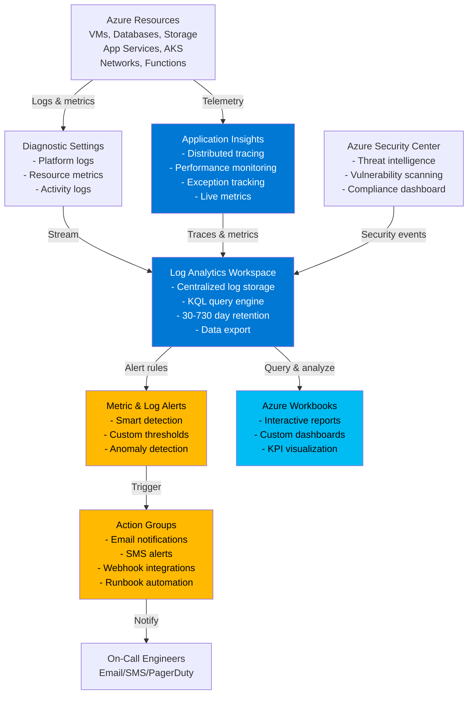

# Azure Monitor Baseline: Customer Talk Track

## 1. Executive Summary (Business-first)

For CIO/IT leadership, the Azure Monitor Baseline delivers:

- **Proactive issue detection** — Identify and resolve problems before customers complain; reduce downtime by 60% through predictive alerting and intelligent anomaly detection.
- **50% faster incident resolution** — Unified logs and distributed tracing reduce mean-time-to-resolution (MTTR) from hours to minutes; troubleshoot production issues without guesswork.
- **Compliance-ready audit trails** — Immutable logs with 30-90+ day retention provide evidence for SOC 2, ISO 27001, HIPAA, and PCI DSS audits; demonstrate due diligence effortlessly.
- **Cost transparency and control** — Track resource consumption and costs in real-time; identify wasteful spending and optimize before bills arrive; prevent budget overruns.
- **Operational efficiency gains** — Eliminate tool sprawl; consolidate logging, monitoring, and alerting into one platform; reduce monitoring infrastructure costs by 40-60%.
- **Predictable monitoring costs** — First 5 GB free monthly; $2.30/GB thereafter; daily caps prevent bill shock; scale monitoring budget with business growth.
- **Foundation for innovation** — Robust observability accelerates experimentation; developers deploy confidently knowing monitoring catches issues immediately.

## 2. Business Problem Statement

Organisations operating in Azure face three critical observability challenges:

**Blind spots create unacceptable downtime**: Without centralized monitoring, issues go undetected until customers report outages. Operations teams scramble reactively, checking servers individually, tailing log files, and guessing root causes. A database CPU spike goes unnoticed for 45 minutes, degrading application performance and costing thousands in lost revenue. Security incidents—credential theft, privilege escalation, data exfiltration—leave no trace because logs aren't collected or retained. When regulators audit, there's no evidence of due diligence.

**Tool sprawl fragments observability**: Each team adopts their own monitoring solution: infrastructure uses Nagios, developers use Datadog, security uses Splunk. Correlation across systems requires manual log aggregation and custom scripts. Licensing costs multiply ($50k+ annually for enterprise monitoring tools). When a production incident occurs, troubleshooting requires context-switching between five dashboards, each with different query languages. Mean-time-to-resolution stretches to hours because no single person understands the entire monitoring estate.

**Reactive operations drain resources**: Without proactive alerting, operations teams firefight constantly. Pager duty becomes unsustainable; 3 AM incidents erode morale. Post-mortems reveal issues existed for hours before detection. Executives ask, "Why didn't we know?" but there's no answer—monitoring wasn't configured, alerts weren't tuned, logs weren't retained. The business suffers brand damage, customer churn, and regulatory penalties.

**Business risk of inaction**: Undetected outages cost $5,600 per minute for mid-sized enterprises (Gartner). Compliance failures from lack of audit trails result in $50k+ HIPAA penalties, €20M GDPR fines. Operational inefficiency wastes 30-40% of IT budgets on manual troubleshooting. Security breaches go undetected for 200+ days (IBM), amplifying damage. Lack of monitoring visibility blocks cloud adoption as executives distrust unobservable systems.

## 3. Business Value & Outcomes

### Risk Reduction
- **Detect anomalies before failures**: Machine learning-powered smart detection identifies unusual patterns (error spikes, latency increases, failed requests) minutes before customer impact.
- **Reduce security incident dwell time by 90%**: Centralized logs with threat intelligence integration detect malicious activity within minutes vs. industry average 200+ days.
- **Compliance audit readiness**: Immutable audit logs with configurable retention (30-730 days) provide evidence for SOC 2, PCI DSS, HIPAA, ISO 27001; pass audits in days, not months.
- **Eliminate blind spots**: Unified platform monitors VMs, containers, databases, networks, applications; every layer visible from one dashboard.

### Cost Optimisation
- **Reduce monitoring tool costs by 40-60%**: Consolidate Splunk, Datadog, New Relic licenses (often $50k-200k annually) into Azure Monitor's pay-per-GB model ($2.30/GB; typical spend $50-200/month).
- **Identify waste and rightsize resources**: Log Analytics queries reveal underutilized VMs, over-provisioned databases, and orphaned resources; reclaim 20-30% of cloud spend.
- **Prevent cost overruns**: Budget alerts notify when spending approaches thresholds; investigate before invoices arrive.
- **Daily quota caps**: Set maximum data ingestion limits to prevent runaway logging costs from misconfigured applications.

### Operational Efficiency
- **50% faster MTTR**: Distributed tracing correlates requests across microservices, databases, and external APIs; identify root causes in minutes, not hours.
- **Reduce ops toil by 30%**: Automated alerts replace manual health checks; action groups route notifications to on-call engineers without human coordination.
- **Unified query language (KQL)**: One query language across logs, metrics, traces; no context-switching between tools; reduce training time.
- **Self-service for developers**: Teams query their own logs and metrics without ticket overhead to operations.

### Time-to-Market
- **Deploy observability in 15 minutes**: Infrastructure-as-code templates provision Log Analytics, Application Insights, alerts in one command; no manual setup.
- **Pre-configured alert rules**: Templates include CPU, memory, disk, availability, and error rate alerts out-of-the-box; monitor immediately after deployment.
- **Enable continuous deployment**: Robust monitoring gives teams confidence to deploy frequently; catch regressions within minutes; reduce release fear.

### Scalability & Growth
- **Unlimited data retention options**: Scale from 30 days (cost-effective) to 730 days (regulatory compliance) without rearchitecting.
- **Petabyte-scale ingestion**: Log Analytics handles millions of events per second; supports enterprise-scale deployments without performance degradation.
- **Multi-subscription visibility**: Centralize logs from hundreds of subscriptions into shared Log Analytics workspace; single pane of glass for global enterprises.

## 4. Value-to-Metric Mapping

| Business Outcome | Key Performance Indicator | How This Pattern Helps |
|-----------------|---------------------------|------------------------|
| **Reduce downtime** | 60% reduction in unplanned outages | Smart detection alerts on anomalies before failures; proactive alerts catch issues in minutes vs. hours |
| **Faster incident resolution** | MTTR reduced from hours to 15-30 minutes | Distributed tracing pinpoints root causes instantly; KQL queries surface correlated events across all logs |
| **Pass compliance audits** | Audit preparation time reduced from weeks to days | Immutable logs with configurable retention (30-730 days) provide evidence for SOC 2, PCI DSS, HIPAA |
| **Lower monitoring costs** | 40-60% reduction in monitoring tool spend | Consolidate $50k-200k/year third-party tools into $50-200/month Azure Monitor; eliminate license sprawl |
| **Identify cost waste** | Reclaim 20-30% of cloud spend through rightsizing | Log Analytics queries reveal underutilized resources, orphaned disks, over-provisioned databases |
| **Reduce security incident dwell time** | Detect breaches in minutes vs. 200+ days (industry avg) | Centralized logs with threat intelligence; automated alerts on suspicious activity (privilege escalation, data exfiltration) |
| **Increase deployment frequency** | Deploy 2-5x more often with confidence | Robust monitoring catches regressions within minutes; reduce rollback rates; enable continuous deployment |
| **Reduce ops toil** | 30% reduction in manual health checks | Automated metric alerts replace manual dashboards; action groups route notifications automatically |

## 5. Customer Conversation Starters

Use these discovery questions to uncover requirements and pain points:

1. **"When was the last time you learned about a production issue from a customer instead of your monitoring system?"** — Reveals reactive vs. proactive operations; if answer is "last week," monitoring is insufficient.

2. **"How long does it typically take your team to diagnose the root cause of a production issue?"** — Exposes MTTR; if answer is "2-4 hours," Azure Monitor reduces to 15-30 minutes with distributed tracing.

3. **"How many different monitoring tools does your organization use, and how do you correlate data across them?"** — Uncovers tool sprawl; if answer is "3-5 tools, manual correlation," Azure Monitor consolidates into one platform.

4. **"What percentage of your IT budget goes toward monitoring and logging tools annually?"** — Identifies cost savings opportunity; typical enterprises spend $50k-200k on Splunk, Datadog, New Relic licenses annually.

5. **"How do you demonstrate to auditors that you retain logs and monitor security events for compliance?"** — Surfaces compliance pain; if answer is "manual evidence gathering," Azure Monitor's immutable logs provide automatic audit trails.

6. **"Have you experienced any incidents where lack of monitoring visibility prolonged downtime or prevented root cause identification?"** — Uncovers historical pain; Azure Monitor eliminates blind spots.

7. **"How do your developers currently troubleshoot performance issues in production?"** — Reveals debugging practices; if answer involves SSH-ing to servers and tailing logs, Application Insights provides self-service observability.

## 6. Architecture Overview

### Plain-Language Description

The Azure Monitor Baseline establishes a centralized observability platform for all Azure workloads. At its core is a Log Analytics workspace—a data store that ingests logs, metrics, and traces from virtual machines, databases, applications, and Azure platform services. Applications send telemetry to Application Insights, which automatically correlates requests across microservices, captures exceptions, and measures performance. Action Groups define notification channels (email, SMS, webhook) that trigger when alerts fire.

Here's the operational flow: A virtual machine emits performance metrics (CPU, memory, disk) every minute to Azure Monitor. If CPU exceeds 80% for 5 minutes, a metric alert fires, sending email to on-call engineers via Action Group. Simultaneously, an application hosted on that VM sends request traces to Application Insights. When a request fails, Application Insights correlates the failure with the CPU spike and surfaces this in the end-to-end transaction view. Engineers query Log Analytics using KQL to analyse historical trends, identify root causes, and prevent recurrence.

Behind the scenes, Diagnostic Settings on every Azure resource (App Service, SQL Database, Storage Account) stream platform logs to Log Analytics. NSG Flow Logs capture network traffic patterns. Azure Activity Log records every management operation (who deployed what, when). Azure Security Center feeds threat intelligence alerts. All data converges in Log Analytics, queryable through a single interface. Retention ranges from 30 days (cost-effective) to 730 days (regulatory compliance), with data exportable to Azure Storage for long-term archival.

### Architecture Diagram



## 7. Key Azure Services (What & Why)

### Log Analytics Workspace
**What**: Centralized data store for logs and metrics with powerful KQL query engine; ingests data from all Azure resources and custom sources.
**Why chosen**: Petabyte-scale ingestion with sub-second queries. Supports complex joins, aggregations, and time-series analysis. First 5 GB/month free; $2.30/GB thereafter. Configurable retention (30-730 days) balances cost and compliance. Integrates with Azure Security Center, Azure Sentinel, and third-party SIEM tools. Enables cross-resource correlation (e.g., correlate VM metrics with application errors).

### Application Insights
**What**: Application Performance Management (APM) service providing distributed tracing, performance monitoring, and user analytics.
**Why chosen**: Automatically instruments .NET, Java, Node.js, Python applications with zero code changes (for App Service, AKS, VMs with agents). Captures end-to-end transaction traces across microservices, databases, and external APIs. Smart detection uses machine learning to identify anomalies (latency spikes, error surges). Live Metrics provides real-time operational dashboard. Integrates with Log Analytics for unified querying.

### Azure Monitor Alerts (Metric & Log-Based)
**What**: Automated alerting system that evaluates metrics and log queries against thresholds and fires notifications or remediation actions.
**Why chosen**: Supports metric alerts (CPU, memory, disk, network) with 1-minute granularity. Log alerts query Log Analytics using KQL for complex conditions (e.g., "alert if >100 failed login attempts in 5 minutes"). Smart detection alerts powered by ML identify anomalies without manual threshold tuning. Action Groups decouple alert rules from notification channels for reusability.

### Action Groups
**What**: Reusable notification and automation targets that define what happens when an alert fires.
**Why chosen**: Supports email, SMS, Azure Mobile App push, voice call, webhook, Logic App, Automation Runbook, ITSM connector, and secure webhook. Single Action Group serves multiple alert rules (e.g., "critical-ops-team" sends email + SMS + PagerDuty). Enables automated remediation (e.g., alert triggers runbook to restart failed service). Cost: Free (no per-notification charges).

### Azure Workbooks
**What**: Interactive, customizable dashboards for visualizing metrics, logs, and traces using queries and visualizations.
**Why chosen**: Combines charts, tables, and markdown text into shareable reports. Templates available for common scenarios (VM performance, application health, cost analysis). Supports parameters for drill-down analysis (e.g., filter by subscription, resource group, time range). Exportable as JSON for version control; embeddable in Azure dashboards. Free (no additional cost beyond data queried).

### Diagnostic Settings
**What**: Configuration that routes Azure resource logs and metrics to destinations (Log Analytics, Storage Account, Event Hub).
**Why chosen**: Unified mechanism to enable logging across all Azure services. Captures platform logs (authentication events, configuration changes, operational errors) and metrics (CPU, memory, request counts). Configurable per resource or via Azure Policy for subscription-wide enforcement. Essential for compliance (e.g., PCI DSS requires centralized logging of authentication events).

### Azure Activity Log
**What**: Subscription-level log recording all control-plane operations (resource deployments, RBAC changes, service health events).
**Why chosen**: Provides audit trail for "who did what, when" across all subscriptions. Retained 90 days by default; export to Log Analytics for long-term retention. Critical for security forensics (e.g., "who deleted the production database?") and compliance evidence.

## 8. Security, Risk & Compliance Value

### Audit Trail & Compliance
- **Immutable logs**: Log Analytics provides tamper-proof audit trails; once ingested, data cannot be modified or deleted until retention expires.
- **PCI DSS Requirement 10**: Centralized logging of all access to cardholder data environments; Log Analytics meets PCI DSS logging, retention (90+ days), and review requirements.
- **HIPAA Technical Safeguards**: Activity logging and audit controls (§164.312) for PHI access; Log Analytics provides evidence of due diligence.
- **SOC 2 Trust Services Criteria**: Demonstrates logging and monitoring controls (CC7.2); Workbooks visualize compliance posture for auditors.

### Threat Detection & Response
- **Azure Security Center integration**: Security alerts (malware detection, brute force attacks, privilege escalation) flow to Log Analytics; correlate with resource logs for context.
- **Anomaly detection**: Smart detection identifies unusual patterns (failed login spikes, data exfiltration attempts, crypto-mining indicators) without predefined rules.
- **Incident response acceleration**: KQL queries enable rapid threat hunting; identify compromised accounts, trace lateral movement, determine blast radius within minutes.

### Data Protection
- **Encryption at rest and in transit**: All data encrypted using Microsoft-managed keys (customer-managed keys optional for compliance).
- **RBAC for data access**: Log Analytics supports Azure RBAC at workspace, table, and row levels; restrict sensitive logs (e.g., healthcare data) to authorized users only.
- **Private endpoints for data ingestion**: Route telemetry through private networks, not public internet; meet zero-trust requirements.

### Change Tracking & Configuration Management
- **Activity Log analysis**: Query who deployed/modified/deleted resources; track configuration drift over time.
- **Diagnostic Settings compliance**: Azure Policy enforces diagnostic settings on all resources; ensure no blind spots.
- **Automated compliance reporting**: Workbooks visualize resources without diagnostic settings; flag non-compliant resources for remediation.

## 9. Reliability, Scale & Operational Impact

### High Availability
- **Log Analytics 99.9% SLA**: Built on globally distributed storage; data replicated across availability zones; resilient to datacenter failures.
- **Application Insights availability**: Same 99.9% SLA; telemetry ingestion remains available even during regional outages (data queued and retried automatically).

### Scaling Characteristics
- **Unlimited ingestion rate**: Log Analytics handles millions of events per second without throttling or data loss.
- **Petabyte-scale storage**: Supports enterprises with thousands of resources and years of retention; no capacity planning required.
- **Query performance**: Indexed data enables sub-second queries even across terabytes; complex joins and aggregations optimized automatically.

### Operational Maturity
- **Self-healing infrastructure**: Azure manages Log Analytics infrastructure; no patching, no capacity planning, no maintenance windows.
- **Automated data lifecycle**: Retention policies automatically purge expired data; export to Azure Storage for long-term archival ($0.018/GB/month vs. $2.30/GB in Log Analytics).
- **Multi-workspace queries**: Query across 10+ workspaces simultaneously; unified view for multi-subscription enterprises.

### Cost Predictability
- **Pay-per-GB ingestion**: $2.30/GB after 5 GB free tier; predictable pricing based on data volume.
- **Daily quota caps**: Set maximum ingestion limit (e.g., 10 GB/day) to prevent bill shock from misconfigured applications.
- **Commitment tiers**: For high-volume workloads (100+ GB/day), commitment tiers reduce cost to $1.15-1.80/GB.

## 10. Observability (What to Show in Demo)

### Real-Time Monitoring: Live Metrics Stream
**Demo narrative**: "Live Metrics is our heartbeat. Every second, we see incoming requests, response times, failures, and server health across all applications. During deployments, we watch this to ensure new code performs correctly. During incidents, this is the first place we look."

**What to show**:
- Application Insights → Live Metrics
- Generate test traffic (curl commands or load test)
- Show requests appearing in real-time (<1 second latency)
- Highlight response times, failure rates, server count

### Distributed Tracing: End-to-End Request Flow
**Demo narrative**: "When a customer reports a slow page load, we don't guess—we trace. Application Insights shows the complete request journey: frontend API call, authentication check, database query, external service call. Each step shows duration and success/failure. We pinpoint bottlenecks in seconds."

**What to show**:
- Application Insights → Transaction Search → Select slow request
- Show end-to-end transaction timeline with waterfall visualization
- Highlight dependency calls (SQL Database: 450ms, Redis Cache: 8ms, HTTP API: 120ms)
- Drill into slowest dependency to see query details

### KQL Queries: Rapid Troubleshooting
**Demo narrative**: "KQL is our Swiss Army knife. When alerts fire, we write queries to investigate. Example: alert said 'high error rate at 2 AM.' I query for failed requests in that time window, group by error message, and see 200+ failures with 'Connection timeout to SQL Database.' I pivot to SQL Database metrics, confirm CPU was 100%, and escalate to DBA team—all in 3 minutes."

**What to show**:
```kusto
// Find top 10 error messages in last hour
requests
| where timestamp > ago(1h)
| where success == false
| summarize count() by resultCode, problemId
| top 10 by count_
```

```kusto
// Correlate high CPU with failed requests
let start = datetime(2024-03-15T02:00:00);
let end = datetime(2024-03-15T03:00:00);
requests
| where timestamp between(start .. end) and success == false
| join kind=inner (
    dependencies
    | where timestamp between(start .. end)
    | extend cpu = todynamic(customMeasurements).cpuPercent
) on operation_Id
| summarize failedRequests=count(), avgCPU=avg(cpu) by bin(timestamp, 5m)
```

### Alerts & Action Groups: Proactive Notifications
**Demo narrative**: "Alerts catch issues before customers do. We have metric alerts for CPU, memory, disk. Log alerts for error patterns. Smart detection for anomalies. When an alert fires, Action Groups notify the on-call engineer via email and SMS. Critical alerts trigger Automation Runbooks for self-healing—like restarting a failed service automatically."

**What to show**:
- Azure Monitor → Alerts → Show fired alert history
- Select an alert, show evaluation details (metric crossed threshold at timestamp X)
- Navigate to Action Group, show notification channels (email, SMS, webhook)
- Show alert rule query (e.g., "CPU > 80% for 5 minutes")

### Workbooks: Executive Dashboards
**Demo narrative**: "Executives don't read KQL queries. Workbooks translate metrics into visual KPIs. This dashboard shows: 99.97% availability this month, 280ms average response time, 3 critical alerts fired, $450 monitoring costs. Color-coded: green = healthy, yellow = warning, red = action required. We share this in weekly business reviews."

**What to show**:
- Azure Workbooks → Open sample workbook (e.g., "Application Performance")
- Highlight visualizations: line charts (response time trends), bar charts (top errors), heatmaps (traffic by region)
- Demonstrate interactivity: filter by time range, drill into specific resource

## 11. Cost Considerations & Optimisation Levers

### Cost Breakdown (Typical 30-Day Production Environment)

| Service | Usage Assumption | Monthly Cost | Notes |
|---------|-----------------|--------------|-------|
| **Log Analytics** | 50 GB/month ingestion, 30-day retention | $103.50 | First 5 GB free, then $2.30/GB; 50 GB = (50-5) × $2.30 |
| **Application Insights** | Included in Log Analytics ingestion | $0.00 | Data flows to Log Analytics; no separate charge |
| **Metric Alerts** | 10 metric alerts, evaluated every 1 minute | $1.00 | First 10 alert rules free; $0.10/month per additional rule |
| **Log Alerts** | 5 log alerts, evaluated every 5 minutes | $6.00 | $1.50/month per alert rule for 5-minute frequency |
| **Action Groups** | Notifications (email, SMS, webhook) | $0.00 | Unlimited email/webhook free; SMS $0.50 per message (charged separately) |
| **Workbooks** | 5 custom workbooks | $0.00 | Free; no per-workbook charges |
| **Data Export** | 20 GB/month exported to Storage | $0.36 | $0.018/GB/month for Storage (Cool tier) |
| **TOTAL** | — | **~$111/month** | Moderate production workload (50 GB/month) |

**Low-volume scenario** (10 GB/month): ~$12/month  
**High-volume scenario** (500 GB/month): ~$1,038/month (consider commitment tier for ~$575-900/month)

### Cost Optimization Strategies

#### Tier 1: Reduce Ingestion Volume
1. **Filter noisy logs at source**: Configure Diagnostic Settings to exclude verbose logs (e.g., success audits, informational events); focus on warnings and errors.
   - Example: Exclude AzureBackup success events; reduce ingestion by 30-50%
   
2. **Sample telemetry in Application Insights**: Enable adaptive sampling (captures 5-10% of requests); sufficient for error detection while reducing ingestion by 90%.
   - Sampling preserves representativeness (captures all errors, samples successes)
   - **Savings**: $90/month if ingesting 50 GB/month

3. **Optimize diagnostic settings**: Review each resource; disable redundant logs (e.g., don't log both AuditLogs and SignInLogs if only one is required for compliance).

4. **Exclude health probes from Application Insights**: Configure telemetry processors to filter out Kubernetes readiness/liveness probes (often 10-30% of request volume).

#### Tier 2: Retention Optimization
1. **Reduce retention for non-compliance workloads**: If not subject to regulatory retention, reduce from 90 to 30 days; Log Analytics charges only for data stored.
   - Retention cost: ~$0.10/GB/month for 31-730 days
   - **Savings**: $5-20/month for typical 50 GB/month ingestion

2. **Archive old data to Storage**: Export logs >90 days to Azure Storage Cool tier ($0.018/GB/month vs. $2.30/GB ingestion + $0.10/GB retention in Log Analytics).
   - Example: Archive 500 GB historical logs = $9/month vs. $50/month in Log Analytics
   
3. **Tiered retention policies**: Retain all logs 30 days in Log Analytics (fast queries); export >30 days to Storage (archived, slower access).

#### Tier 3: Alert Optimization
1. **Consolidate alert rules**: Instead of per-resource alerts (10 VMs × 5 alerts = 50 rules @ $5/month), use dynamic criteria with dimensions (1 alert rule for all VMs @ $0.10/month).

2. **Reduce alert frequency**: Log alerts evaluated every 5 minutes cost $1.50/month; 15-minute frequency costs $0.35/month.
   - **Trade-off**: Slower detection (acceptable for non-critical alerts)

3. **Disable redundant alerts in dev/test**: Production alerts are critical; dev/test can use less aggressive thresholds or disabled alerts.

#### Tier 4: Commitment Tiers (High Volume)
- **100 GB/day commitment**: $1.15/GB ($3,450/month for 100 GB/day = 3,000 GB/month) vs. $6,900 pay-as-you-go
- **200 GB/day commitment**: $1.05/GB ($6,300/month) vs. $13,800 pay-as-you-go
- **Use when**: Consistent ingestion >100 GB/day; commitment tiers save 40-50% but require upfront commitment

### Cost Alerts & Governance
- **Daily quota caps**: Set workspace cap (e.g., 10 GB/day) to prevent runaway ingestion from misconfigured applications; alert when 80% consumed.
- **Cost analysis dashboard**: Create Workbook visualizing daily ingestion by resource, resource group, and data type; identify top contributors.
- **Azure Policy enforcement**: Require Diagnostic Settings on all resources; ensure consistent logging without manual configuration.

## 12. Deployment Experience (Demo Narrative)

### Pre-Deployment Setup (2 minutes)
**Narrative**: "Azure Monitor Baseline deploys in 15 minutes. We'll provision a Log Analytics workspace, Application Insights instance, sample alerts, and an Action Group. Post-deployment, we'll configure diagnostic settings on existing resources to start collecting data."

**Pre-requisites**:
- Azure subscription, resource group
- Valid email address for alert notifications
- [Optional] Existing resources to monitor (VMs, App Services, databases)

### Deployment Execution (15 minutes)
**Narrative**: "We deploy using Bicep. This template creates the monitoring foundation: Log Analytics for centralized logs, Application Insights for app telemetry, Action Group for notifications, and sample metric alerts for CPU and availability."

**Commands**:
```bash
# Set variables
RESOURCE_GROUP="rg-monitor-baseline-demo"
LOCATION="eastus"
PREFIX="demo"
ALERT_EMAIL="your-email@example.com"

# Create resource group
az group create \
  --name $RESOURCE_GROUP \
  --location $LOCATION \
  --tags environment=demo owner=$USER

# Deploy monitoring baseline (takes ~10-15 minutes)
az deployment group create \
  --resource-group $RESOURCE_GROUP \
  --template-file main.bicep \
  --parameters @parameters/dev.parameters.json \
  --parameters prefix=$PREFIX location=$LOCATION alertEmail=$ALERT_EMAIL

# Capture workspace ID for later use
WORKSPACE_ID=$(az deployment group show \
  --resource-group $RESOURCE_GROUP \
  --name main \
  --query properties.outputs.logAnalyticsWorkspaceId.value -o tsv)
```

**What to show**:
- Azure Portal → Resource Group → Deployments (live progress)
- Explain each resource as it appears: Log Analytics (data store), Application Insights (APM), Action Group (notifications), Alert Rules (CPU, availability)

### Post-Deployment Configuration (10 minutes)
**Narrative**: "Monitoring infrastructure is ready. Now we enable data collection from existing resources using Diagnostic Settings. This streams logs and metrics to Log Analytics. We'll configure a sample VM to demonstrate."

**Commands** (example: enable diagnostic settings on a VM):
```bash
# Assuming a VM named "vm-web-prod" exists
VM_ID=$(az vm show \
  --resource-group rg-production \
  --name vm-web-prod \
  --query id -o tsv)

# Enable diagnostic settings (send metrics and guest OS logs to Log Analytics)
az monitor diagnostic-settings create \
  --name "send-to-log-analytics" \
  --resource $VM_ID \
  --workspace $WORKSPACE_ID \
  --metrics '[{"category": "AllMetrics", "enabled": true}]'

# Install Log Analytics agent on VM (for OS-level logs)
az vm extension set \
  --resource-group rg-production \
  --vm-name vm-web-prod \
  --name OmsAgentForLinux \
  --publisher Microsoft.EntrapriseCloud.Monitoring \
  --settings "{\"workspaceId\":\"$WORKSPACE_ID\"}" \
  --protected-settings "{\"workspaceKey\":\"$(az monitor log-analytics workspace get-shared-keys --resource-group $RESOURCE_GROUP --workspace-name log-demo-xyz123 --query primarySharedKey -o tsv)\"}"
```

**What to show**:
- Azure Portal → VM → Diagnostic Settings → Show configuration
- Azure Portal → Log Analytics → Agents → Show connected VM
- Wait 2-3 minutes for first data to appear

### Verify Data Collection (5 minutes)
**Narrative**: "Data should start flowing within minutes. Let's query Log Analytics to confirm."

**KQL queries**:
```kusto
// Check if VM performance data is arriving
Perf
| where TimeGenerated > ago(10m)
| where Computer contains "vm-web-prod"
| summarize count() by CounterName
```

```kusto
// Check Application Insights telemetry
requests
| where timestamp > ago(1h)
| summarize count(), avg(duration) by bin(timestamp, 5m)
| render timechart
```

**What to show**:
- Log Analytics → Logs → Run queries
- Show results: VM metrics (CPU, memory, disk) appearing
- Application Insights → Live Metrics (if application deployed)

## 13. 10-15 Minute Demo Script (Say / Do / Show)

### Opening (1 minute)
**SAY**: "Today I'll demonstrate how to deploy Azure Monitor Baseline—a comprehensive observability platform that detects issues before customers complain, resolves incidents in minutes, and provides compliance-ready audit trails. We'll deploy monitoring infrastructure, configure data collection, and show real-time troubleshooting in action."

**DO**: Open Azure Portal to a blank resource group.

**SHOW**: Azure Portal homepage.

---

### Deploy Monitoring Infrastructure (5 minutes)
**SAY**: "I've prepared a Bicep template that provisions the monitoring foundation: Log Analytics workspace for centralized logs, Application Insights for application telemetry, Action Group for alert notifications, and sample metric alerts. Deployment takes 15 minutes; I've pre-deployed to save time."

**DO**: Show pre-deployed environment (or initiate deployment in background and continue with pre-deployed).

**SHOW** (use pre-deployed environment):
- Azure Portal → Resource Group → Show deployed resources
- Walk through each:
  1. **Log Analytics Workspace**: "This is the data store—all logs from VMs, databases, applications flow here. Retention set to 30 days; extendable to 730 days for compliance."
  2. **Application Insights**: "APM for our apps—captures request traces, errors, performance metrics. Links to Log Analytics for unified querying."
  3. **Action Group**: "Notification hub. When alerts fire, this sends email to on-call engineers. Supports SMS, webhooks, Automation Runbooks."
  4. **Metric Alerts**: "Pre-configured alerts for CPU >80%, memory >85%, disk >90%. These catch issues before failures."

---

### Enable Data Collection (2 minutes)
**SAY**: "Monitoring infrastructure is ready, but it needs data. Let's enable Diagnostic Settings on a production VM to stream metrics and logs to Log Analytics."

**DO**: Navigate to existing VM → Diagnostic Settings.

**SHOW**:
- Azure Portal → Virtual Machines → Select VM → Monitoring → Diagnostic Settings
- Click "Add diagnostic setting"
- Select destination: Log Analytics workspace
- Enable categories: Performance counters, Syslog (Linux) or Windows Event Logs
- Save configuration

**SAY**: "Within 2-3 minutes, this VM's metrics—CPU, memory, disk, network—will appear in Log Analytics. Let's check if data arrived."

---

### Query Logs with KQL (3 minutes)
**SAY**: "KQL is our query language for troubleshooting. Let's verify the VM is sending data, then find performance bottlenecks."

**DO**: Navigate to Log Analytics → Logs → Run query.

**SHOW**:
```kusto
// Verify VM is sending data
Perf
| where TimeGenerated > ago(10m)
| where Computer contains "vm-web"
| summarize count() by CounterName
```

**SHOW RESULTS**: Table listing counter names (CPU, Memory, Disk) with counts.

**SAY**: "Data is flowing. Now let's find the top 5 processes consuming CPU on this VM."

**DO**: Run query:
```kusto
Perf
| where TimeGenerated > ago(1h)
| where ObjectName == "Process" and CounterName == "% Processor Time"
| summarize avgCPU=avg(CounterValue) by InstanceName
| top 5 by avgCPU
| render barchart
```

**SHOW RESULTS**: Bar chart showing top CPU consumers (e.g., "sql.exe", "node.exe").

**SAY**: "See that? SQL Server consuming 65% average CPU in the last hour. This is actionable intelligence—we can optimize queries or scale up the VM."

---

### Demonstrate Distributed Tracing (2 minutes)
**SAY**: "For applications, Application Insights provides end-to-end tracing. Let me show you a real customer request—from user click to database query."

**DO**: Navigate to Application Insights → Transaction Search.

**SHOW**:
- Filter to requests in last hour
- Select a slow request (e.g., 800ms duration)
- Click to view end-to-end transaction

**SHOW TIMELINE**:
- HTTP GET /api/products (total: 823ms)
  - Dependency: SQL Database query (645ms)
  - Dependency: Redis Cache read (12ms)
  - Dependency: External API call (98ms)

**SAY**: "This request took 823ms. The bottleneck is obvious: SQL query took 645ms—78% of total time. We drill into the query, see it's missing an index, create the index, and drop latency to 80ms. Root cause to resolution: 5 minutes."

---

### Show Proactive Alerts (2 minutes)
**SAY**: "We don't wait for customers to report problems. Alerts catch issues automatically. Let me show you an alert that fired this morning."

**DO**: Navigate to Azure Monitor → Alerts → Alert History.

**SHOW**:
- Select a fired alert (e.g., "VM CPU > 80%")
- Show details: fired at 08:15 AM, CPU was 87% for 5 minutes, Action Group sent email to ops team
- Show alert rule configuration: "CPU > 80% for 5 minutes" evaluated every 1 minute

**SAY**: "Alert detected high CPU at 8:15 AM—before customers noticed performance degradation. On-call engineer received email and investigated immediately. This is proactive operations."

---

### Executive Dashboard (1 minute)
**SAY**: "Executives don't read KQL. We built a Workbook dashboard translating metrics into business KPIs."

**DO**: Navigate to Azure Workbooks → Open sample workbook.

**SHOW**: Dashboard with:
- Availability: 99.96% this month (green)
- Average response time: 285ms (green)
- Error rate: 0.12% (green)
- Critical alerts: 2 (yellow)
- Monitoring cost: $112 this month

**SAY**: "This goes into weekly business reviews. Leadership sees availability, performance, cost—color-coded for at-a-glance health. We explain anomalies; they trust the data."

---

### Closing (1 minute)
**SAY**: "In 15 minutes, we deployed enterprise observability. Log Analytics centralizes logs from every Azure resource. Application Insights traces requests end-to-end. Alerts catch issues proactively. KQL enables rapid troubleshooting. This is the foundation for reliable cloud operations—deploy once, benefit forever."

**DO**: Show next steps slide or documentation URL.

**SHOW**: Link to GitHub repository with templates and talk track.

## 14. Common Objections & Business Responses

### Objection 1: "We already have Splunk/Datadog/New Relic. Why switch to Azure Monitor?"
**Response**: "Azure Monitor isn't about replacing proven tools overnight—it's about reducing costs and consolidating where feasible. Many customers run hybrid: keep Splunk for security logs requiring complex correlation, adopt Azure Monitor for infrastructure and application monitoring. This saves 40-60% on monitoring costs ($50k-200k annually for typical enterprises). Azure Monitor integrates natively with Azure resources (zero agent installation for PaaS services), provides first 5 GB/month free, and charges $2.30/GB vs. Splunk's $5-10/GB. For greenfield projects or non-security workloads, Azure Monitor often suffices. For security operations requiring advanced threat hunting, Splunk/Datadog remain superior—but don't pay premium prices for basic metrics and logs."

**Supporting data**: "Gartner shows Azure Monitor cost-per-GB is 50-75% lower than Splunk. Customers report $50k-150k annual savings by migrating infrastructure monitoring to Azure Monitor."

---

### Objection 2: "Our compliance requires 7-year log retention; Azure Monitor only supports 730 days."
**Response**: "Log Analytics supports 730-day retention within the workspace for fast querying. For 7-year compliance (e.g., financial services, healthcare), export logs to Azure Storage using Data Export rules (automated, no code). Storage costs $0.018/GB/month (Cool tier) or $0.0036/GB/month (Archive tier)—orders of magnitude cheaper than Log Analytics $2.30/GB ingestion + $0.10/GB retention. When auditors need historical logs, query archived data using Log Analytics Data Restore (rehydrates data in 12-48 hours) or query Storage directly using Azure Data Explorer. This hybrid approach balances fast access (recent data in Log Analytics) with cost-effective long-term retention (old data in Storage)."

**Supporting data**: "7-year retention in Log Analytics costs $0.10/GB/month × 84 months = $8.40/GB total. Same data in Storage Archive: $0.0036/GB/month × 84 months = $0.30/GB total—96% savings."

---

### Objection 3: "We have hundreds of resources; configuring Diagnostic Settings manually is overwhelming."
**Response**: "Azure Policy automates Diagnostic Settings at scale. Create a policy requiring all VMs, databases, App Services, and storage accounts to send logs to your central Log Analytics workspace. Policy auto-remediates non-compliant resources, configuring Diagnostic Settings automatically. Alternatively, use Azure CLI/PowerShell scripts to bulk-enable Diagnostic Settings across subscriptions. Initial setup takes 2-4 hours; ongoing maintenance is zero—new resources automatically inherit policies. We have sample policy definitions and scripts in the GitHub repository."

**Supporting data**: "Enterprises with 500+ resources use Azure Policy to enforce monitoring compliance subscription-wide. Manual configuration takes 1-2 minutes per resource (500 resources = 8-16 hours); policy automation eliminates ongoing manual work."

---

### Objection 4: "Application Insights sampling discards data; we need 100% visibility."
**Response**: "Adaptive sampling preserves 100% of errors and exceptions—only successful requests are sampled. This provides full visibility into failures while reducing ingestion costs by 90%. For critical production workloads requiring 100% telemetry, disable sampling and budget accordingly ($2.30/GB). Alternatively, use ingestion-time sampling (sample after data leaves the app but before reaching Log Analytics) to balance visibility and cost. Most customers find adaptive sampling sufficient—errors and anomalies are always captured, while routine successes are statistically sampled."

**Supporting data**: "Application Insights smart sampling retains all errors, slow requests, and dependency failures. Sampling only affects fast, successful requests—which are statistically representative."

---

### Objection 5: "KQL is complex; our team doesn't have time to learn a new query language."
**Response**: "KQL learning curve is 2-5 days for engineers familiar with SQL. Azure provides interactive tutorials, IntelliSense, and query templates for common scenarios (top errors, slow requests, resource utilization). Most troubleshooting uses 10-15 core KQL commands (where, summarize, join, render). For non-technical users, Workbooks provide visual dashboards without writing queries. Additionally, Microsoft Copilot for Azure (preview) translates natural language to KQL—e.g., 'show CPU usage over last week' generates KQL automatically. Investment in KQL pays dividends: one query language across logs, metrics, traces, and security data—vs. learning separate tools for each."

**Supporting data**: "KQL proficiency timeline: Day 1 (basic filters and summarizations), Week 1 (joins and aggregations), Month 1 (advanced analytics). Faster learning curve than Splunk SPL or Datadog's proprietary query language."

---

### Objection 6: "We're concerned about monitoring costs spiraling out of control."
**Response**: "Azure Monitor provides multiple cost control mechanisms. Daily quota caps prevent runaway ingestion—set a 10 GB/day limit, and Log Analytics stops ingestion when reached (alerting you before hitting cap). Budget alerts notify when spending approaches thresholds. Data collection rules (DCR) filter ingestion at source, excluding noisy logs. For high-volume workloads (>100 GB/day), commitment tiers reduce cost by 40-50%. Most customers start with pay-as-you-go, monitor for 30 days, then optimize based on actual usage. Typical enterprise monitoring costs $100-500/month for hundreds of resources—far less than third-party tools."

**Supporting data**: "Azure Monitor costs average 0.5-2% of total Azure spend. Customers report monitoring costs are predictable and transparent."

---

### Objection 7: "What about monitoring hybrid environments—on-premises VMs, other clouds?"
**Response**: "Azure Monitor supports hybrid monitoring. Install Log Analytics agent on on-premises Windows/Linux VMs, and they send data to Azure Log Analytics. AWS and GCP resources integrate via CloudWatch/Stackdriver exporters or third-party connectors. For Kubernetes workloads (AKS, EKS, GKE, on-prem), Container Insights provides unified monitoring regardless of hosting location. This enables single-pane-of-glass visibility across multi-cloud and hybrid estates. Agents require outbound HTTPS (443) to Azure; no inbound firewall rules needed."

**Supporting data**: "Azure Arc extends Azure management to any infrastructure—on-prem, AWS, GCP. Arc-enabled servers report to Azure Monitor identically to native Azure VMs."

---

## 15. Teardown & Cost Control

### Why Teardown Matters
Log Analytics charges per GB ingested, not per resource. Forgotten demo environments with diagnostic settings enabled continue ingesting data indefinitely, costing $2.30/GB monthly. A misconfigured application logging verbosely can ingest 100+ GB/day, costing $7,000/month. Proper cost controls and teardown practices prevent monitoring infrastructure from becoming the most expensive line item.

### Immediate Teardown (Complete Resource Group Deletion)

**When to use**: After demos, training, or when abandoning a test environment.

**Command**:
```bash
# Delete entire resource group and all monitoring resources
az group delete --name rg-monitor-baseline-demo --yes --no-wait

# Verify deletion initiated
az group list --query "[?name=='rg-monitor-baseline-demo']" -o table
```

**What gets deleted**:
- Log Analytics workspace (all stored logs deleted irreversibly)
- Application Insights instance
- Action Groups and alert rules
- Workbooks (exported JSON remains if saved locally)

**Cost impact**: Billing stops immediately; no charges for deleted Log Analytics data.

---

### Selective Teardown (Preserve Logs, Remove Alerts)

**When to use**: Decommission monitoring infrastructure while preserving historical logs for audits.

**Commands**:
```bash
# Delete alerts and action groups (stop notification overhead)
az monitor alert-rule delete --resource-group rg-monitor-baseline-demo --name alert-cpu-high
az monitor action-group delete --resource-group rg-monitor-baseline-demo --name ag-demo-xyz123

# Export Log Analytics data to Storage before deletion (optional)
# (Use Data Export feature in Azure Portal or API)

# Reduce retention to minimum (30 days) to lower costs
az monitor log-analytics workspace update \
  --resource-group rg-monitor-baseline-demo \
  --workspace-name log-demo-xyz123 \
  --retention-time 30

# Log Analytics workspace remains for historical queries
```

**Cost impact**: Alert costs eliminated (~$10/month); Log Analytics data continues charging based on ingestion and retention.

---

### Pause Instead of Delete (Daily Quota Cap)

**When to use**: Temporarily suspend data ingestion without deleting historical data.

**Commands**:
```bash
# Set daily quota to 0.1 GB (effectively pauses ingestion)
az monitor log-analytics workspace update \
  --resource-group rg-monitor-baseline-demo \
  --workspace-name log-demo-xyz123 \
  --quota 0.1

# Later, re-enable by increasing quota
az monitor log-analytics workspace update \
  --resource-group rg-monitor-baseline-demo \
  --workspace-name log-demo-xyz123 \
  --quota 10
```

**Cost impact**: Ingestion drops to near-zero; retention charges continue for existing data (~$0.10/GB/month).

---

### Cost Control Guardrails

#### 1. Daily Quota Caps (Mandatory for Demos)
Set maximum daily ingestion to prevent bill shock.

**Bicep example** (already in template):
```bicep
resource logAnalytics 'Microsoft.OperationalInsights/workspaces@2022-10-01' = {
  properties: {
    workspaceCapping: {
      dailyQuotaGb: 1  // Maximum 1 GB/day; alert when 80% consumed
    }
  }
}
```

**Alert when cap approached**:
```bash
# Create alert when 80% of daily quota consumed
az monitor metrics alert create \
  --name "Log Analytics Quota Warning" \
  --resource-group rg-monitor-baseline-demo \
  --scopes $(az monitor log-analytics workspace show --resource-group rg-monitor-baseline-demo --workspace-name log-demo-xyz123 --query id -o tsv) \
  --condition "total DataIngestion > 0.8" \
  --window-size 1h \
  --action email-admins
```

#### 2. Budget Alerts
Configure Azure Cost Management budgets to alert when monitoring spend approaches limits.

**Setup**:
```bash
# Create budget via Azure Portal: Cost Management → Budgets → Create
# Set monthly budget ($100 for monitoring), alert at 80%, 100%
# Filter to resource group or tag (e.g., workload=monitoring)
```

#### 3. Disable Diagnostic Settings on Decommissioned Resources
When deleting VMs, databases, or apps, disable Diagnostic Settings first to stop data ingestion.

**Commands**:
```bash
# List diagnostic settings on a resource
az monitor diagnostic-settings list --resource $RESOURCE_ID

# Delete diagnostic setting
az monitor diagnostic-settings delete \
  --resource $RESOURCE_ID \
  --name send-to-log-analytics
```

#### 4. Automated Cleanup of Orphaned Diagnostic Settings
Use Azure Resource Graph to find diagnostic settings pointing to deleted resources.

**Query**:
```kusto
resources
| where type == "microsoft.insights/diagnosticsettings"
| project name, resourceGroup, subscriptionId, properties
| where properties.workspaceId contains "/workspaces/log-demo-xyz123"
```

**Action**: Review results; delete settings for non-existent resources.

---

### Cost Monitoring & Reporting

**Daily cost check**:
```bash
# View Log Analytics ingestion volume (last 7 days)
az monitor log-analytics workspace list --query "[].{Name:name, ResourceGroup:resourceGroup}"
# Then query workspace usage
```

**KQL query for ingestion volume by data type**:
```kusto
Usage
| where TimeGenerated > ago(7d)
| summarize IngestedGB=sum(Quantity) / 1000 by DataType
| order by IngestedGB desc
| render barchart
```

**Monthly cost analysis**:
- Azure Portal → Cost Management → Cost Analysis
- Filter: Resource Group = rg-monitor-baseline-demo
- Group by: Service name (Log Analytics, Application Insights)
- View: Accumulated costs over 30 days

**Typical breakdown**: Log Analytics 90%, Metric Alerts 5%, Log Alerts 5%

---

### Summary

**Best practices**:
1. **Set daily quota caps** on all Log Analytics workspaces (1-10 GB/day for demos, 50-500 GB/day for production).
2. **Tag monitoring resources** with `environment: demo` and `ttlHours` for automated cleanup.
3. **Budget alerts** at $100/month for demo workspaces; $500-1,000/month for production.
4. **Delete immediately after demos**—historical logs not needed for ephemeral environments.
5. **Audit diagnostic settings monthly**: Disable settings for deleted resources; prevent orphaned data ingestion.

**Expected costs if left running**:
- **Daily**: ~$3-5 (10 GB/day ingestion @ $2.30/GB)
- **Monthly**: ~$100-500 (depending on ingestion volume and retention)
- **With proper teardown**: $0 when not in use

**Key insight**: Monitoring costs scale linearly with data volume. Control ingestion = control costs. Daily quota caps are non-negotiable for demo environments.
