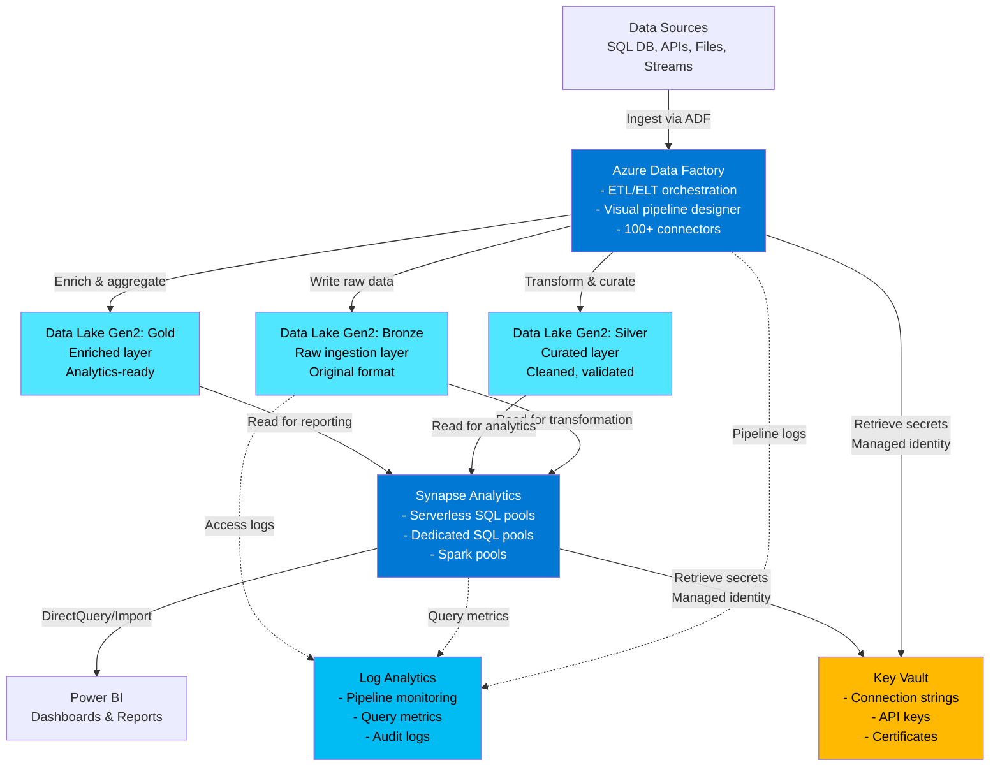

# Data Analytics Pipeline with Azure Synapse: Customer Talk Track

## 1. Executive Summary (Business-first)

For CIOs, data officers, and business leaders, the Data Analytics Pipeline pattern delivers:

- **Unified analytics platform** — Eliminate data silos by bringing SQL data warehousing, big data processing, and real-time analytics into a single integrated workspace; reduce tool sprawl and training costs.
- **Data democratisation at scale** — Enable data scientists, analysts, and business users to access and query enterprise data using familiar tools (SQL, Spark, Power BI) without infrastructure expertise.
- **Cost-effective big data processing** — Process petabyte-scale datasets using serverless SQL queries or on-demand Spark pools; pay only for queries executed, not provisioned infrastructure.
- **ETL/ELT automation** — Build, schedule, and monitor complex data pipelines using visual designers and code; transform raw data into analytics-ready insights with minimal manual intervention.
- **Enterprise-grade security** — Data Lake Gen2 with hierarchical namespaces, Azure AD integration, and column-level security protect sensitive data while maintaining accessibility for authorised users.
- **Accelerated insights delivery** — Reduce time from raw data ingestion to business insights from weeks to hours; deploy modern data warehouse architectures without custom infrastructure builds.
- **Multi-layer data architecture** — Implement bronze/silver/gold data lake layers to separate raw ingestion, data quality curation, and analytics-ready datasets; improve data lineage and governance.

## 2. Business Problem Statement

Organisations face four critical challenges when building modern analytics platforms:

**Data trapped in silos prevents holistic insights**: Customer data lives in CRM systems, transaction data in SQL databases, operational logs in cloud storage, and IoT telemetry in event streams. Analysts spend 60-70% of their time finding, extracting, and joining data across systems before any analysis begins. Business questions requiring cross-system insights take weeks to answer, delaying strategic decisions and creating competitive disadvantages.

**On-premises data warehouses can't scale economically**: Traditional SQL data warehouses hit performance ceilings at terabyte scale. Scaling requires expensive hardware upgrades planned months in advance. Big data platforms like Hadoop demand dedicated infrastructure teams and months of cluster tuning. When business demands analytics on petabyte datasets or real-time streaming data, legacy platforms simply can't deliver without seven-figure infrastructure investments.

**Complex ETL pipelines create operational bottlenecks**: Building data pipelines requires custom code connecting dozens of data sources, transforming inconsistent formats, handling failures, and scheduling dependencies. Teams maintain thousands of lines of brittle Python or Java ETL code. When pipelines fail at 3 AM, data engineers troubleshoot through log files across multiple systems. Pipeline fragility causes data quality issues, late reports, and lost confidence in analytics.

**Security and governance block data access**: Protecting sensitive data requires row-level security, column masking, audit trails, and compliance certifications. Implementing these controls manually across data platforms takes months and delays analytics projects. Overly restrictive access controls prevent analysts from doing their jobs; insufficient controls risk data breaches and regulatory penalties.

**Business risk of inaction**: Delayed insights mean missed market opportunities and reactive decision-making. Over-provisioned infrastructure wastes budget that could fund innovation. Data governance gaps expose organisations to compliance violations and breaches. Manual ETL processes cause data quality issues that undermine trust in analytics.

## 3. Business Value & Outcomes

### Cost Optimisation
- **Eliminate data warehouse over-provisioning** — Serverless SQL queries charge per terabyte scanned, not per hour; save 50-70% vs. always-on dedicated clusters for ad-hoc analytics.
- **On-demand Spark processing** — Auto-pause Spark pools after 15 minutes of inactivity; pay only when processing workloads run, not 24/7.
- **Consolidated tooling** — Data Factory, Synapse SQL, and Spark in one platform eliminates separate ETL tool licenses, data warehouse licenses, and Hadoop cluster costs.
- **Storage tiering** — Data Lake Gen2 hot/cool/archive tiers reduce storage costs by 70% for historical data; automatically move aged data to cheaper tiers.

### Risk Reduction
- **Built-in enterprise security** — Azure AD integration, managed identities, and Key Vault secrets management eliminate credential sprawl and hardcoded passwords.
- **Compliance-ready** — Synapse Analytics certified for HIPAA, SOC 2, ISO 27001; inherit Azure compliance posture without custom implementations.
- **Data lineage and auditing** — Automatic tracking of data transformations and access patterns simplifies regulatory audits and data governance.
- **Disaster recovery included** — Geo-redundant Data Lake storage and workspace configuration backups protect against regional failures without custom DR plans.

### Time-to-Market
- **Deploy data platforms in days, not months** — Infrastructure-as-code templates provision complete analytics platforms in 20-30 minutes; eliminate procurement and installation delays.
- **Visual pipeline design** — Data Factory's drag-and-drop interface reduces ETL development time by 60%; business analysts build pipelines without coding.
- **Self-service analytics** — Synapse Studio provides unified workspace for SQL analysts, data engineers, and data scientists; reduce cross-team coordination delays.

### Operational Efficiency
- **Unified monitoring** — Log Analytics and Application Insights provide centralised visibility into pipeline runs, query performance, and resource utilisation.
- **Automated orchestration** — Schedule pipelines, handle retries, and manage dependencies without custom scheduling infrastructure.
- **Reduced infrastructure management** — Managed services eliminate server patching, cluster tuning, and capacity planning; redirect ops resources to higher-value work.

### Scalability & Growth
- **Petabyte-scale data processing** — Synapse Spark pools process datasets of any size by distributing work across hundreds of nodes automatically.
- **Concurrent workload isolation** — Dedicated SQL pools support thousands of simultaneous queries with workload management; prevent report queries from blocking ETL jobs.
- **Global data distribution** — Data Lake Gen2 multi-region replication enables analytics workloads in multiple geographies for regulatory compliance.

## 4. Value-to-Metric Mapping

| Business Outcome | Key Performance Indicator | How This Pattern Helps |
|-----------------|---------------------------|------------------------|
| **Reduce analytics infrastructure costs** | 50-70% cost reduction vs. on-premises data warehouses | Serverless SQL charges per query, Spark pools auto-pause; eliminate idle capacity waste |
| **Accelerate insight delivery** | Time from raw data to insights reduced from weeks to hours | Automated ETL pipelines, pre-integrated analytics tools, bronze/silver/gold lake architecture |
| **Improve data accessibility** | 80% of analysts self-serve data without engineering support | Serverless SQL queries over Data Lake; analysts use familiar SQL tools without infrastructure knowledge |
| **Scale data processing** | Process petabyte-scale datasets without performance degradation | Synapse Spark distributes processing across hundreds of nodes; scales linearly with data volume |
| **Reduce ETL development time** | 60% reduction in pipeline development effort | Visual Data Factory designer, reusable pipeline components, built-in connectors for 100+ data sources |
| **Enhance data governance** | 100% audit trail for data access and transformations | Automatic logging to Log Analytics, built-in data lineage, column-level security |
| **Decrease pipeline failures** | 40% reduction in ETL job failures | Built-in retry logic, dependency management, monitoring/alerting; identify issues before SLA breaches |
| **Meet compliance requirements** | Reduce audit preparation time by 70% | Azure compliance certifications, automatic audit logs, encryption at rest/transit enabled by default |

## 5. Customer Conversation Starters

Use these discovery questions to uncover requirements and pain points:

1. **"How much of your analysts' time is spent finding and preparing data versus actually analysing it?"** — Typical answer is 60-70%; reveals opportunity for data democratisation and self-service analytics.

2. **"What's the largest dataset you need to analyse today, and how long do queries take?"** — Uncovers scale limitations; if queries take hours or time out, Synapse's distributed processing provides immediate value.

3. **"When was the last time your data warehouse ran out of capacity, and how long did it take to scale up?"** — Identifies scaling pain; on-premises warehouses require hardware procurement; Synapse scales in minutes.

4. **"How many separate tools do your teams use for data ingestion, transformation, warehousing, and analytics?"** — Reveals tool sprawl; typical answer is 4-6 tools; Synapse consolidates into unified platform.

5. **"How long does it take to build and deploy a new ETL pipeline from requirements to production?"** — Exposes development inefficiency; typical answer is 2-6 weeks; Data Factory visual designer reduces to days.

6. **"What percentage of your data warehouse queries are ad-hoc versus scheduled reports?"** — Determines serverless SQL suitability; if >30% ad-hoc, serverless eliminates paying for idle capacity.

7. **"How do you currently enforce data security and compliance for analytics workloads?"** — Uncovers governance gaps; if answer involves custom code or manual processes, Synapse's built-in security streamlines compliance.

8. **"What happens when an ETL pipeline fails at 3 AM? How long does troubleshooting take?"** — Reveals operational burden; integrated monitoring and retry logic reduce MTTR by 50%+.

## 6. Architecture Overview

### Plain-Language Description

The Data Analytics Pipeline pattern builds a modern data platform without managing infrastructure. Raw data from various sources (databases, APIs, files, event streams) lands in Azure Data Lake Storage Gen2, organised into a bronze layer. Data Factory orchestrates ETL/ELT pipelines that extract data from sources, transform it using mapping data flows or Spark notebooks, and load it into silver (curated) and gold (enriched) lake layers.

Analysts query data using Synapse serverless SQL pools, which read directly from Data Lake parquet files without copying data into a separate warehouse—queries charge per terabyte scanned. For complex transformations and machine learning, data engineers use Synapse Spark pools, which auto-provision compute clusters on-demand and auto-pause when idle. Power BI connects to Synapse for interactive dashboards and reports.

Behind the scenes, all services use managed identities to authenticate—no passwords or connection strings in code. Key Vault stores any required secrets. Log Analytics captures pipeline run logs, query performance metrics, and security events for unified monitoring. The entire platform scales automatically: Data Lake storage grows infinitely, serverless SQL scales per query, Spark pools scale per job.

### Architecture Diagram



## 7. Key Azure Services (What & Why)

### Azure Data Lake Storage Gen2
**What**: Hierarchical object storage optimised for analytics workloads with file system semantics and massive scale.
**Why chosen**: Gen2 combines blob storage economics ($0.018/GB for hot tier) with file system performance. Hierarchical namespaces enable folder-level permissions and efficient directory operations. Supports petabyte-scale datasets with unlimited storage accounts. Three-tier architecture (hot/cool/archive) reduces costs for historical data by 70%. Compatible with Hadoop ecosystem and Azure analytics tools. Provides foundation for bronze/silver/gold data lake architecture.

### Azure Data Factory
**What**: Cloud-based ETL/ELT service for orchestrating and automating data movement and transformation at scale.
**Why chosen**: Visual designer reduces ETL development time by 60% compared to hand-coded pipelines. 100+ built-in connectors for on-premises and cloud data sources eliminate custom integration code. Mapping data flows provide code-free transformations using Spark clusters provisioned on-demand. Schedule pipelines with dependency management and automatic retries. Monitoring dashboard shows pipeline runs, activity status, and failure diagnostics. Managed service eliminates scheduling infrastructure and reduces operational overhead.

### Synapse Analytics Serverless SQL
**What**: On-demand SQL query engine that reads data directly from Data Lake without data movement or provisioning.
**Why chosen**: Charges only for data scanned ($5 per terabyte), not for provisioned capacity. Analysts query parquet, CSV, or JSON files in Data Lake using familiar SQL syntax. No ETL required to move data into a warehouse before querying. Scales automatically to thousands of concurrent queries. T-SQL compatibility means existing SQL skills apply. Ideal for ad-hoc analytics, data exploration, and infrequent reporting workloads.

### Synapse Analytics Dedicated SQL Pool (Optional)
**What**: Massively parallel processing (MPP) data warehouse with dedicated compute and storage.
**Why chosen**: For consistent high-throughput workloads, dedicated pools provide predictable performance. Supports complex queries across billions of rows with columnstore indexing and distribution strategies. Workload management isolates concurrent queries by priority. DWU scaling adjusts compute capacity in minutes. Production data warehouses benefit from dedicated pools; dev/test environments use serverless SQL. Costs $1,200/month for DW100c entry tier when running; pause when idle to eliminate costs.

### Synapse Analytics Spark Pools
**What**: Managed Apache Spark clusters for big data processing, machine learning, and advanced transformations.
**Why chosen**: Auto-provision Spark clusters in 2-4 minutes; no cluster management overhead. Supports Python, Scala, R, and .NET for Spark. Notebooks provide interactive development environment for data engineers and scientists. Auto-pause after 15 minutes of inactivity eliminates idle costs. Handles petabyte-scale data transformations and machine learning workloads. Integrates with MLflow for experiment tracking and model management.

### Azure Key Vault
**What**: Secure storage for secrets, keys, and certificates with hardware security module (HSM) backing.
**Why chosen**: Centralises connection strings, API keys, and certificates for all data sources. Data Factory and Synapse retrieve secrets using managed identity—zero credentials in code or configuration. RBAC integration enforces least privilege access. Audit logs track secret retrieval for compliance. Automatic secret rotation and expiration policies prevent stale credentials.

### Log Analytics Workspace
**What**: Centralised log aggregation and analytics platform using Kusto Query Language (KQL).
**Why chosen**: All Data Factory pipeline logs, Synapse query metrics, and Data Lake access logs flow to single workspace. KQL queries provide powerful analytics for troubleshooting, performance tuning, and compliance reporting. Retention policies (30-730 days) meet audit requirements. Alert rules notify ops teams of pipeline failures or performance degradation. Workbooks provide customisable dashboards for operational visibility.

## 8. Security, Risk & Compliance Value

### Identity & Access Management
- **Managed identities eliminate credential sprawl**: Data Factory and Synapse authenticate to Data Lake, Key Vault, and data sources using Azure AD identities—no connection strings in code.
- **Role-Based Access Control (RBAC)**: Grant folder-level permissions in Data Lake Gen2; data scientists access curated layer, engineers access raw layer, analysts access gold layer only.
- **Column-level security**: Synapse SQL supports column masking to hide sensitive data (credit card numbers, SSNs) from unauthorised users; comply with GDPR and HIPAA.

### Data Protection
- **Encryption everywhere**: Data Lake encrypts at rest using Microsoft-managed keys (customer-managed keys optional). TLS 1.2 enforced for all data transfers.
- **Data retention policies**: Lifecycle management automatically deletes or archives aged data; prevent compliance violations from retaining PII beyond legal limits.
- **Immutable storage**: Write-once-read-many (WORM) policies on Data Lake prevent data tampering; meet SEC and FINRA archival requirements.

### Network Security
- **Private endpoints**: Deploy Synapse and Data Lake with private endpoints to eliminate public internet exposure; traffic stays on Azure backbone.
- **Firewall rules**: Data Lake firewall restricts access to trusted Azure services and specific IP ranges; prevent unauthorised data exfiltration.
- **Managed virtual network**: Synapse managed VNet isolates Spark clusters and SQL pools from internet; outbound traffic controlled via managed private endpoints.

### Compliance & Audit
- **Compliance certifications**: Synapse Analytics and Data Lake certified for HIPAA, SOC 2, ISO 27001, PCI DSS; inherit Azure compliance posture.
- **Audit logs**: Log Analytics retains all data access, pipeline executions, and query activity for 90-730 days; evidence for compliance audits.
- **Data lineage**: Track data transformations from source to gold layer; understand impact of schema changes and troubleshoot data quality issues.

### Threat Protection
- **Advanced Threat Protection**: Detect anomalous data access patterns (unusual query volume, unauthorised IP addresses, SQL injection attempts) and alert security teams.
- **Automatic patching**: Azure manages Synapse runtime security updates and Data Lake infrastructure patching; no maintenance windows or vulnerability exposure.
- **Defender for Storage**: Malware scanning for Data Lake uploads prevents malicious files from entering analytics pipelines.

## 9. Reliability, Scale & Operational Impact

### High Availability
- **Data Lake geo-redundant storage (GRS)**: Data replicated to secondary region 300+ miles away; 99.99999999999999% (16 nines) durability.
- **Synapse workspace zonal redundancy**: SQL and Spark pools distribute across availability zones; survive datacenter failures transparently.
- **No single points of failure**: Managed services provide built-in redundancy; no custom clustering or failover configuration.

### Scaling Characteristics
- **Data Lake infinite scale**: Store petabytes of data with no capacity planning; storage accounts support 5 PB limits, multiple accounts provide unlimited scale.
- **Serverless SQL auto-scaling**: Query engine distributes work across compute nodes automatically; handle 1-1,000 concurrent queries without provisioning.
- **Spark pool autoscale**: Configure min/max nodes; clusters grow to handle large datasets and shrink when jobs complete; pay only for nodes used.

### Performance Optimization
- **Parquet columnar format**: Reduce storage costs by 70% and query times by 80% compared to CSV/JSON; columnar compression and predicate pushdown.
- **Data Lake partitioning**: Organise data by date, region, or category; partition pruning eliminates scanning irrelevant data, improving query performance 10-100x.
- **Dedicated SQL pool indexing**: Clustered columnstore indexes compress data 10x and accelerate analytical queries; hash distribution optimises joins.

### Operational Maturity
- **Pipeline retry logic**: Data Factory automatically retries transient failures (network timeouts, rate limiting); reduce manual intervention by 80%.
- **Monitoring and alerting**: Log Analytics queries detect pipeline failures, slow queries, and resource bottlenecks; action groups trigger email, SMS, or webhook notifications.
- **Cost anomaly detection**: Azure Cost Management alerts when spending exceeds forecasts; prevent bill shock from runaway queries or forgotten Spark pools.

### Disaster Recovery
- **Cross-region replication**: Configure Data Lake read-access geo-redundant storage (RA-GRS); query data from secondary region during primary outages.
- **Workspace backup**: Export Synapse workspace configuration (pipelines, SQL scripts, notebooks) to Git; redeploy in alternate region in minutes.
- **Infrastructure-as-code recovery**: Entire analytics platform recreatable from Bicep templates; RPO near-zero (data replication), RTO <1 hour (redeploy infrastructure).

## 10. Observability (What to Show in Demo)

### Data Factory Monitoring: Pipeline Execution Visibility
**Demo narrative**: "When data pipelines fail, we need immediate visibility. Data Factory's monitoring dashboard shows every pipeline run, activity status, and execution duration. This pipeline ingested customer data from SQL Server, transformed it using Spark, and loaded it into the gold layer. Total duration: 8 minutes. We see each activity's status—green means success, red means failure. If something fails, we drill in to see the exact error message and which record caused the issue."

**What to show**:
- Azure Portal → Data Factory → Monitor → Pipeline runs
- Select completed pipeline run, show activity timeline
- Highlight input/output row counts for each activity
- Click failed activity (if available) to show error details

### Synapse Serverless SQL: Query Performance Insights
**Demo narrative**: "Business analysts run hundreds of ad-hoc queries daily. Synapse Studio shows query history, execution times, and data scanned. This query analysed 500 GB of sales data and completed in 12 seconds. We're charged $2.50 for that query—5 TB scanned times $5/TB. The query plan shows it used partition pruning to skip 4 TB of irrelevant data. Without partitioning, this query would have scanned 5 TB and taken 45 seconds."

**What to show**:
- Synapse Studio → Develop → SQL scripts → Run query
- After execution, show "Data processed" metric
- Open "Explain" plan to demonstrate partition elimination
- Navigate to Monitor → SQL requests to show query history

### Spark Pool Monitoring: Job Execution and Auto-Scaling
**Demo narrative**: "Spark jobs process large datasets using distributed compute. This notebook transformed 2 TB of log files—deduplication, aggregation, and enrichment. The job started with 3 nodes, scaled to 20 nodes during heavy processing, then scaled back down. Auto-pause kicked in after 15 minutes of inactivity, stopping all billing. Total job duration: 18 minutes. Total cost: $4.80. Running this on a dedicated Spark cluster would cost $200/day even when idle."

**What to show**:
- Synapse Studio → Monitor → Apache Spark applications
- Select completed Spark job, show execution timeline
- Display resource utilisation (CPU, memory, node count)
- Highlight auto-pause configuration

### Log Analytics: Unified Troubleshooting
**Demo narrative**: "When pipelines fail or queries slow down, Log Analytics provides unified troubleshooting. This KQL query shows all Data Factory pipeline failures in the last 24 hours, grouped by error message. We see 'Cosmos DB rate limit exceeded' caused 15 failures. Drilling in, we identify the specific pipeline and activity. We increase Cosmos DB throughput, retry the pipeline, and failures stop. Root cause to resolution: 10 minutes."

**What to show**:
- Azure Portal → Log Analytics workspace → Logs
- Run KQL query for pipeline failures or slow queries
- Show results table with timestamps and error messages
- Demonstrate filtering and aggregation capabilities

### Cost Management: Spend Tracking and Forecasting
**Demo narrative**: "Cost visibility prevents surprises. This dashboard shows daily spend by service. Yesterday: Data Lake $12, Data Factory $8, Synapse serverless SQL $15, Spark pools $22. Total: $57 for processing 5 TB of data. The forecast predicts $1,700/month at current usage. We've set a budget alert at $2,000/month; if spending approaches that threshold, we investigate before bills arrive."

**What to show**:
- Azure Portal → Cost Management → Cost analysis
- Filter to resource group, show breakdown by service
- Highlight daily cost trends and forecast
- Navigate to Budgets, show alert configuration

## 11. Cost Considerations & Optimisation Levers

### Cost Breakdown (Typical 30-Day Production Analytics Platform)

| Service | Usage Assumption | Monthly Cost | Notes |
|---------|-----------------|--------------|-------|
| **Data Lake Storage Gen2** | 10 TB hot tier, 50 TB cool tier, 200 TB archive | $400 | Hot $23/TB, cool $10/TB, archive $2/TB per month |
| **Data Factory** | 100 pipeline runs/day, 10 activities each | $150 | $1/1,000 activity runs + integration runtime hours |
| **Synapse Serverless SQL** | 20 TB scanned per day | $3,000 | $5/TB scanned; optimize with partitioning and parquet |
| **Synapse Spark Pools** | 20 hours/day active, 10 nodes average, Small size | $1,200 | $0.42/node-hour; auto-pause reduces costs 70% vs. always-on |
| **Dedicated SQL Pool** (optional) | DW500c, paused 12 hours/day | $1,800 | $3,672/month if always-on; pause reduces to 50% |
| **Key Vault** | 100,000 operations | $0.30 | $0.03/10K operations |
| **Log Analytics** | 50 GB ingestion, 90-day retention | $120 | First 5 GB free, then $2.30/GB |
| **TOTAL (without Dedicated SQL)** | — | **~$4,870/month** | Variable; scales with data volume |
| **TOTAL (with Dedicated SQL, paused 12h)** | — | **~$6,670/month** | Pause SQL pool when unused to save costs |

### Cost Optimization Strategies

#### Tier 1: Immediate Wins (No Architecture Changes)
1. **Partition Data Lake files**: Organise data by date or category (`/year=2024/month=03/day=15/`); serverless SQL partition pruning reduces scanned data by 80-95%, cutting query costs proportionally.

2. **Use Parquet format**: Convert CSV/JSON to Parquet; reduce storage costs by 70% and query costs by 80% through compression and columnar structure.

3. **Pause Dedicated SQL pools**: Pause pools when unused (nights, weekends); DW500c costs $3,672/month always-on, $1,200/month if paused 18 hours/day.

4. **Enable Spark pool auto-pause**: Configure 15-minute idle timeout; eliminate costs for forgotten sessions or idle notebooks.

5. **Implement Data Lake lifecycle policies**: Automatically move data >90 days old to cool tier, >1 year to archive tier; save $13/TB per month for aged data.

#### Tier 2: Configuration Adjustments
1. **Right-size Spark pools**: Start with Small nodes (4 vCores, 32 GB); most workloads don't need Medium/Large; reduce costs by 50-75% if sufficient.

2. **Optimize serverless SQL queries**: Select only needed columns, filter before joins, use partition keys in WHERE clauses; reduce data scanned per query by 60%+.

3. **Reduce Log Analytics retention**: Non-production environments rarely need 90-day retention; reduce to 30 days, save 66% on log storage.

4. **Schedule pipelines strategically**: Run non-critical ETL during off-peak hours; spread workloads to avoid concurrency charges for Data Factory integration runtimes.

5. **Cache Data Factory integration runtime**: Reuse integration runtime instances across pipelines; reduce startup overhead and execution time.

#### Tier 3: Advanced Optimizations
1. **Hybrid serverless + dedicated SQL**: Use serverless SQL for ad-hoc queries (<10 TB/day scanned), dedicated pools for consistent high-throughput workloads; switch workloads to cheaper option based on usage patterns.

2. **Materialise aggregations**: Pre-compute common aggregations (daily sales, monthly KPIs) in gold layer; queries read pre-aggregated data instead of scanning billions of rows.

3. **Implement Delta Lake**: Use Delta Lake format on Data Lake for incremental processing; process only changed data instead of full refreshes, reducing Spark processing time by 80%+.

4. **Multi-region cost awareness**: Data Lake replication to secondary regions costs 2x per GB egress; evaluate if read replicas are necessary or if backups suffice.

5. **Reserved capacity**: For predictable workloads, purchase Synapse committed units (SCU) reservations; save 20-30% vs. pay-as-you-go for dedicated SQL pools.

### Cost Alerts & Governance
- **Budget alerts**: Set budgets in Azure Cost Management; alert at 50%, 80%, 100% thresholds to prevent runaway costs from forgotten Spark pools.
- **Tag-based allocation**: Tag resources with cost center, project, environment; allocate costs accurately across business units.
- **Query cost limits**: Implement serverless SQL query result set caching and cost guardrails using resource governor (preview feature).

## 12. Deployment Experience (Demo Narrative)

### Pre-Deployment Setup (2 minutes)
**Narrative**: "Before deploying, we confirm prerequisites: Azure subscription, resource group, and Azure CLI authentication. We'll review parameters to customise names, regions, and whether to deploy a dedicated SQL pool—which adds significant cost. Deployment takes 20-30 minutes due to Synapse workspace provisioning."

**Commands**:
```bash
# Verify Azure CLI authentication
az account show

# Create resource group
az group create --name rg-analytics-demo --location eastus

# Review parameters (adjust prefix, deploySqlPool setting)
cat parameters/dev.parameters.json
```

### Deployment Execution (20-30 minutes)
**Narrative**: "One command deploys the entire analytics platform. Bicep provisions Data Lake Storage with bronze/silver/gold containers, Synapse workspace with serverless SQL, optional dedicated SQL pool, optional Spark pool, Data Factory with linked services, Key Vault for secrets, and Log Analytics for monitoring. Dependencies are handled automatically—Data Lake deploys first, then Synapse references it."

**Commands**:
```bash
# Deploy infrastructure
az deployment group create \
  --resource-group rg-analytics-demo \
  --template-file main.bicep \
  --parameters @parameters/dev.parameters.json \
  --parameters prefix=demo \
               location=eastus \
               sqlAdministratorPassword='YourSecurePassword123!'
               
# Deployment takes 20-30 minutes
# Synapse workspace provisioning is longest step
```

**What to show during deployment**:
- Azure Portal → Resource Group → Deployments (show live progress)
- Explain Synapse workspace, Data Factory, Data Lake provisioning
- Highlight managed identity creation and RBAC assignments
- Point out Key Vault and Log Analytics workspace appearing

### Post-Deployment Verification (5 minutes)
**Narrative**: "Deployment succeeded. Let's verify each component. Data Lake should have bronze, silver, gold containers. Synapse workspace should show serverless SQL endpoint and optional dedicated SQL pool. Data Factory should list linked services for Data Lake and Synapse. Key Vault should grant Synapse and Data Factory managed identities access to secrets."

**Commands**:
```bash
# List Data Lake containers
STORAGE_ACCOUNT=$(az deployment group show \
  --resource-group rg-analytics-demo \
  --name main \
  --query properties.outputs.dataLakeName.value -o tsv)

az storage container list \
  --account-name $STORAGE_ACCOUNT \
  --auth-mode login

# Expected output: bronze, silver, gold containers

# Get Synapse workspace name
SYNAPSE_WORKSPACE=$(az deployment group show \
  --resource-group rg-analytics-demo \
  --name main \
  --query properties.outputs.synapseWorkspaceName.value -o tsv)

echo "Synapse Studio URL: https://$SYNAPSE_WORKSPACE.dev.azuresynapse.net"
```

**What to show**:
- Azure Portal → Storage Account → Containers (verify bronze/silver/gold)
- Synapse Studio → Manage → SQL pools (show serverless, optional dedicated pool)
- Data Factory → Manage → Linked services (show Data Lake, Synapse connections)
- Key Vault → Access control (IAM) → Show Synapse/ADF managed identity roles

### Upload Sample Data & Build Pipeline (10 minutes)
**Narrative**: "Now we ingest sample data. We'll upload CSV files to the bronze layer, then build a Data Factory pipeline to transform and load into silver. This demonstrates the ETL workflow. In production, you'd connect to real data sources—SQL databases, APIs, SaaS applications."

**Commands**:
```bash
# Upload sample data to bronze layer
az storage blob upload-batch \
  --account-name $STORAGE_ACCOUNT \
  --destination bronze/sales \
  --source ./sample-data/sales \
  --auth-mode login

# List uploaded files
az storage blob list \
  --account-name $STORAGE_ACCOUNT \
  --container-name bronze \
  --prefix sales/ \
  --auth-mode login
```

**What to show**:
- Azure Portal → Storage Account → bronze container (verify uploaded files)
- Data Factory Studio → Author → Create new pipeline
- Add Copy activity: Source = bronze CSV files, Sink = silver parquet files
- Add Data Flow activity: transform (filter, aggregate, join)
- Validate and trigger pipeline, show monitoring dashboard

### Query Data with Synapse Serverless SQL (5 minutes)
**Narrative**: "With data in the silver layer, we query using serverless SQL. No data movement required—SQL reads parquet files directly from Data Lake. We'll create an external table pointing to parquet files, then run analytics queries. Analysts use familiar SQL tools; no Spark knowledge needed."

**Commands** (run in Synapse Studio):
```sql
-- Create external data source
CREATE EXTERNAL DATA SOURCE silver_layer
WITH (
    LOCATION = 'https://<storage-account>.dfs.core.windows.net/silver/'
);

-- Create external table
CREATE EXTERNAL TABLE sales (
    order_id INT,
    customer_id INT,
    order_date DATE,
    amount DECIMAL(10,2)
)
WITH (
    LOCATION = 'sales/*.parquet',
    DATA_SOURCE = silver_layer,
    FILE_FORMAT = ParquetFormat
);

-- Query data
SELECT 
    YEAR(order_date) AS year,
    MONTH(order_date) AS month,
    SUM(amount) AS total_sales
FROM sales
WHERE order_date >= '2024-01-01'
GROUP BY YEAR(order_date), MONTH(order_date)
ORDER BY year, month;
```

**What to show**:
- Synapse Studio → Develop → SQL script → Run queries
- Show query results and "Data processed" metric (cost indicator)
- Highlight query performance and ease of SQL-based analytics

## 13. 10-15 Minute Demo Script (Say / Do / Show)

### Opening (1 minute)
**SAY**: "Today I'll demonstrate how to build a production-ready data analytics platform in under 30 minutes. We'll deploy Data Lake Storage, Azure Synapse Analytics, and Data Factory—a complete ETL pipeline that processes terabytes of data, all without managing servers or clusters."

**DO**: Open Azure Portal to blank resource group.

**SHOW**: Azure Portal homepage; emphasize starting from zero infrastructure.

---

### Deploy Infrastructure (5 minutes)
**SAY**: "One Bicep template deploys everything: a hierarchical data lake with bronze/silver/gold layers, Synapse workspace for SQL and Spark analytics, Data Factory for ETL orchestration, Key Vault for secrets, and Log Analytics for monitoring. This deployment takes 20-30 minutes; I've prepared a pre-deployed environment to save time."

**DO**: 
```bash
# Show deployment command (explain, don't wait)
az deployment group create \
  --resource-group rg-analytics-demo \
  --template-file main.bicep \
  --parameters @parameters/dev.parameters.json
```

**SHOW**: 
- Terminal showing command
- Switch to pre-deployed Azure Portal → Resource Group
- Highlight deployed resources: Storage, Synapse, Data Factory, Key Vault

**SAY** (while showing resources): "Data Lake Storage costs $23/TB per month for hot tier. Synapse serverless SQL charges $5 per terabyte scanned. Spark pools cost $0.42/node-hour and auto-pause after 15 minutes. This entire platform costs $150-300/day for active analytics workloads, $30-50/day if Spark pools are paused."

---

### Explore Data Lake Architecture (2 minutes)
**SAY**: "Data lakes use bronze/silver/gold architecture. Bronze holds raw data in original format—CSVs, JSONs, whatever sources provide. Silver contains cleaned, validated data in efficient parquet format. Gold stores enriched, aggregated data ready for analytics. This separation ensures data lineage and quality."

**DO**: Navigate Azure Portal → Storage Account → Containers.

**SHOW**:
1. **bronze container** → Upload sample CSV files
   - **SAY**: "Raw sales data from ERP system lands here. 500 MB CSV file, unprocessed."

2. **silver container** → Show parquet files
   - **SAY**: "Data Factory pipeline transformed CSV to parquet, deduplicated, validated. Storage reduced from 500 MB to 80 MB through compression."

3. **gold container** → Show aggregated files
   - **SAY**: "Daily sales aggregations, ready for Power BI dashboards. Queries run in seconds instead of minutes because pre-aggregated."

---

### Build ETL Pipeline in Data Factory (3 minutes)
**SAY**: "Data Factory orchestrates data movement and transformation. We'll build a pipeline that copies data from bronze to silver, applies transformations, and loads into gold. Visual designer means no code required."

**DO**: Open Data Factory Studio → Author → New pipeline.

**SHOW**:
1. Add **Copy activity**: bronze CSV → silver parquet
   - **SAY**: "Copy activity reads CSV from bronze, converts to parquet, writes to silver. Built-in format conversion—no custom code."

2. Add **Data Flow activity**: silver → gold
   - **SAY**: "Data Flow applies transformations using visual mapping. Filter invalid records, join with customer dimension, aggregate by date. Runs on Spark clusters provisioned on-demand."

3. **Trigger pipeline** → Monitor → Show pipeline run
   - **SAY**: "Pipeline runs in 8 minutes. Monitoring shows each activity's status, rows processed, and execution time. If failures occur, we see exact error messages and affected records."

---

### Query Data with Serverless SQL (3 minutes)
**SAY**: "Analysts query data using serverless SQL—no data movement, no provisioning. SQL reads parquet files directly from Data Lake. We're charged only for data scanned: $5 per terabyte."

**DO**: Synapse Studio → Develop → New SQL script.

**SHOW**:
```sql
-- Query silver layer parquet files
SELECT 
    product_category,
    SUM(order_amount) AS total_sales,
    COUNT(DISTINCT customer_id) AS unique_customers
FROM 
    OPENROWSET(
        BULK 'https://<storage>.dfs.core.windows.net/silver/sales/*.parquet',
        FORMAT = 'PARQUET'
    ) AS sales
WHERE order_date >= '2024-01-01'
GROUP BY product_category
ORDER BY total_sales DESC;
```

**SAY** (run query, show results): "Query analysed 500 GB in 12 seconds. Cost: $2.50 ($5/TB × 0.5 TB scanned). Results show top product categories by revenue. Analysts use SQL they already know—no Spark expertise required."

**SHOW**: 
- Query results table
- "Data processed" metric (500 GB scanned)
- Highlight cost-effectiveness vs. provisioned warehouse

---

### Demonstrate Spark for Advanced Processing (2 minutes)
**SAY**: "For complex transformations and machine learning, Synapse Spark provides distributed processing. I'll run a notebook that deduplicates 2 TB of log files. Spark auto-provisions a cluster, processes data, then auto-pauses."

**DO**: Synapse Studio → Develop → Import notebook.

**SHOW**:
1. Open pre-built notebook (Python/PySpark)
2. Run cells showing data loading, transformation, aggregation
3. Monitor → Spark applications → Show job execution
   - **SAY**: "Spark cluster started with 3 nodes, scaled to 20 during heavy processing, completed in 18 minutes. Auto-pause kicks in after 15 minutes idle. Total cost: $4.80. Running this on a dedicated cluster would cost $200/day even when idle."

---

### Show Monitoring & Cost Management (2 minutes)
**SAY**: "Unified monitoring eliminates tool sprawl. Log Analytics captures pipeline logs, query metrics, and access events. Cost Management shows daily spend by service."

**DO**: Azure Portal → Log Analytics → Logs.

**SHOW**:
```kql
// Show failed Data Factory pipeline runs
ADFPipelineRun
| where Status == "Failed"
| where TimeGenerated > ago(24h)
| summarize count() by PipelineName, ErrorMessage
```

**SAY**: "This query identifies pipeline failures in the last 24 hours. We see 'Cosmos DB rate limit' caused 15 failures. We increase throughput, retry pipelines, failures stop. Root cause to resolution: 10 minutes."

**DO**: Azure Portal → Cost Management → Cost analysis.

**SHOW**: Daily cost breakdown by service.
**SAY**: "Yesterday's spend: Data Lake $12, Synapse serverless SQL $15, Spark pools $22. Total: $49 for processing 5 TB of data. Forecast predicts $1,500/month. Budget alert set at $2,000 prevents surprises."

---

### Closing (1 minute)
**SAY**: "In 30 minutes, we deployed a complete analytics platform. No servers to manage, no clusters to tune. Data Factory automates ETL, serverless SQL provides ad-hoc analytics, Spark handles big data processing. Scales from gigabytes to petabytes. Pay only for what you use. Analysts focus on insights, not infrastructure."

**DO**: Show teardown command (explain, don't execute in demo).

**SHOW**: 
```bash
# Teardown command (mention for cleanup)
az group delete --name rg-analytics-demo --yes --no-wait
```

## 14. Common Objections & Business Responses

### Objection 1: "Serverless SQL costs are unpredictable; we need fixed monthly pricing."
**Response**: "Serverless SQL charges per terabyte scanned, which varies by query patterns. However, you control costs through query design and data organisation. Partition pruning, parquet compression, and materialised aggregations reduce scanned data by 80-95%, making costs highly predictable. For example, a retail customer processes 20 TB daily; with partitioning, queries scan 1-2 TB, costing $150-300/month. That's 60% cheaper than their previous provisioned warehouse at $800/month. For absolute cost certainty, dedicated SQL pools provide fixed monthly pricing with pause/resume to eliminate idle costs."

**Supporting data**: "Customers report serverless SQL costs stabilise within 2-3 weeks as query patterns normalise. Cost Management forecasting becomes accurate, and budget alerts prevent overages."

---

### Objection 2: "We already have on-premises Hadoop; why migrate to Azure Synapse?"
**Response**: "On-premises Hadoop requires dedicated infrastructure teams for cluster management, capacity planning, hardware refresh, and software patching. Customers report 40-60% of data engineering effort goes to infrastructure, not analytics. Synapse eliminates operational overhead: no cluster tuning, no hardware failures, no HDFS fragmentation. You also gain unified analytics—SQL and Spark in one workspace—whereas Hadoop often requires separate tools for Hive, Spark, and SQL gateways. Migration pays for itself through reduced ops costs within 6-12 months."

**Supporting data**: "A manufacturing customer migrated from 20-node Hadoop cluster ($400K capex + $150K/year ops) to Synapse ($80K/year). Savings funded three new data science projects."

---

### Objection 3: "Spark pool costs are high; how do we prevent runaway spending?"
**Response**: "Spark pools cost $0.42/node-hour, which adds up if left running. The key is auto-pause and right-sizing. Enable 15-minute idle timeout so pools stop when unused. Start with Small nodes (4 vCores); most workloads don't need Medium or Large. For scheduled jobs, use Data Factory to start pools on-demand and pause immediately after. Customers reduce Spark costs by 70-80% through auto-pause alone. For absolute control, set Azure Policy to enforce auto-pause and node size limits, or use budget alerts to notify when spend exceeds thresholds."

**Supporting data**: "A financial services customer reduced Spark costs from $8,000/month (always-on large pools) to $1,200/month (auto-pause, right-sized) without performance impact."

---

### Objection 4: "Our analysts don't know Spark; they only know SQL. How will they use this platform?"
**Response**: "That's exactly why Synapse includes serverless SQL—analysts query Data Lake using familiar T-SQL without learning Spark. Serverless SQL reads parquet files directly; analysts use SQL Server Management Studio, Azure Data Studio, or Power BI like any SQL database. Spark is optional, used by data engineers for complex transformations and machine learning. Most customers report 80% of analytics users stay in SQL; only data engineers touch Spark. This lowers training costs and accelerates adoption."

**Supporting data**: "A healthcare customer onboarded 200 SQL analysts to Synapse serverless SQL with zero training—existing SQL skills transferred directly."

---

### Objection 5: "Data Lake lacks ACID transactions; how do we ensure data consistency?"
**Response**: "For ACID guarantees, use Delta Lake format on Data Lake Storage. Delta provides transactional consistency, time travel, and schema enforcement—features traditionally limited to databases. Synapse Spark and Data Factory support Delta natively. For SQL users, create external tables over Delta files in serverless SQL; queries automatically read consistent snapshots. This combines Data Lake economics with database reliability."

**Supporting data**: "Delta Lake adoption eliminates duplicate data issues and partial write failures. Customers report 90% reduction in data quality incidents after switching from CSV to Delta."

---

### Objection 6: "We need real-time analytics; batch ETL pipelines are too slow."
**Response**: "Synapse supports both batch and real-time analytics. For real-time, integrate Azure Stream Analytics or Event Hubs with Synapse Spark Structured Streaming. Stream Analytics continuously ingests events and writes to Data Lake; Spark notebooks process streaming data with sub-second latency. For hybrid workloads, combine batch ETL for historical data with streaming for recent events. Synapse serverless SQL queries both seamlessly—analysts don't care if data arrived via batch or stream."

**Supporting data**: "An IoT customer processes 1 million events/second using Stream Analytics + Spark Streaming, with end-to-end latency under 3 seconds from sensor to dashboard."

---

### Objection 7: "What if we outgrow Synapse? We're planning petabyte-scale growth."
**Response**: "Synapse is designed for petabyte scale. Customers run Synapse with 10+ petabytes in Data Lake, thousands of concurrent queries, and hundred-node Spark clusters. Data Lake supports infinite scale through multiple storage accounts. Serverless SQL distributes queries across compute nodes automatically. Dedicated SQL pools scale to 60,000 DWUs for extreme throughput. If you outgrow Synapse (rare), you can integrate with Azure Databricks or HDInsight for specialised workloads while keeping Synapse for SQL analytics—these tools interoperate natively."

**Supporting data**: "Microsoft runs Synapse internally for Xbox telemetry: 5 PB Data Lake, 10,000 concurrent analysts, billions of queries/month. If it handles Xbox scale, it handles most enterprise workloads."

## 15. Teardown & Next Steps

### Teardown Commands

**Warning**: Teardown deletes all resources and data permanently. Back up important data before proceeding.

```bash
# Delete resource group and all resources
az group delete --name rg-analytics-demo --yes --no-wait

# Verification (after a few minutes)
az group exists --name rg-analytics-demo
# Output: false (confirms deletion)
```

**Cost note**: Stopped resources still incur storage costs. Deleting the resource group eliminates all charges immediately.

### What Gets Deleted
- Data Lake Storage and all data (bronze/silver/gold layers)
- Synapse workspace, SQL pools (dedicated/serverless), Spark pools
- Data Factory pipelines, linked services, datasets
- Key Vault and stored secrets
- Log Analytics workspace and historical logs

### Backup Before Teardown (If Needed)
```bash
# Export Data Factory pipelines to Git (if configured)
# Or download via Data Factory Studio → Manage → ARM template export

# Backup critical Data Lake folders
az storage blob download-batch \
  --account-name $STORAGE_ACCOUNT \
  --source gold \
  --destination ./backup/gold \
  --auth-mode login

# Export Synapse workspace configuration
# Synapse Studio → Manage → Git configuration → Commit all
```

### Next Steps for Customer Engagement

1. **Pilot project selection**: Identify a non-critical analytics workload (BI reporting, data exploration, ML experimentation) for initial Synapse deployment; prove value in 30-60 days.

2. **Architecture review**: Schedule workshop to map existing data sources, ETL workflows, and analytics requirements to Synapse services; identify migration priorities.

3. **Cost modelling**: Analyse current data warehouse costs (compute, storage, licensing, operations); compare to Synapse pricing using Azure Cost Calculator; build business case.

4. **Proof-of-concept deployment**: Deploy this template with customer's sample data (1-5 TB subset); benchmark query performance, test ETL pipelines, validate security requirements.

5. **Training plan**: Enroll data engineers in Synapse Analytics training (Microsoft Learn modules, instructor-led workshops); prepare analysts for serverless SQL adoption.

6. **Migration strategy**: Define phased migration approach—start with data lake ingestion, add serverless SQL queries, migrate ETL pipelines, replace legacy warehouse; minimise disruption.

7. **Governance framework**: Establish naming conventions, RBAC policies, cost allocation tags, and data classification standards before scaling to production.

### Resources for Continued Learning

- **Microsoft Learn**: [Azure Synapse Analytics learning paths](https://learn.microsoft.com/training/browse/?products=azure-synapse-analytics)
- **Architecture guidance**: [Modern data warehouse architecture](https://learn.microsoft.com/azure/architecture/solution-ideas/articles/modern-data-warehouse)
- **Best practices**: [Synapse SQL best practices](https://learn.microsoft.com/azure/synapse-analytics/sql/best-practices-dedicated-sql-pool)
- **Cost optimisation**: [Synapse cost management guide](https://learn.microsoft.com/azure/synapse-analytics/overview-costs)
- **Sample code**: [Synapse Analytics samples on GitHub](https://github.com/Azure-Samples/Synapse)

### Support Engagement

For technical questions, architecture reviews, or deployment assistance:
- Open GitHub issue in this repository for template-specific questions
- Contact Microsoft Customer Success team for enterprise support
- Join [Azure Synapse Analytics community forums](https://learn.microsoft.com/answers/topics/azure-synapse-analytics.html)
