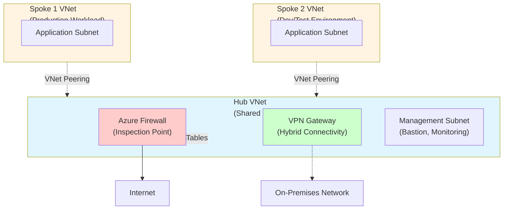

# Hub-Spoke Network Topology: Customer Talk Track

## 1. Executive Summary (Business-first)

For CIO/IT leadership, the Hub-Spoke Network Topology delivers:

- **Centralised security enforcement** — All network traffic flows through a single inspection point, reducing attack surface and simplifying compliance auditing.
- **Cost efficiency through shared services** — Consolidate expensive network appliances (firewalls, VPN gateways) in the hub, avoiding duplication across every workload.
- **Rapid environment provisioning** — New workloads connect to the hub in minutes without reconfiguring existing networks or security policies.
- **Simplified hybrid connectivity** — One connection point to on-premises networks serves all Azure workloads, reducing complexity and WAN costs.
- **Workload isolation with controlled communication** — Teams operate in isolated spokes with managed access to shared services, balancing security with agility.
- **Predictable network operations** — Centralised visibility and control mean fewer surprises, faster troubleshooting, and lower operational burden.

## 2. Business Problem Statement

Organisations struggle with three interconnected network challenges:

**Security fragmentation**: When each application team builds their own network, security controls become inconsistent. One misconfigured firewall rule exposes the entire estate. Security teams spend weeks auditing dozens of disparate network configurations, and every new workload increases audit complexity.

**Cost sprawl**: Deploying dedicated firewalls, VPN gateways, and network appliances for each environment creates redundant spending. A mid-sized organisation might pay for 10+ firewall instances when one would suffice, wasting tens of thousands annually on duplicate infrastructure.

**Operational complexity**: Without a standard network pattern, each workload becomes a unique snowflake. Network engineers field endless change requests, troubleshooting becomes archaeological work, and adding hybrid connectivity to a new workload requires weeks of planning and coordination.

**Business risk of inaction**: Fragmented networks slow down digital initiatives, increase breach likelihood, and create compliance gaps. Security incidents take longer to detect and contain, regulatory audits expose inconsistencies, and delayed time-to-market for new services impacts revenue.

## 3. Business Value & Outcomes

### Cost Optimisation
- **Eliminate redundant network appliances** — One Azure Firewall instance serves all spokes instead of per-workload firewalls, reducing licensing and operational costs by 60-80%.
- **Consolidate hybrid connectivity** — A single VPN/ExpressRoute connection serves all workloads, cutting WAN circuit costs and gateway expenses.
- **Optimise bandwidth usage** — Centralised egress through the firewall enables better traffic shaping and cost monitoring.

### Risk Reduction
- **Enforced security posture** — All inter-spoke and internet-bound traffic inspects through the hub firewall, preventing workload teams from bypassing security.
- **Reduced attack surface** — Isolated spokes with no direct peering limit lateral movement; compromising one spoke doesn't expose others.
- **Simplified compliance** — Centralised logging and inspection points make audit trails straightforward; demonstrate control in minutes, not weeks.

### Time-to-Market
- **Self-service workload deployment** — New teams provision spokes in minutes using templates, connecting instantly to shared services and hybrid networks.
- **Faster security approvals** — Standard hub-spoke pattern with pre-approved security controls eliminates per-project security reviews.
- **Rapid experimentation** — Dev/test spokes stand up quickly with production-grade network security, accelerating innovation cycles.

### Operational Efficiency
- **Single pane of glass** — Monitor all network traffic through one firewall interface; troubleshoot from a central point instead of jumping between workloads.
- **Standardised operations** — One network pattern means one runbook, predictable behaviour, and faster onboarding for new engineers.
- **Automated expansion** — Infrastructure-as-code templates add new spokes with zero manual network configuration.

### Scalability & Growth
- **Non-disruptive scaling** — Add new spokes without touching existing ones; the hub handles all coordination.
- **Support for 500+ spokes** — Azure VNet peering scales to support massive enterprise estates without redesign.
- **Future-proof architecture** — Easily integrate new Azure services, migrate workloads, or add connectivity options without rearchitecting the entire network.

## 4. Value-to-Metric Mapping (Table)

| Business Outcome | Example KPI/Metric | How Hub-Spoke Improves It |
|---|---|---|
| Reduced infrastructure costs | Monthly Azure network spend | Consolidate firewalls (1 vs. 10+) and gateways; typical 50-70% reduction in network appliance costs |
| Faster workload deployment | Time from request to production-ready network | Reduce from 2-4 weeks to 1-2 hours with templated spoke provisioning |
| Improved security posture | Number of network security incidents / time to detect | Centralised inspection catches threats faster; reduced lateral movement limits breach scope |
| Compliance readiness | Days to pass network audit | Centralised logs and controls reduce audit prep from weeks to days |
| Reduced operational burden | Network engineer hours per month on configuration | Standardised pattern cuts routine change requests by 60-80% |
| Hybrid connectivity efficiency | Cost per on-premises connection | One ExpressRoute/VPN serves all workloads; avoid $5K-50K per additional circuit |
| Team autonomy | Developer satisfaction / unblocked velocity | Teams self-serve network provisioning without waiting for central IT |
| Mean time to resolution (MTTR) | Minutes to diagnose network issues | Centralised firewall logs and flow analysis pinpoint problems in minutes vs. hours |

## 5. Customer Conversation Starters

Use these discovery questions to qualify hub-spoke relevance:

1. **"How many separate Azure virtual networks do you operate today, and who manages each one?"** — Reveals fragmentation and ownership complexity. If the answer is "more than 5" or "we're not sure," hub-spoke provides immediate value.

2. **"When you onboard a new application to Azure, how long does the network configuration take?"** — Quantifies time-to-market impact. Answers over one week indicate manual processes that hub-spoke automates.

3. **"Do your Azure workloads need to access on-premises resources? How do you provide that connectivity today?"** — Identifies hybrid needs. Multiple VPN connections or inconsistent hybrid access patterns signal opportunity.

4. **"How do you enforce network security policies across different applications or teams?"** — Exposes security gaps. "Each team handles their own" means inconsistent controls and audit risk.

5. **"Tell me about your last network security audit. How long did it take, and what were the findings?"** — Gauges compliance burden. Long audits or findings about inconsistent controls validate centralised security value.

6. **"What happens when one team needs to communicate with another team's Azure resources?"** — Reveals inter-workload communication complexity. Ad-hoc peering or internet hairpinning indicates poor architecture.

7. **"How do you monitor and troubleshoot network connectivity issues across your Azure estate?"** — Assesses operational maturity. "We check each VNet individually" highlights the value of centralised visibility.

## 6. Architecture Overview

The Hub-Spoke Network Topology organises your Azure network as a centralised connectivity model. Imagine a wheel: the hub is the axle, and spokes are the wheel segments radiating outward.

**The Hub** is a dedicated virtual network hosting shared services:
- **Azure Firewall** inspects all traffic between spokes, to the internet, and to on-premises networks
- **VPN Gateway or ExpressRoute** provides a single connection point to your on-premises data centre
- **Management services** like Azure Bastion, monitoring agents, or domain controllers serve all spokes

**The Spokes** are separate virtual networks, each hosting a discrete workload, team, or environment (e.g., Production Web App, Dev/Test Environment, HR Systems). Spokes peer to the hub but not to each other, ensuring isolation by default.

**Traffic Flow**: When Spoke 1 needs to communicate with Spoke 2, traffic routes through the hub firewall. The firewall inspects and logs the connection, enforcing security policies. Internet-bound traffic from any spoke also flows through the hub firewall, applying consistent egress filtering.

**Simplified Diagram**:

**Key Principles**:
- **No spoke-to-spoke peering** — Prevents unauthorised lateral movement
- **Hub as the single choke point** — All controlled traffic inspects through the firewall
- **Spokes are cattle, not pets** — Standardised, repeatable, disposable workload environments

## 7. Key Azure Services (What & Why)

### Azure Virtual Network (VNet)
**What**: Software-defined network providing isolated address space and subnets for Azure resources.  
**Why chosen**: VNets provide the foundational network isolation boundary. The hub-spoke pattern structures VNets to balance isolation (spokes) with shared connectivity (hub). Azure's native VNet peering offers low-latency, high-bandwidth connections without needing complex routing appliances.

### Azure Firewall
**What**: Managed, cloud-native firewall-as-a-service with built-in high availability and automatic scaling.  
**Why chosen**: Centralised inspection point for all spoke traffic. Eliminates need for third-party network virtual appliances in most scenarios, reducing cost and operational complexity. Built-in threat intelligence and logging integrate directly with Azure Monitor. Standard tier balances cost with essential features; Premium tier adds advanced threat protection for highly regulated workloads.

### VNet Peering
**What**: Non-transitive connection between two virtual networks enabling private IP communication over Azure's backbone.  
**Why chosen**: Provides low-latency connectivity between hub and spokes with no extra gateway or encryption overhead. Non-transitive property enforces the hub-spoke topology by preventing spokes from directly reaching each other.

### Route Tables (User-Defined Routes)
**What**: Custom routing rules that override Azure's default routing behaviour, directing traffic to specific next hops.  
**Why chosen**: Force spoke subnet traffic to route through the Azure Firewall (via 0.0.0.0/0 route with next hop = firewall IP). This ensures the firewall inspects all inter-spoke and internet-bound traffic, enforcing security policies.

### Network Security Groups (NSGs)
**What**: Stateful firewall rules applied at the subnet or network interface level, filtering inbound and outbound traffic.  
**Why chosen**: Provide defence-in-depth alongside Azure Firewall. NSGs enforce least-privilege access at the subnet level (e.g., deny internet inbound by default), while the hub firewall handles cross-spoke and egress filtering.

### VPN Gateway (Optional)
**What**: Managed IPsec VPN gateway connecting Azure to on-premises networks or remote clients.  
**Why chosen**: When hybrid connectivity is required, a single VPN Gateway in the hub serves all spokes via gateway transit. Avoids deploying separate gateways per spoke, reducing cost and management overhead. For production workloads, consider ExpressRoute for higher bandwidth and reliability.

## 8. Security, Risk & Compliance Value

### Security Posture Improvements
- **Centralised threat inspection**: All spoke traffic flows through the hub firewall, enabling detection of malicious activity, command-and-control traffic, and data exfiltration attempts. Security teams see all network flows in one place.
- **Prevented lateral movement**: Isolated spokes with no direct peering mean a compromised workload cannot directly reach others. Attackers must traverse the hub firewall, where detection and blocking occur.
- **Consistent policy enforcement**: Security rules defined once in the hub apply to all spokes automatically. No risk of one team accidentally disabling firewall rules or opening unintended ports.
- **Zero-trust foundation**: Default-deny network posture; spokes cannot communicate without explicit firewall rules. Supports least-privilege access principles.

### Compliance Alignment
- **Audit trail completeness**: Azure Firewall logs capture all network flows (source, destination, action) and integrate with Azure Monitor and SIEM tools. Demonstrate "who accessed what" for SOC 2, ISO 27001, or PCI DSS audits.
- **Simplified segmentation documentation**: Hub-spoke topology provides clear network diagrams and documented isolation boundaries, accelerating compliance assessments.
- **Centralised policy controls**: Compliance teams review one firewall ruleset instead of dozens, reducing audit time and finding rate.

### Risk Avoided
- **Data exfiltration prevention**: Egress filtering through the hub firewall blocks unauthorised data transfers to external endpoints.
- **Shadow IT network changes**: Centralised hub management prevents individual teams from bypassing security controls or creating unmonitored pathways.
- **Configuration drift**: Infrastructure-as-code deployment ensures spokes deploy consistently with approved security baselines; no manual configuration errors.

## 9. Reliability, Scale & Operational Impact

### High Availability Approach
- **Azure Firewall built-in HA**: Managed service with 99.95% SLA; automatically distributes across availability zones where supported. No manual failover configuration required.
- **VNet peering resilience**: Azure's backbone network handles peering traffic with built-in redundancy; no single point of failure.
- **Zone-redundant VPN Gateway option**: For critical hybrid connectivity, deploy zone-redundant gateway SKU (99.95% SLA vs. 99.9% for single-zone).

### Scaling Model
- **Horizontal spoke expansion**: Add new spokes without downtime or impact to existing workloads. Azure supports 500+ VNet peerings per hub VNet.
- **Firewall autoscaling**: Azure Firewall automatically scales throughput based on traffic patterns; no manual capacity planning for typical workloads.
- **Regional hub-spoke**: For global applications, deploy regional hub-spoke topologies and interconnect hubs via Azure Virtual WAN or VNet peering.

### Operational Burden Reduced
- **Single troubleshooting entry point**: Network issues start at the hub firewall logs. Flow logs, diagnostic queries, and connection monitoring pinpoint failures in minutes.
- **Automated provisioning**: Infrastructure-as-code templates deploy new spokes in 10-15 minutes with no manual networking steps. Developers self-serve through CI/CD pipelines or portals.
- **Reduced change request volume**: Standard spoke template covers 80% of use cases. Central network team focuses on hub optimisation, not routine spoke configurations.

## 10. Observability (What to Show in Demo)

### Azure Firewall Logs
**What to show**: Network rule log entries showing allowed/denied connections between spokes.  
**Business insight**: "This log proves all inter-workload traffic inspects through security controls. For compliance audits, we export these logs to your SIEM, providing complete network activity records."

### Flow Logs & Connection Monitor
**What to show**: NSG flow logs visualised in Azure Network Watcher, showing traffic patterns between subnets.  
**Business insight**: "These flow visualisations help you understand application dependencies and optimise performance. If a new spoke experiences connectivity issues, flow logs identify the problem in minutes instead of hours."

### Azure Monitor Workbooks
**What to show**: Pre-built Azure Firewall workbook displaying top traffic sources, denied connections, and threat intelligence hits.  
**Business insight**: "Your security team monitors network threats here in real-time. Spikes in denied connections trigger alerts, enabling proactive incident response."

### Cost Analysis
**What to show**: Azure Cost Management view filtered to hub-spoke resources, highlighting firewall, gateway, and bandwidth costs.  
**Business insight**: "Centralised firewall and gateway costs are shared across all workloads. As you add more spokes, per-workload network cost decreases, unlike a per-environment firewall model."

### Topology View (Azure Network Watcher)
**What to show**: Visual graph of hub VNet connected to multiple spoke VNets with peering relationships.  
**Business insight**: "This topology map provides instant clarity on network layout for new team members and auditors. No need to diagram manually; Azure visualises your hub-spoke architecture automatically."

## 11. Cost Considerations & Optimisation Levers

### Major Cost Drivers
1. **Azure Firewall**: Largest fixed cost (~$1.25/hour for Standard tier, ~$6,500/month base). Covers inspection for all spokes; cost per spoke decreases as you add workloads.
2. **VPN Gateway**: ~$0.29/hour for VpnGw1 (~$200/month). One-time deployment; cost shared across all spokes needing hybrid access.
3. **VNet peering bandwidth**: Ingress free; egress charged at ~$0.01/GB for cross-region or ~$0.005/GB in-region. Typically negligible for most workloads.
4. **Public IP addresses**: ~$3/month per static IP. Hub firewall and VPN gateway each require one.

### Optimisation Levers
- **Firewall tier**: Start with Standard tier for most workloads. Upgrade to Premium only if you require TLS inspection, IDPS, or advanced threat protection.
- **Deferred VPN Gateway**: If hybrid connectivity isn't immediately needed, deploy the gateway only when on-premises access is required. Saves ~$200/month.
- **Spoke consolidation**: Group related workloads (e.g., dev/test environments) into fewer spokes with multiple subnets to reduce peering overhead.
- **Traffic optimisation**: Minimise cross-region traffic; deploy regional hub-spoke topologies to keep traffic in-region and reduce bandwidth costs.
- **Reserved pricing**: For production deployments, consider Azure Reservations or Savings Plans to reduce firewall and gateway costs by up to 30%.

### Demo Guardrails
- **Default to deployFirewall=true and deployVpnGateway=false** to demonstrate core value without excessive cost. VPN Gateway adds 20-30 minutes to deployment time and ~$200/month ongoing cost.
- **Deploy to lower-cost regions** (e.g., East US, West Europe) for demos; avoid premium regions unless customer's workload requires it.
- **Set ttlHours tag** to enable automatic cleanup via Azure Policy or automation scripts. Demo environments should not run indefinitely.
- **Tear down immediately after demo** to avoid ongoing firewall charges. Include teardown in your demo script.

## 12. Deployment Experience (Demo Narrative)

### Pre-Demo Setup (Do Once)
Ensure your Azure subscription has sufficient quota for Standard tier Azure Firewall and at least 3 VNets in the target region. Confirm you have Contributor role on the subscription or target resource group.

### Deployment Narrative

**"I'm going to deploy a fully functional hub-spoke network topology in about 15 minutes. This includes a centralised hub with Azure Firewall, two isolated spoke networks for different workloads, and all the routing and peering configuration. In a traditional on-premises deployment, this architecture would take weeks to design, procure hardware, and configure. With Azure and infrastructure-as-code, we provision everything in minutes."**

**[Navigate to Azure Portal → Deploy to Azure button or GitHub Actions workflow]**

**"Notice I'm using a pre-built template maintained in our pattern catalogue. This is the same template our customers use in production, ensuring consistency between demos and real deployments. I'll set a few parameters:"**

- **Region**: "I'm choosing [region] for low latency and cost efficiency."
- **Prefix**: "I'll use 'demo' as the resource name prefix for easy identification."
- **Deploy Firewall**: "I'm enabling the Azure Firewall to demonstrate centralised security inspection."
- **Deploy VPN Gateway**: "I'm leaving this off to speed up the demo. In production, you'd enable this for hybrid connectivity."

**"The deployment creates five key components: the hub VNet with firewall, two spoke VNets, VNet peerings connecting spokes to the hub, and route tables directing traffic through the firewall. All resources include consistent tagging for governance and cost tracking, including a time-to-live tag so we can automatically clean up demo environments."**

**[Deployment in progress — 10-15 minutes]**

**"While Azure provisions the resources, let's discuss typical use cases. Spoke 1 might host your production web application, while Spoke 2 runs dev/test environments. The hub firewall sits between them, controlling which traffic is allowed. If your developers need to test against production-like data, you define a firewall rule permitting specific connections — nothing else flows between spokes."**

**[Deployment completes — show Resource Group]**

**"Deployment complete. You can see all resources in this resource group: three VNets, the firewall, public IPs, NSGs, and route tables. Everything is named consistently with the 'demo' prefix we specified. Total deployment time: 15 minutes. Total monthly cost for this demo environment: approximately $200-250, mostly the Azure Firewall. In production, as you add more spokes, the per-workload cost decreases since the firewall serves all of them."**

### Value to Reinforce During Deployment
- **Speed**: "This entire network architecture deployed in 15 minutes. Manual configuration would take days or weeks."
- **Consistency**: "Every deployment uses the same template, eliminating configuration drift and human error."
- **Security by default**: "Notice the firewall and NSGs deploy with deny-all defaults. We explicitly allow only necessary traffic, enforcing least-privilege access."
- **Cost transparency**: "Tags enable cost allocation to teams, workloads, or environments. Finance teams see exactly what each spoke costs."

## 13. 10-15 Minute Demo Script (Say / Do / Show)

### Segment 1: Architecture Overview (2 minutes)

**Say**: "Today I'll demonstrate the Hub-Spoke Network Topology, a proven Azure pattern for enterprises needing centralised security and scalable network operations. This architecture solves three problems: fragmented security controls, duplicated network costs, and complex hybrid connectivity. By the end, you'll see a fully deployed hub-spoke network with traffic inspection, workload isolation, and centralised monitoring."

**Do**: Display architecture diagram (Mermaid or PowerPoint slide).

**Show**: Highlight hub (shared services), spokes (isolated workloads), and traffic flows through the firewall.

---

### Segment 2: Initiate Deployment (1 minute)

**Say**: "I'm deploying from our Azure Pattern Demo Portal — a catalogue of production-ready reference architectures. The hub-spoke pattern includes complete infrastructure-as-code, security best practices, and cost optimisation. I'll click Deploy to Azure, select my subscription, and set parameters."

**Do**: Click "Deploy to Azure" button → Select subscription → Enter parameters (prefix, region, deployFirewall=true).

**Show**: Azure Portal deployment form with parameters filled in.

---

### Segment 3: Discuss Business Value While Deploying (8 minutes)

**Say**: "The deployment takes about 15 minutes. While Azure provisions resources, let's discuss the business value. This pattern reduces network infrastructure costs by 50-70% through consolidation. One Azure Firewall serves all spokes instead of deploying separate firewalls per workload. For a company with 10 workloads, that's one firewall instance instead of 10, saving tens of thousands annually."

**Do**: Navigate to Azure Portal → Resource Groups → Show deployment in progress.

**Show**: Deployment progress with resource creation status.

**Say**: "From a security perspective, centralised inspection means all inter-workload traffic logs through the hub firewall. Your security team monitors one location instead of chasing logs across dozens of VNets. For compliance audits — think SOC 2, ISO 27001, PCI DSS — this centralised logging accelerates audit preparation from weeks to days."

**Do**: Open Azure Monitor in a separate tab (pre-configured in another subscription) → Show Firewall Workbook with sample traffic logs.

**Show**: Azure Firewall logs displaying allowed/denied connections, top talkers, and threat intelligence hits.

**Say**: "Operationally, this pattern enables self-service. New teams provision spokes from templates without waiting for central IT to configure networking manually. Deployment time drops from weeks to hours. Developers move faster, and your network team focuses on hub optimisation instead of repetitive spoke requests."

**Do**: Show infrastructure-as-code template (Bicep file) in GitHub repository.

**Show**: Template parameters and structure, highlighting modularity.

**Say**: "Hybrid connectivity becomes simple. The hub hosts one VPN Gateway or ExpressRoute connection serving all spokes. No need to configure separate hybrid links for every application. You pay for one circuit and one gateway, not ten."

**Do**: Return to Azure Portal deployment → Check status (should be nearing completion).

---

### Segment 4: Explore Deployed Resources (3 minutes)

**Say**: "Deployment complete. Let's explore what Azure created. First, the hub VNet with three subnets: Azure Firewall Subnet, Gateway Subnet for hybrid connectivity, and Management Subnet for shared services like Bastion or monitoring."

**Do**: Navigate to Resource Group → Click hub VNet → Subnets blade.

**Show**: Hub VNet subnets with address ranges.

**Say**: "Next, the two spoke VNets. Each spoke peers to the hub but not to each other — isolation by default. If Spoke 1 needs to communicate with Spoke 2, traffic routes through the hub firewall where security policies apply."

**Do**: Click spoke1 VNet → Peerings blade.

**Show**: Peering connection to hub VNet with "Connected" status.

**Say**: "Here's the Azure Firewall. It has a public IP for internet egress and a private IP on the hub subnet. Spoke route tables direct all traffic to this private IP, forcing inspection."

**Do**: Click Azure Firewall resource → Overview blade.

**Show**: Firewall private IP address, public IP, and network rules configured.

**Say**: "Each spoke has a route table with a default route (0.0.0.0/0) pointing to the firewall. This ensures all internet-bound or cross-spoke traffic inspects through the hub. The firewall logs all connections, providing security visibility and audit trails."

**Do**: Click spoke1 route table → Routes blade.

**Show**: Route entry with next hop = firewall IP.

---

### Segment 5: Demonstrate Observability (1 minute)

**Say**: "Let's check the monitoring. Azure Firewall logs integrate with Azure Monitor. This workbook shows traffic patterns, denied connections, and threat intelligence hits. Security teams use this dashboard for real-time threat detection and post-incident analysis."

**Do**: Navigate to Azure Monitor → Workbooks → Azure Firewall Workbook.

**Show**: Traffic statistics, top source/destination IPs, denied connection logs.

**Say**: "For deeper troubleshooting, Network Watcher provides topology views, connection monitors, and NSG flow logs. If a spoke reports connectivity issues, flow logs pinpoint the problem in minutes."

**Do**: Navigate to Network Watcher → Topology.

**Show**: Visual graph of hub VNet connected to spoke VNets.

---

### Segment 6: Discuss Cost & Teardown (1 minute)

**Say**: "Cost-wise, this demo environment runs about $200-250 per month, mostly the Azure Firewall. As you add more spokes, the per-spoke cost decreases since the firewall serves all of them. For production, consider Azure Reservations to reduce firewall costs by up to 30%."

**Do**: Navigate to Azure Cost Management → Cost Analysis → Filter to demo resource group.

**Show**: Resource costs broken down by service (Firewall, VNets, Public IPs).

**Say**: "When you're done testing, delete the resource group to avoid ongoing charges. The entire environment disappears in minutes — another advantage of infrastructure-as-code. You can redeploy anytime from the template."

**Do**: Navigate to Resource Group → Delete resource group (optionally demonstrate).

**Show**: Confirmation prompt for deletion.

---

### Closing

**Say**: "In 15 minutes, we deployed a production-ready hub-spoke network with centralised security, workload isolation, and monitoring. This architecture reduces costs, accelerates workload onboarding, and simplifies compliance. The same template used in this demo goes straight into production. If you'd like to deploy this in your own subscription or discuss customisation for your specific requirements, let's talk next steps."

## 14. Common Objections & Business Responses

### Objection: "This looks expensive — Azure Firewall costs $200/month, and we have budget constraints."

**Response**: "Fair concern. Let's compare total cost of ownership. If you deploy firewalls per workload, you're paying $200/month times the number of workloads — potentially $2,000+/month for 10 environments. Hub-spoke consolidates to one firewall serving all, so your per-workload cost drops significantly. Additionally, centralised management reduces network engineer hours spent on configuration and troubleshooting, saving labour costs. For smaller workloads or non-production environments, we can discuss using Network Security Groups alone or deploying Firewall Basic SKU at lower cost."

---

### Objection: "Our network team is comfortable with traditional on-premises hub-spoke using NVAs. Why use Azure Firewall?"

**Response**: "Azure Firewall is a managed service, meaning Microsoft handles patching, scaling, and high availability automatically. With NVAs, you're responsible for deploying redundant instances, configuring load balancers, and maintaining OS patches — significant operational overhead. Azure Firewall integrates natively with Azure Monitor, Azure Security Center, and threat intelligence feeds, simplifying observability. For organisations with NVA expertise or specific feature requirements, the pattern supports replacing Azure Firewall with third-party NVAs while retaining the hub-spoke topology. We can discuss hybrid approaches where you use Azure Firewall for standard workloads and NVAs for specialised cases."

---

### Objection: "We're already using a flat network with all VNets peered to each other. Why change?"

**Response**: "Flat networks work fine at small scale but create security and operational challenges as you grow. Every VNet peers to every other VNet, creating a full-mesh that becomes unmanageable. Security policies apply individually to each peering, increasing configuration complexity and error risk. Compliance audits struggle with 'who can reach what' questions. Hub-spoke eliminates the mesh by centralising connectivity through the hub, where one firewall enforces all policies. If you're under 5 VNets and have no compliance requirements, flat might suffice. But as you scale, hub-spoke prevents future pain."

---

### Objection: "Our developers want direct spoke-to-spoke peering for low latency. Routing through the firewall adds hops."

**Response**: "Latency impact is typically sub-millisecond for Azure Firewall inspection, negligible for most applications. The security benefit — prevented lateral movement, logged traffic, enforced policies — outweighs the minimal latency cost. For extremely latency-sensitive applications (e.g., high-frequency trading, real-time gaming), we can selectively allow direct spoke peering for specific workloads while keeping others hub-routed. Most enterprises prioritise security over microseconds of latency. We can also load-test your specific application to quantify actual impact before making architecture decisions."

---

### Objection: "This pattern assumes all workloads are in one Azure region. What about multi-region?"

**Response**: "Excellent question. Hub-spoke works within a region; for multi-region deployments, you have two options. First, deploy independent hub-spoke topologies per region and interconnect the hubs via VNet peering or Azure Virtual WAN. This provides regional isolation with controlled cross-region traffic. Second, use Azure Virtual WAN as a global hub, connecting regional spoke VNets and on-premises sites through Microsoft's global network. We typically recommend starting with single-region hub-spoke, then expanding to multi-region as your workload distribution requires it. The pattern scales to both approaches."

---

### Objection: "We need to comply with regulations requiring network segmentation. Does this pattern meet compliance requirements?"

**Response**: "Yes, hub-spoke explicitly supports compliance-driven segmentation. Spokes are isolated by default with no direct communication; all inter-spoke traffic routes through the hub firewall where you log and control it. For stricter requirements (e.g., PCI DSS cardholder data environment), you can deploy dedicated spokes with no firewall rules permitting inbound connections from other spokes — air-gapped isolation while still accessing shared services in the hub. Audit logs from Azure Firewall and NSG flow logs provide evidence of segmentation enforcement. Many customers use this pattern to achieve SOC 2, ISO 27001, HIPAA, and PCI DSS compliance."

---

### Objection: "Infrastructure-as-code is new for us. We manually configure networks today. Is this pattern too complex?"

**Response**: "The template handles the complexity for you. You click 'Deploy to Azure', provide a few parameters (region, name prefix), and Azure provisions everything — no manual network configuration required. Once deployed, you manage the hub firewall through the Azure Portal, just like manually-created firewalls. For new spokes, you rerun the template with updated spoke count or use modular Bicep to add spoke resources individually. If you're transitioning from manual processes, we can start with template-based deployments while your team learns infrastructure-as-code gradually. The pattern reduces complexity compared to managing dozens of VNets manually."

---

## 15. Teardown & Cost Control

### Teardown Steps (Post-Demo)

1. **Navigate to the Resource Group** containing the hub-spoke deployment in the Azure Portal.
2. **Click "Delete resource group"** at the top of the Overview pane.
3. **Type the resource group name** to confirm deletion.
4. **Click "Delete"** and wait 5-10 minutes for Azure to remove all resources.

**Key point**: Deleting the resource group removes all contained resources (VNets, Firewall, Public IPs, NSGs, Route Tables) in one operation. No need to delete resources individually.

### Cost Hygiene Reminders

- **Set TTL tags on demo environments** — Use the `ttlHours` tag to indicate intended lifespan (e.g., `ttlHours: 24`). Implement Azure Policy or automation scripts to delete resource groups past their TTL automatically.
- **Monitor spend with cost alerts** — Configure Azure Cost Management budgets and alerts to notify you if demo environments exceed expected spend (e.g., alert at $300/month threshold).
- **Disable VPN Gateway for demos** — Unless hybrid connectivity demonstration is required, leave `deployVpnGateway=false` to avoid $200/month ongoing cost and 20-30 minute deployment time.
- **Stop after-hours costs** — For extended demos or pilot environments, consider deallocating non-essential resources (e.g., scale down firewall tier, pause VMs in spokes) outside business hours. Note: Azure Firewall cannot be deallocated; it must be deleted to stop charges.
- **Use lower-cost regions** — Deploy demos to East US, West Europe, or other low-cost regions unless customer's actual workload requires a specific geography.
- **Check for orphaned resources** — After deletion, verify the resource group no longer exists and no standalone resources (e.g., disks, IPs) remain in the subscription. Use Azure Resource Graph queries to detect orphans.

### Automation Options for Cost Control

For teams running frequent demos:

- **Azure Automation Runbooks**: Schedule runbooks to scan for resource groups with expired `ttlHours` tags and delete them automatically.
- **GitHub Actions workflow**: Create a scheduled workflow that queries Azure Resource Graph for demo environments and deletes those past their TTL.
- **Azure Policy (deny deployment)**: Prevent accidental creation of Azure Firewall Premium tier or VPN Gateway in demo subscriptions to avoid high costs.
- **Budget thresholds**: Set a monthly budget for demo activities (e.g., $500/month) with email alerts at 80% and 100% thresholds.

---

## Summary

This talk track provides a complete narrative for customer engagements, from executive-level business value to detailed deployment demonstrations. Use the sections modularly: pull executive summaries for CxO meetings, detailed architecture and demo scripts for technical audiences, and objection handling for sales conversations.

**Next Steps**: Customise the demo script to your customer's specific pain points, rehearse the 10-15 minute flow to stay on time, and always pre-deploy a reference environment before live demos to avoid unexpected deployment delays.
