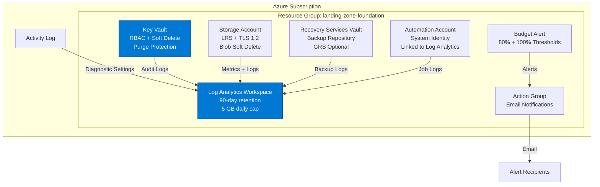

# Landing Zone Foundation

[](https://portal.azure.com/#create/Microsoft.Template/uri/https%3A%2F%2Fraw.githubusercontent.com%2Fyour-org%2FAzure-Infra-Demos%2Fmain%2Fpatterns%2Flanding-zone-foundation%2Fazuredeploy.json)

## Overview

Deploy a production-ready Azure governance foundation in 5 minutes. This pattern establishes centralized logging, secret management, backup infrastructure, cost controls, and activity monitoring—the essential building blocks every enterprise workload needs before going live.

**Category**: Governance & Operations  
**Services**: Log Analytics, Automation Account, Key Vault, Storage Account, Recovery Services Vault, Budget Alerts  
**Complexity**: Intermediate  
**Estimated Cost**: $15-30/day (~$450-900/month)  
**Deployment Time**: 5 minutes

## What Gets Deployed

This pattern creates a resource group with six core governance services:

1. **Log Analytics Workspace**: Centralized log aggregation with 90-day retention and 5 GB daily cap
2. **Automation Account**: Runbook execution for scheduled tasks and remediation workflows
3. **Key Vault**: Encrypted secret storage with RBAC, soft delete, and purge protection
4. **Storage Account**: Durable storage for logs, backups, and diagnostics (LRS, TLS 1.2)
5. **Recovery Services Vault**: Backup repository for VMs, file shares, and databases
6. **Budget Alert**: Cost monitoring with email notifications at 80% and 100% thresholds
7. **Action Group**: Alert routing for budget and monitoring notifications
8. **Activity Log Diagnostics**: Subscription-level audit trail sent to Log Analytics

All resources are configured with diagnostic settings that route logs and metrics to the central Log Analytics workspace.

## Architecture



## Prerequisites

- **Azure Subscription**: Contributor role or higher
- **Azure CLI**: Version 2.50.0 or later ([install guide](https://learn.microsoft.com/cli/azure/install-azure-cli))
- **Email Address**: For budget and alert notifications
- **Resource Group**: Create before deployment or use existing

## Deployment

### Option 1: Azure Portal (Deploy to Azure Button)

Click the **Deploy to Azure** button above and fill in the parameters:
- **Resource Group**: Select existing or create new
- **Location**: Azure region (e.g., `eastus`, `westeurope`)
- **Alert Email**: Email address for budget and alert notifications
- **Monthly Budget Amount**: Budget threshold in USD (default: $1,000)
- **Log Retention Days**: Log Analytics retention period (default: 90)

### Option 2: Azure CLI

```bash
# Set variables
RESOURCE_GROUP="rg-landing-zone-dev"
LOCATION="eastus"
ALERT_EMAIL="ops@contoso.com"
MONTHLY_BUDGET=1000

# Create resource group
az group create \
  --name $RESOURCE_GROUP \
  --location $LOCATION

# Deploy the pattern
az deployment group create \
  --resource-group $RESOURCE_GROUP \
  --template-file main.bicep \
  --parameters alertEmail=$ALERT_EMAIL \
               monthlyBudgetAmount=$MONTHLY_BUDGET \
               logRetentionDays=90 \
               prefix=demo
```

### Option 3: Using Parameter File

```bash
# Edit parameters/dev.parameters.json with your values
az deployment group create \
  --resource-group $RESOURCE_GROUP \
  --template-file main.bicep \
  --parameters @parameters/dev.parameters.json
```

## Parameters

| Parameter | Type | Default | Required | Description |
|-----------|------|---------|----------|-------------|
| `location` | string | (resource group location) | No | Azure region for deployment |
| `prefix` | string | `demo` | No | Prefix for resource naming |
| `alertEmail` | string | - | **Yes** | Email address for alert notifications |
| `logRetentionDays` | int | `90` | No | Log Analytics retention period (30-730 days) |
| `enableBudgetAlert` | bool | `true` | No | Enable budget alert and notifications |
| `monthlyBudgetAmount` | int | `1000` | No | Monthly budget threshold in USD |
| `tags` | object | (see below) | No | Resource tags for organization |

**Default Tags**:
```json
{
  "owner": "pattern-demo",
  "workload": "landing-zone-foundation",
  "environment": "demo",
  "ttlHours": "48"
}
```

## Post-Deployment Validation

Verify the deployment succeeded:

```bash
# List deployed resources
az resource list \
  --resource-group $RESOURCE_GROUP \
  --output table

# Get Log Analytics workspace ID
WORKSPACE_ID=$(az monitor log-analytics workspace show \
  --resource-group $RESOURCE_GROUP \
  --workspace-name log-demo-* \
  --query id -o tsv)

# Query activity logs (verify logging is working)
az monitor log-analytics query \
  --workspace $WORKSPACE_ID \
  --analytics-query "AzureActivity | take 10"

# Test Key Vault access
KV_NAME=$(az keyvault list \
  --resource-group $RESOURCE_GROUP \
  --query "[0].name" -o tsv)

az keyvault secret set \
  --vault-name $KV_NAME \
  --name test-secret \
  --value "Hello from Landing Zone"

az keyvault secret show \
  --vault-name $KV_NAME \
  --name test-secret \
  --query "value" -o tsv

# Verify budget alert
az consumption budget list \
  --resource-group $RESOURCE_GROUP \
  --output table
```

## Cost Breakdown

Estimated daily costs for deployed resources:

| Service | Daily Cost | Monthly Cost | Cost Driver |
|---------|-----------|--------------|-------------|
| Log Analytics Workspace | $5-15 | $150-450 | Data ingestion volume (per GB) |
| Automation Account | $0-5 | $0-150 | Runbook execution time (per minute) |
| Key Vault | $1-3 | $30-90 | Operations count (per 10,000) |
| Storage Account | $2-5 | $60-150 | Storage capacity + transactions |
| Recovery Services Vault | $0-10 | $0-300 | Protected instances + backup storage |
| Budget Alert | $0 | $0 | Free (included) |
| Action Group | $0 | $0 | Free for email (1,000/month) |
| **Total** | **$8-38** | **$240-1,140** | |

**Cost Optimization Tips**:
- Reduce Log Analytics retention from 90 to 30 days (saves ~60% on retention costs)
- Lower daily ingestion cap from 5 GB to 2 GB if usage is lower
- Use Storage lifecycle policies to move logs to Cool/Archive tiers
- Reduce backup retention for non-critical workloads
- Set budget threshold lower to catch cost growth earlier

**Note**: Costs scale with usage. A small development environment typically runs $15-20/day. Production environments with higher log volume and more backups can reach $30-40/day.

## Security & Compliance

This pattern implements security best practices aligned with compliance frameworks:

**Encryption**:
- All data encrypted at rest (Microsoft-managed keys)
- TLS 1.2 minimum enforced for all connections
- Key Vault soft delete (90 days) and purge protection enabled

**Identity & Access**:
- Automation Account uses system-assigned managed identity
- Key Vault uses Azure RBAC (not access policies)
- No credentials stored in code or configuration

**Audit & Logging**:
- Subscription activity logs captured (control plane operations)
- Resource diagnostic logs sent to Log Analytics
- 90-day retention meets SOC 2, ISO 27001, PCI-DSS baselines

**Data Protection**:
- Storage blob soft delete (7 days)
- Key Vault soft delete prevents accidental permanent deletion
- Recovery Services Vault ready for backup policies

**Compliance Mappings**:
- **SOC 2 Type II**: CC6.1 (encryption), CC6.2 (audit logging), CC6.3 (access controls)
- **ISO 27001**: A.9.4 (secret management), A.12.3 (backup), A.12.4 (log retention)
- **PCI-DSS**: 3.4 (encryption), 10.2 (audit trails), 10.3 (access logging)

## Next Steps

After deployment, consider these enhancements:

1. **Configure Backup Policies**:
   ```bash
   # Create VM backup policy (example)
   az backup policy create \
     --resource-group $RESOURCE_GROUP \
     --vault-name rsv-* \
     --name DailyVMBackup \
     --backup-management-type AzureIaasVM \
     --policy @backup-policy.json
   ```

2. **Deploy Automation Runbooks**:
   - Start/stop VMs on schedule (cost optimization)
   - Cleanup old snapshots (storage management)
   - Tag enforcement (governance)

3. **Create Log Analytics Queries**:
   - Security monitoring (failed login attempts)
   - Cost analysis (resource usage by tag)
   - Compliance reporting (audit trail queries)

4. **Extend with Private Endpoints** (for production):
   - Add VNet and subnet
   - Create private endpoints for Key Vault, Storage, Recovery Vault
   - Configure private DNS zones

5. **Integrate with Azure Policy**:
   - Require diagnostic settings on all resources
   - Enforce tag inheritance from resource group
   - Mandate TLS 1.2 minimum for Storage/Key Vault

6. **Enable Azure Defender** (Microsoft Defender for Cloud):
   - Defender for Key Vault (threat detection)
   - Defender for Storage (malware scanning)
   - Defender for Resource Manager (control plane protection)

## Cleanup

To remove all deployed resources and stop billing:

```bash
# Delete resource group (removes all resources)
az group delete --name $RESOURCE_GROUP --yes --no-wait

# Verify deletion
az group exists --name $RESOURCE_GROUP
# Output: false
```

**Important**: Key Vault has soft delete enabled with a 90-day retention period. Deleted vaults remain in a "soft-deleted" state and can be recovered or purged:

```bash
# List soft-deleted Key Vaults
az keyvault list-deleted --output table

# Purge soft-deleted Key Vault (permanent deletion)
az keyvault purge --name <keyvault-name>
```

**What Gets Deleted**:
- Log Analytics workspace (logs retained during soft-delete period)
- Automation Account and all runbooks
- Storage Account (soft-deleted blobs recoverable for 7 days)
- Recovery Services Vault (only if no protected items exist)
- Budget alerts (notifications stop immediately)

**Before Deleting**:
- Export critical runbooks to source control
- Back up important secrets from Key Vault
- Ensure Recovery Vault backups are no longer needed
- Export Log Analytics data if long-term retention required

## Troubleshooting

**Deployment fails with "Key Vault name already exists"**:
- Key Vault names are globally unique and may be soft-deleted
- Use `az keyvault list-deleted` to check
- Purge the deleted vault: `az keyvault purge --name <name>`
- Or choose a different `prefix` parameter

**Budget alert not sending emails**:
- Verify email address is correct in deployment parameters
- Check spam/junk folder for alert emails
- Confirm budget is scoped to correct resource group
- Budget alerts trigger when actual spend crosses thresholds (not projected)

**Log Analytics queries return no data**:
- Diagnostic settings take 5-10 minutes to start flowing data
- Check that resources have diagnostic settings configured
- Verify workspace ID is correct in queries
- Run `AzureActivity | take 10` to test basic connectivity

**Automation Account runbooks fail**:
- Ensure managed identity has appropriate RBAC roles
- Check runbook logs in Log Analytics: `AzureDiagnostics | where ResourceProvider == "MICROSOFT.AUTOMATION"`
- Verify PowerShell module versions are compatible

**Recovery Vault won't delete**:
- Protected items must be removed before vault deletion
- Navigate to Portal → Recovery Services Vault → Backup Items → Stop Protection
- Then delete backup data before removing vault

## Related Patterns

- **Hub-Spoke Network**: Extends this foundation with network connectivity
- **Azure Monitor Baseline**: Adds custom metrics, alerts, and dashboards
- **Zero Trust Network**: Implements private endpoints and network isolation
- **Compliance as Code**: Uses Azure Policy to enforce governance requirements

## Additional Resources

- [Microsoft Cloud Adoption Framework](https://learn.microsoft.com/azure/cloud-adoption-framework/)
- [Azure Landing Zones](https://learn.microsoft.com/azure/cloud-adoption-framework/ready/landing-zone/)
- [Log Analytics Workspace Design](https://learn.microsoft.com/azure/azure-monitor/logs/workspace-design)
- [Key Vault Best Practices](https://learn.microsoft.com/azure/key-vault/general/best-practices)
- [Azure Backup Architecture](https://learn.microsoft.com/azure/backup/backup-architecture)
- [Cost Management Best Practices](https://learn.microsoft.com/azure/cost-management-billing/costs/cost-mgt-best-practices)

## Support

For issues or questions:
- **Issues**: Open an issue in this repository
- **Discussions**: Use GitHub Discussions for questions
- **Talk Track**: See `talk-track.md` for detailed presentation guidance
- **Microsoft Docs**: [Azure Architecture Center](https://learn.microsoft.com/azure/architecture/)

## License

This pattern is provided as-is under the MIT License. See LICENSE file for details.

---

**Maintained by**: Azure Patterns Team  
**Last Updated**: 2024  
**Version**: 1.0.0
