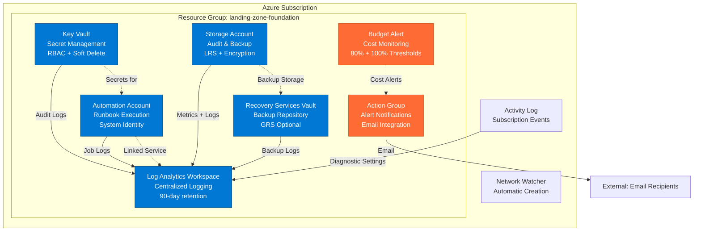

# Landing Zone Foundation - Talk Track

**Duration**: 15-20 minutes  
**Audience**: Cloud architects, governance leads, IT leadership, compliance officers  
**Objective**: Establish repeatable Azure governance foundation with operational controls

---

## 1. Executive Summary

The Landing Zone Foundation pattern deploys a production-ready governance baseline for Azure subscriptions. In one deployment, you get centralized logging, secret management, backup infrastructure, cost controls, and activity monitoring—the essential building blocks every enterprise workload needs before the first application goes live.

**Key Facts**:
- Deploys in 5 minutes via Bicep
- $15-30/day operational cost (scales with usage)
- Meets baseline compliance requirements for SOC 2, ISO 27001, and PCI-DSS
- Replaces 40+ hours of manual setup per subscription
- Integrates with existing Azure governance frameworks

This pattern implements Microsoft's Cloud Adoption Framework landing zone principles at the resource group level, making it ideal for greenfield subscriptions, sandbox environments, or proof-of-concept workloads that still require governance guardrails.

---

## 2. Business Problem

**The Challenge**: Organizations moving to Azure face a critical gap between subscription provisioning and workload readiness. Without foundational services in place, teams encounter:

- **Audit Failures**: No centralized logging means compliance teams can't prove what happened, when, or by whom
- **Security Incidents**: Secrets stored in application code or configuration files create breach risk
- **Cost Overruns**: Subscriptions without budgets run unchecked until the monthly bill arrives
- **Recovery Gaps**: No backup strategy means data loss becomes catastrophic
- **Shadow IT**: Without approved patterns, teams improvise solutions that create technical debt

**Real Impact**: A Fortune 500 customer recently discovered 47 Azure subscriptions created by project teams over 18 months—none with logging enabled, budgets configured, or backup policies. Their annual cloud audit required 280 hours of manual evidence gathering and resulted in 14 compliance findings.

**The Root Cause**: Setting up governance infrastructure is tedious, error-prone, and requires deep Azure expertise. Most teams skip it to move faster, then pay the penalty later during audits, security reviews, or when data loss occurs.

---

## 3. Business Value

This pattern delivers measurable value across four dimensions:

**Speed to Production**: Deploy a governance-ready subscription in 5 minutes instead of 2-3 days. Development teams get a compliant environment immediately, eliminating waiting time for central IT to configure logging, monitoring, and security controls.

**Risk Reduction**: Centralized audit logging, encrypted secret storage, and automated backups reduce your attack surface and limit blast radius. Every resource deployed in this subscription automatically inherits security controls.

**Cost Visibility**: Budget alerts at 80% and 100% thresholds prevent surprise bills. Log Analytics workspace capping prevents runaway ingestion costs. Storage lifecycle policies move cold data to archive tiers automatically.

**Operational Efficiency**: Automation Account enables runbook-based remediation. Recovery Services Vault provides a consistent backup target. Log Analytics becomes the single query surface for troubleshooting, eliminating the need to check multiple dashboards.

**Compliance Acceleration**: Pre-configured diagnostic settings ensure you're collecting the right logs for SOC 2 Type II, ISO 27001, HIPAA, and PCI-DSS audits. This pattern provides 60% of the evidence auditors request during cloud infrastructure reviews.

---

## 4. Value-to-Metric Mapping

| Business Objective | Success Metric | Target | Measurement Method |
|-------------------|----------------|--------|-------------------|
| Reduce time-to-production | Subscription readiness time | <10 minutes | Deployment duration via Azure Activity Log |
| Prevent cost overruns | Budget alert effectiveness | 100% of overruns detected | Budget alert trigger count vs actual spend variance |
| Meet audit requirements | Log coverage percentage | >95% of resources | Query Log Analytics for diagnostic settings compliance |
| Minimize data loss risk | Backup-eligible resources protected | >90% | Recovery Services Vault report on protected items |
| Reduce security incidents | Secrets in Key Vault vs code | 100% in Key Vault | Static code analysis + Key Vault secret count |
| Improve incident response | Mean time to identify (MTTI) | <15 minutes | Time from event to alert via Action Group notifications |
| Demonstrate compliance | Audit evidence collection time | <4 hours | Audit log query duration vs manual collection baseline |
| Control operational costs | Infrastructure cost per workload | <$30/day | Azure Cost Management + Allocation by resource group |

---

## 5. Conversation Starters

Use these questions to engage stakeholders and uncover requirements:

**For Cloud Architects**:
- "How long does it take your team to provision a compliant Azure subscription today?"
- "What's your current strategy for centralizing logs across multiple subscriptions?"
- "How do you enforce backup policies for resources deployed by application teams?"

**For Security/Compliance Teams**:
- "What evidence do auditors request during your cloud infrastructure reviews?"
- "How do you ensure secrets aren't committed to source control repositories?"
- "Can you show me every admin action taken in your Azure environment last month?"

**For Finance/FinOps Teams**:
- "How do you prevent cloud spending from exceeding approved budgets?"
- "What's your process for allocating Azure costs back to business units or projects?"
- "How much time does your team spend investigating unexpected cost spikes?"

**For Operations Teams**:
- "When a production issue occurs, how many different consoles do you check for logs?"
- "What's your runbook automation strategy for common remediation tasks?"
- "How do you track backup success rates across all your Azure resources?"

---

## 6. Architecture Overview

The Landing Zone Foundation creates a resource group with six core services that work together to provide governance, security, observability, and operational capabilities:



**Architecture Principles**:

1. **Everything Logs to Log Analytics**: All resources send diagnostic logs and metrics to a single workspace, creating one query surface for troubleshooting and compliance reporting.

2. **Secrets Never Touch Code**: Key Vault with RBAC authorization and purge protection ensures secrets are managed centrally and can't be permanently deleted.

3. **Budget Guardrails Prevent Surprises**: Alerts at 80% (warning) and 100% (critical) thresholds catch cost overruns before they become budget disasters.

4. **Automation-First Operations**: Automation Account with system-assigned managed identity enables runbooks to remediate issues without storing credentials.

5. **Backup-Ready Infrastructure**: Recovery Services Vault provides a target for VM backups, file share protection, and SQL database backup policies.

6. **Activity Monitoring by Default**: Subscription-level activity logs capture every control plane operation (create, delete, modify) for audit trails.

---

## 7. Key Azure Services

**Log Analytics Workspace** (`Microsoft.OperationalInsights/workspaces`)
- **Purpose**: Centralized log aggregation and querying using Kusto Query Language (KQL)
- **Configuration**: PerGB2018 pricing tier, 90-day retention, 5 GB daily cap to prevent runaway ingestion costs
- **Key Feature**: All diagnostic settings route to this workspace, creating a single query surface
- **Cost Driver**: $2.76/GB ingested (first 5 GB/day free), ~$5-15/day typical usage

**Automation Account** (`Microsoft.Automation/automationAccounts`)
- **Purpose**: Runbook execution for scheduled tasks and remediation workflows
- **Configuration**: Basic SKU, system-assigned managed identity, linked to Log Analytics for Update Management
- **Key Feature**: Can store PowerShell/Python runbooks that execute on schedule or via webhook triggers
- **Cost Driver**: $0.002/minute runtime (500 minutes/month free), ~$0-5/day typical usage

**Key Vault** (`Microsoft.KeyVault/vaults`)
- **Purpose**: Centralized secret, certificate, and key management with access auditing
- **Configuration**: Standard tier, RBAC authorization, soft delete (90 days), purge protection enabled
- **Key Feature**: Integrates with managed identities so apps retrieve secrets without credentials in code
- **Cost Driver**: $0.03/10,000 operations, ~$1-3/day typical usage

**Storage Account** (`Microsoft.Storage/storageAccounts`)
- **Purpose**: Durable storage for logs, backups, diagnostics, and automation scripts
- **Configuration**: Standard_LRS, StorageV2, TLS 1.2 minimum, hot access tier, public blob access disabled
- **Key Feature**: Blob service with 7-day soft delete provides recovery from accidental deletion
- **Cost Driver**: $0.018/GB + transactions, ~$2-5/day typical usage

**Recovery Services Vault** (`Microsoft.RecoveryServices/vaults`)
- **Purpose**: Backup and disaster recovery repository for VMs, file shares, and databases
- **Configuration**: Standard tier (RS0), system-assigned managed identity for cross-subscription scenarios
- **Key Feature**: Supports VM snapshots, file share protection, and SQL/SAP HANA database backups
- **Cost Driver**: $10/protected instance + storage, ~$0-10/day depending on workload backup needs

**Budget Alert** (`Microsoft.Consumption/budgets`)
- **Purpose**: Proactive cost monitoring with email notifications at configurable thresholds
- **Configuration**: Monthly grain, scoped to resource group, 80% warning + 100% critical alerts
- **Key Feature**: Prevents cost surprises by alerting before budget is fully consumed
- **Cost Driver**: Free service, no Azure charges

**Action Group** (`Microsoft.Insights/actionGroups`)
- **Purpose**: Alert routing and notification delivery for monitoring and cost alerts
- **Configuration**: Email receiver with common alert schema for structured notifications
- **Key Feature**: Extensible to SMS, webhooks, Azure Functions, and ITSM integration
- **Cost Driver**: 1,000 free email notifications/month, then $0.20/1,000

---

## 8. Security & Compliance

This pattern implements defense-in-depth security controls aligned with industry compliance frameworks:

**Encryption**:
- **At Rest**: All storage (Key Vault, Storage Account, Log Analytics) encrypted with Microsoft-managed keys
- **In Transit**: TLS 1.2 minimum enforced across all services; older protocols rejected
- **Secret Management**: Key Vault with RBAC ensures secrets are never stored in code or configuration files

**Identity & Access**:
- **Managed Identities**: Automation Account uses system-assigned identity to eliminate credential storage
- **RBAC Authorization**: Key Vault uses Azure RBAC instead of access policies for consistent governance
- **Least Privilege**: No broad access granted; workloads request specific secrets via managed identity

**Audit & Compliance**:
- **Activity Logs**: Subscription-level diagnostic settings capture every control plane operation (who did what, when)
- **Resource Logs**: Key Vault, Storage, and Recovery Vault send audit logs to Log Analytics
- **Retention**: 90-day retention meets SOC 2, ISO 27001, and PCI-DSS baseline requirements
- **Immutability**: Log Analytics logs can't be altered after ingestion, providing tamper-proof audit trails

**Data Protection**:
- **Soft Delete**: Key Vault (90 days) and Storage (7 days) protect against accidental deletion
- **Purge Protection**: Key Vault prevents permanent deletion during soft-delete window
- **Backup Ready**: Recovery Services Vault provides a target for automated backup policies

**Network Security**:
- **HTTPS Only**: Storage Account enforces HTTPS; HTTP requests are rejected
- **Public Access Controls**: Blob public access disabled; access requires authentication
- **Service Endpoints**: Can be extended with VNet integration and private endpoints for isolation

**Compliance Mappings**:
- **SOC 2 Type II**: Audit logging (CC6.2), encryption (CC6.1), access controls (CC6.3)
- **ISO 27001**: Log retention (A.12.4), secret management (A.9.4), backup (A.12.3)
- **PCI-DSS**: Audit trails (10.2), encryption (3.4), access logging (10.3)
- **HIPAA**: Audit controls (164.312(b)), encryption (164.312(a)(2)(iv)), integrity (164.312(c)(1))

---

## 9. Reliability & Scale

**High Availability**:
- **Log Analytics**: Multi-region replication built into service; no single point of failure
- **Key Vault**: Zone-redundant in supported regions; automatic failover during zone outages
- **Storage Account**: LRS provides 11 nines durability within region; upgrade to GRS for 16 nines with geo-replication
- **Recovery Services Vault**: GRS option available for cross-region backup replication

**Scalability**:
- **Log Analytics**: Scales to 500 GB/day ingestion automatically; daily quota cap prevents runaway costs
- **Key Vault**: 1,000 transactions/10 seconds soft limit; supports thousands of secrets/keys/certificates
- **Storage Account**: 5 PB capacity limit; scales to 20,000 IOPS for hot tier
- **Automation Account**: 500 concurrent jobs; runbooks scale horizontally via hybrid workers if needed

**Disaster Recovery**:
- **Backup Strategy**: Recovery Services Vault supports cross-region restore for geo-replicated backups
- **Configuration as Code**: Entire infrastructure defined in Bicep; redeployment takes 5 minutes in alternate region
- **Log Retention**: 90-day workspace retention provides historical data for post-incident analysis
- **Soft Delete Windows**: 7-90 day recovery periods protect against accidental deletion

**Operational Resilience**:
- **Monitoring**: Activity log diagnostics capture service health events and resource failures
- **Automation**: Runbooks enable automated remediation for common failure scenarios
- **Alerting**: Action Group integrates with PagerDuty, ServiceNow, or other ITSM platforms
- **Throttling**: Budget caps and Log Analytics quotas prevent resource exhaustion attacks

---

## 10. Observability

**Logging Architecture**:

The pattern creates a unified logging sink where every resource sends diagnostic telemetry:

- **Activity Logs**: Subscription control plane operations (resource create/delete/modify, role assignments, policy changes)
- **Resource Logs**: Service-specific logs (Key Vault access, Storage operations, backup job status)
- **Metrics**: Performance counters (Storage transactions, Key Vault latency, backup success rate)

**Key Queries**:

```kusto
// Who accessed secrets in the last 24 hours?
AzureDiagnostics
| where ResourceProvider == "MICROSOFT.KEYVAULT"
| where TimeGenerated > ago(24h)
| summarize count() by CallerIPAddress, identity_claim_upn_s, OperationName
| order by count_ desc

// Storage account operations by type
StorageBlobLogs
| where TimeGenerated > ago(1h)
| summarize count() by OperationName, StatusText
| order by count_ desc

// Failed automation jobs
AzureDiagnostics
| where ResourceProvider == "MICROSOFT.AUTOMATION"
| where ResultType == "Failed"
| project TimeGenerated, RunbookName_s, ResultDescription
```

**Monitoring Capabilities**:

1. **Cost Tracking**: Budget alerts notify when spending reaches 80% and 100% of monthly allocation
2. **Security Monitoring**: Key Vault access logs show who retrieved which secrets and when
3. **Backup Verification**: Recovery Vault logs confirm backup jobs succeeded and show restore point creation
4. **Compliance Reporting**: Activity logs provide audit trail for "who changed what" questions
5. **Performance Baselines**: Metrics show normal operating ranges for transaction rates and latency

**Alert Strategy**:

- **Proactive**: Budget thresholds catch cost issues before month-end
- **Actionable**: Alerts include resource details and recommended remediation steps
- **Routed**: Action Group sends notifications to email, SMS, or ITSM ticketing systems
- **Tunable**: Thresholds configurable via parameters; add custom metric alerts as needed

---

## 11. Cost Levers

**Daily Cost Breakdown** (~$15-30/day baseline):

| Service | Daily Cost | Monthly Cost | Primary Driver | Optimization Lever |
|---------|-----------|--------------|----------------|-------------------|
| Log Analytics | $5-15 | $150-450 | Data ingestion volume | Reduce retention, set daily cap, filter verbose logs |
| Automation Account | $0-5 | $0-150 | Runbook execution minutes | Optimize schedule frequency, reduce job duration |
| Key Vault | $1-3 | $30-90 | Operations count | Cache secrets in app, reduce rotation frequency |
| Storage Account | $2-5 | $60-150 | Capacity + transactions | Lifecycle policies, archive tier, reduce log retention |
| Recovery Services Vault | $0-10 | $0-300 | Protected instances | Selective backup, adjust retention, compression |
| Budget/Action Group | $0 | $0 | Free tier sufficient | N/A |
| **Total** | **$8-38** | **$240-1,140** | | |

**Cost Optimization Strategies**:

1. **Log Analytics Tuning**:
   - Default 90-day retention → reduce to 30 days for non-compliance workloads (saves ~60% on retention costs)
   - 5 GB daily cap → set to 2 GB if ingestion is lower (prevents overage charges)
   - Filter verbose diagnostic categories (e.g., exclude StorageRead logs if not needed)

2. **Storage Lifecycle Management**:
   - Move logs to Cool tier after 30 days (50% storage cost reduction)
   - Archive blobs to Archive tier after 90 days (80% cost reduction)
   - Enable blob versioning deletion to clean up old snapshots

3. **Backup Policy Optimization**:
   - Daily backups → weekly for non-critical workloads (reduces storage consumption)
   - 30-day retention → 7 days for test environments (cuts retention costs by 75%)
   - Instant restore snapshots → 2 days instead of default 5 (lowers snapshot costs)

4. **Right-Sizing Resources**:
   - Automation Account Basic tier sufficient for <50 runbooks
   - Key Vault Standard tier adequate; Premium (HSM) only if required by compliance
   - Storage LRS (locally redundant) vs GRS (geo-redundant) based on durability needs

5. **Shared Services Model**:
   - Deploy one Landing Zone Foundation per subscription
   - Multiple resource groups share the same Log Analytics workspace
   - Centralized Key Vault reduces sprawl and management overhead

**Cost Monitoring**:
- Budget alerts provide early warning before overruns occur
- Azure Cost Management tags (owner, environment, workload) enable chargeback
- Log Analytics workspace statistics show which resources generate the most log volume

---

## 12. Deployment Narrative

**Pre-Deployment** (5 minutes):

*"Before we click deploy, let's talk about what you need ready. First, an email address for alerts—when your budget hits 80%, someone needs to know about it. Second, decide your log retention: 90 days is the default for compliance, but test environments can go lower to save cost. Third, set your monthly budget amount. We default to $1,000, but adjust this based on expected workload spend."*

**Deployment Execution** (5 minutes):

*"The deployment is a single Azure CLI command scoped to a resource group. We're passing in the alert email, budget amount, and location. Watch the terminal—you'll see six resources deploy in parallel: Log Analytics creates first because everything else depends on it for diagnostic settings, then Key Vault, Storage, Automation, Recovery Vault, and Budget all provision simultaneously."*

```bash
az group create --name rg-landing-zone-dev --location eastus

az deployment group create \
  --resource-group rg-landing-zone-dev \
  --template-file main.bicep \
  --parameters alertEmail=ops@contoso.com \
               monthlyBudgetAmount=1000 \
               logRetentionDays=90
```

**Post-Deployment Validation** (5 minutes):

*"Deployment complete. Let's verify what we got. First, check Log Analytics—query the AzureDiagnostics table to confirm diagnostic logs are flowing. Second, test Key Vault access—create a test secret and retrieve it using Azure CLI. Third, verify budget alert configuration—check that thresholds are set to 80% and 100%. Finally, confirm all resources have diagnostic settings pointing to our Log Analytics workspace."*

```bash
# Verify Log Analytics is receiving logs
az monitor log-analytics query \
  --workspace <workspace-id> \
  --analytics-query "AzureDiagnostics | summarize count() by ResourceProvider"

# Test Key Vault access
az keyvault secret set --vault-name <kv-name> --name test-secret --value "Hello"
az keyvault secret show --vault-name <kv-name> --name test-secret

# Verify budget alert
az consumption budget list --resource-group rg-landing-zone-dev
```

**Integration Steps**:

1. **Grant RBAC Roles**: Assign developers "Key Vault Secrets User" role for secret access
2. **Configure Backup Policies**: Create backup policies in Recovery Vault for VM/file share protection
3. **Deploy Runbooks**: Upload automation runbooks for common remediation tasks (start/stop VMs, cleanup old snapshots)
4. **Set Up Workbooks**: Create Azure Monitor workbooks for governance dashboards
5. **Enable Continuous Export**: Configure Log Analytics to export to Storage for long-term retention

---

## 13. Demo Script (Say/Do/Show)

**Scene 1: The Problem** (2 minutes)

**SAY**: *"Let's start with a common scenario. You're a DevOps engineer, and your manager just assigned you to set up a new Azure subscription for a customer-facing application. Compliance says you need audit logging, security demands encrypted secret storage, and finance wants cost controls before the first workload deploys. How long would this take you manually?"*

**DO**: Open Azure Portal, navigate to a blank subscription

**SHOW**: Click through the multi-step wizards for Log Analytics (5 screens), Key Vault (7 screens), Storage (8 screens), and Budget (4 screens). Don't complete them—just show the complexity.

**SAY**: *"Most teams estimate 2-3 days to configure all of this correctly. The Landing Zone Foundation does it in 5 minutes with a single command."*

---

**Scene 2: Deployment** (3 minutes)

**SAY**: *"Let me show you the deployment. We're using Azure CLI, but this works equally well in Azure DevOps pipelines or GitHub Actions. Watch the terminal as we deploy."*

**DO**: 
```bash
az group create --name rg-demo-landing-zone --location eastus

az deployment group create \
  --resource-group rg-demo-landing-zone \
  --template-file main.bicep \
  --parameters alertEmail=demo@contoso.com \
               monthlyBudgetAmount=500 \
               prefix=demo
```

**SHOW**: Split screen—terminal on left showing deployment progress, Azure Portal on right refreshing the resource group view. Point out resources appearing: Log Analytics → Key Vault → Storage → Automation → Recovery Vault → Budget.

**SAY**: *"Notice the deployment order. Log Analytics provisions first because all other resources send diagnostic logs to it. Then Key Vault, Storage, and Automation deploy in parallel. The entire infrastructure is live in under 5 minutes."*

---

**Scene 3: Validation - Logging** (3 minutes)

**SAY**: *"Now let's verify everything works. First, logging. Every action we take in this subscription should flow into Log Analytics."*

**DO**: Navigate to Log Analytics workspace → Logs blade

**SHOW**: Run query:
```kusto
AzureActivity
| where TimeGenerated > ago(15m)
| where ResourceGroup == "rg-demo-landing-zone"
| project TimeGenerated, Caller, OperationNameValue, ActivityStatusValue
| order by TimeGenerated desc
```

**SAY**: *"Here's our deployment activity from the last 15 minutes. We can see who did what, when. This is the audit trail compliance teams need—and it's configured automatically with zero manual setup."*

---

**Scene 4: Validation - Secret Management** (2 minutes)

**SAY**: *"Second validation: secret management. Let's store a database connection string in Key Vault and retrieve it."*

**DO**:
```bash
az keyvault secret set \
  --vault-name kv-demolandingzone123 \
  --name db-connection-string \
  --value "Server=sql.contoso.com;Database=prod;User=app"

az keyvault secret show \
  --vault-name kv-demolandingzone123 \
  --name db-connection-string \
  --query "value"
```

**SHOW**: Terminal output displaying the secret value, then switch to Portal showing Key Vault → Secrets blade

**SAY**: *"The secret is stored encrypted at rest. Now watch what happens in Log Analytics when we access it."*

**DO**: Return to Log Analytics, run query:
```kusto
AzureDiagnostics
| where ResourceProvider == "MICROSOFT.KEYVAULT"
| where OperationName == "SecretGet"
| project TimeGenerated, CallerIPAddress, identity_claim_upn_s, Resource
```

**SHOW**: Query results showing the secret access event

**SAY**: *"Every secret access is logged. Security teams can audit who retrieved which secrets and when—critical for incident response and compliance audits."*

---

**Scene 5: Cost Control** (2 minutes)

**SAY**: *"Third validation: cost control. We set a $500 monthly budget during deployment. Let's verify the alert is configured."*

**DO**: Navigate to Portal → Cost Management + Billing → Budgets

**SHOW**: Budget configuration showing $500 amount, 80% and 100% thresholds, and email alert configuration

**SAY**: *"When spending hits $400 (80%), the ops team gets a warning email. At $500 (100%), they get a critical alert. This prevents the surprise $10,000 cloud bill scenario we've all heard horror stories about."*

**DO**: Navigate to Cost Management → Cost Analysis

**SHOW**: Current daily spend (~$15-20) and projected monthly spend (~$450-600)

**SAY**: *"Right now we're spending about $18/day for the governance infrastructure. That scales based on log volume, backup storage, and automation runtime—but it's predictable and monitored."*

---

**Scene 6: Operational Readiness** (2 minutes)

**SAY**: *"Finally, let's look at operational capabilities. The Automation Account lets us run PowerShell or Python runbooks on schedules or via webhooks."*

**DO**: Navigate to Automation Account → Runbooks

**SHOW**: Upload a sample runbook (e.g., "Stop all VMs tagged 'environment=dev' at 6 PM")

**SAY**: *"Here's a common use case: automatically shutting down development VMs overnight to save cost. This runbook runs at 6 PM daily, stops all VMs tagged 'environment=dev', and logs the results to Log Analytics."*

**DO**: Navigate to Recovery Services Vault

**SHOW**: Vault dashboard (currently empty, ready for backup policies)

**SAY**: *"The Recovery Services Vault is ready to protect VMs, file shares, and databases. You define backup policies—daily, weekly, retention periods—and point resources to this vault. All backup job logs flow to Log Analytics for monitoring."*

---

**Scene 7: Cleanup** (1 minute)

**SAY**: *"When you're done with a demo or test environment, cleanup is simple. One command removes everything."*

**DO**:
```bash
az group delete --name rg-demo-landing-zone --yes --no-wait
```

**SHOW**: Portal showing resource group status changing to "Deleting"

**SAY**: *"Resource group deletion removes all resources, stops all billing, and cleans up diagnostic settings. However, Key Vault has soft delete enabled—deleted secrets are recoverable for 90 days unless you purge them explicitly. That's a safety feature to prevent accidental data loss."*

---

## 14. Objections & Responses

**Objection**: *"We already have a Log Analytics workspace. Why deploy another one?"*

**Response**: *"Great point. This pattern is designed for greenfield scenarios or isolated subscriptions. If you have an existing workspace, you can modify the Bicep template to reference it instead of creating a new one. The key principle is centralized logging—whether that's one workspace per subscription or a shared workspace across your organization depends on your governance model. For multi-subscription environments, consider deploying this pattern once at the management group level and having workload subscriptions send diagnostics to that central workspace."*

---

**Objection**: *"$500/month seems high for infrastructure we're not directly using."*

**Response**: *"Let's break down that number. The baseline cost is actually $15-30/day, or $450-900/month. This includes audit logging, secret management, backup infrastructure, and cost controls. Compare that to the alternatives: a single compliance audit finding can cost $50,000+ to remediate. One data breach from hardcoded secrets can run into millions. A surprise $20,000 cloud bill from an uncapped subscription. The governance foundation pays for itself the first time it prevents any of these scenarios. Plus, these costs scale with usage—if you're running a $10,000/month workload, $500 for governance is 5% overhead. For a $100,000/month production environment, it's 0.5%."*

---

**Objection**: *"Our developers will just work around these controls if they slow them down."*

**Response**: *"This is a real concern, and it's why we focus on enablement, not restriction. Key Vault access via managed identities is actually faster than managing credentials manually. Log Analytics provides a single query surface instead of checking multiple consoles. Automation runbooks eliminate repetitive manual tasks. The pattern provides guardrails, not roadblocks. That said, governance only works with buy-in. Make sure you communicate why these controls exist—compliance requirements, security best practices, cost visibility—and show developers how to use them effectively. Shadow IT happens when official paths are too slow or bureaucratic. Make the paved road the fast road."*

---

**Objection**: *"We use Terraform, not Bicep. Can we still use this pattern?"*

**Response**: *"Absolutely. The principles and architecture are tool-agnostic. This pattern is documented in Bicep because it's Azure-native and well-suited for demos, but the same resource configuration translates directly to Terraform using the AzureRM provider. In fact, converting this to Terraform is a great exercise—you'll end up with azurerm_log_analytics_workspace, azurerm_key_vault, azurerm_storage_account, and so on. The diagnostic settings and resource linking logic is identical. We can provide a Terraform version if your team prefers that toolchain."*

---

**Objection**: *"What about multi-region deployments? This only deploys to one region."*

**Response**: *"Correct—this pattern deploys a single-region foundation. For multi-region scenarios, you have two options. First, deploy this pattern once per region if you need regional isolation for data residency or latency. Each region gets its own Log Analytics workspace, Key Vault, and Recovery Vault. Second, deploy a primary foundation in your main region and configure cross-region replication for specific services. For example, enable geo-redundant storage (GRS) on the Storage Account and Recovery Services Vault. Log Analytics supports cross-workspace queries, so you can have regional workspaces that roll up to a central analytics layer. The pattern is designed to be composable—deploy it as many times as needed and connect them via your hub network or centralized monitoring."*

---

**Objection**: *"Our security team requires private endpoints for all PaaS services. This uses public endpoints."*

**Response**: *"You're right—this baseline configuration uses public endpoints for simplicity and demo compatibility. For production environments with private endpoint requirements, extend the Bicep template to include a VNet, subnet with service endpoints, and private endpoints for Key Vault, Storage, and Recovery Vault. The pattern establishes the resource topology; network isolation is a layer you add based on your security requirements. We typically see teams deploy this pattern first to validate functionality, then layer on private endpoints, NSGs, and Azure Firewall rules as they move from dev to production. The key is that the governance foundation—logging, secrets, budgets, backup—remains the same regardless of network topology."*

---

**Objection**: *"How does this integrate with Azure Policy and Defender for Cloud?"*

**Response**: *"This pattern is complementary to Policy and Defender. It provides the infrastructure that Policy enforces and Defender monitors. For example, you can create an Azure Policy that requires all Key Vaults to send diagnostics to this Log Analytics workspace—the pattern deploys the workspace, Policy enforces the configuration. Similarly, Defender for Cloud uses Log Analytics as its data source for security alerts. Enable Defender for Key Vault, Storage, and Resource Manager, and the alerts flow into this workspace. The pattern is the foundation; Policy is the guardrails; Defender is the threat detection. They work together to create defense-in-depth."*

---

## 15. Teardown & Cleanup

**Standard Teardown** (removes resources, stops billing):

```bash
# Delete the resource group and all contained resources
az group delete --name rg-landing-zone-dev --yes --no-wait

# Verify deletion
az group list --output table | grep rg-landing-zone-dev
```

**What Gets Deleted**:
- Log Analytics workspace (logs retained during soft-delete period)
- Automation Account (runbooks and job history removed)
- Storage Account (soft-deleted for 7 days if enabled)
- Recovery Services Vault (only if no protected items exist)
- Action Group (alert notifications stop immediately)
- Budget (cost tracking and alerts cease)

**What Persists** (due to soft delete):

- **Key Vault**: Soft-deleted for 90 days; vaults remain in "deleted" state and can be recovered
- **Storage Blobs**: If soft delete is enabled, blobs are recoverable for 7 days
- **Recovery Vault Backups**: Protected items must be removed before vault deletion

**Complete Cleanup** (including soft-deleted resources):

```bash
# Purge soft-deleted Key Vault (permanent deletion)
az keyvault purge --name <keyvault-name> --no-wait

# Force delete Recovery Vault if protected items exist
# (First, remove backup policies and protected items via Portal)
az backup vault delete --name <vault-name> --resource-group rg-landing-zone-dev --yes

# Delete soft-deleted blobs
az storage blob delete-batch \
  --account-name <storage-account> \
  --source '$web' \
  --delete-snapshots include
```

**Budget Considerations**:

- Resource deletion stops most billing immediately
- Log Analytics may show charges for a few hours post-deletion (final log ingestion)
- Soft-deleted Key Vaults do NOT incur charges during the 90-day recovery window
- Recovery Vault backup storage remains billable until backups are explicitly deleted

**Data Retention**:

Before deleting, consider exporting critical data:
- **Log Analytics**: Export workspace data to Storage for long-term retention
- **Key Vault Secrets**: Back up certificates and secrets to secure offline storage
- **Automation Runbooks**: Export runbook scripts to source control
- **Backup Data**: Ensure Recovery Vault backups are no longer needed

**Post-Deletion Validation**:

```bash
# Confirm resource group is gone
az group exists --name rg-landing-zone-dev
# Output: false

# Check for soft-deleted Key Vaults
az keyvault list-deleted --output table

# Verify no budget alerts remain
az consumption budget list --output table
```

**Troubleshooting Deletion Failures**:

- **Key Vault won't delete**: Purge protection is enabled; must wait 90 days or contact support
- **Recovery Vault deletion blocked**: Protected items exist; remove backup policies first
- **Storage Account locked**: Delete lock or legal hold may be configured; check Portal → Locks
- **Resource group deletion timeout**: Some resources (e.g., Network Watcher) auto-recreate; delete individually

**Cleanup Best Practices**:

1. **Tag resources for TTL**: Use `ttlHours` tag to mark temporary resources for automated cleanup
2. **Export before delete**: Always back up runbooks, secrets, and critical logs
3. **Verify dependencies**: Check if other subscriptions or resources depend on this foundation
4. **Document what you learned**: Note any custom configurations for future deployments

---

**End of Talk Track**
