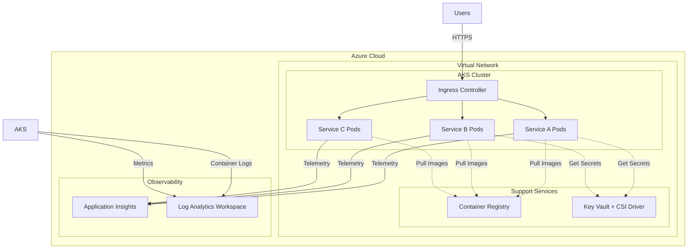

# Microservices on AKS - Talk Track

**Duration**: 15-20 minutes  
**Audience**: Platform engineers, DevOps leads, CTOs, solution architects  
**Objective**: Deploy production-ready Kubernetes for microservices workloads  
**Estimated Cost**: $80-150/day ($2,400-4,500/month)

---

## 1. Executive Summary

Azure Kubernetes Service delivers enterprise-grade container orchestration for teams transitioning from monoliths to microservices or consolidating disparate container deployments. This pattern combines AKS with Container Registry, Key Vault, Application Insights, and network isolation to create a complete microservices platform.

**Bottom Line**: Deploy containerized applications that scale automatically, reduce deployment cycles from weeks to hours, and give developers self-service infrastructure while maintaining enterprise security and compliance.

**Ideal For**: Organizations running or migrating to microservices, teams with 5+ containerized services, companies requiring independent service scaling and deployment velocity.

---

## 2. Business Problem

**The Monolith Trap**: Companies struggle with tightly-coupled applications where a single change requires full system redeployment, slowing innovation and increasing risk.

**Container Chaos**: Teams running containers without orchestration face manual scaling, no self-healing, configuration drift, and operations overhead that negates container benefits.

**Siloed Deployments**: Different teams build isolated container solutions, duplicating infrastructure costs and creating operational fragmentation across the organization.

**Pain Points**:
- 2-3 week deployment cycles for simple feature changes
- Entire application downtime when updating one component
- Cannot scale specific bottleneck services independently
- Manual intervention required for failures or traffic spikes
- DevOps teams spending 60%+ time on operational toil

---

## 3. Business Value

**Deployment Velocity**: Ship features in hours, not weeks. Independent microservice deployments eliminate coordination overhead and reduce blast radius.

**Resource Efficiency**: Pay only for compute you use. Auto-scaling responds to demand in real-time, eliminating over-provisioning. Average 40% infrastructure cost reduction vs. static VM deployments.

**Developer Productivity**: Self-service infrastructure via Kubernetes manifests. Developers deploy without tickets, security is policy-enforced, and platform teams focus on capability, not requests.

**Operational Resilience**: Self-healing infrastructure automatically restarts failed containers, redistributes load, and maintains availability without manual intervention.

**Competitive Agility**: Release features when ready, not when the deployment window opens. A/B testing and gradual rollouts reduce risk and accelerate learning.

---

## 4. Value-to-Metric Mapping

| Business Value | Measurable Metric | Typical Improvement |
|----------------|-------------------|---------------------|
| Deployment Velocity | Mean time to deploy | 14 days → 2 hours |
| Development Efficiency | Developer cycle time | -60% wait time |
| Infrastructure Cost | Cost per transaction | -40% with auto-scaling |
| System Reliability | Unplanned downtime | 99.5% → 99.95% uptime |
| Time to Market | Feature release frequency | 2x releases per quarter |
| Operational Efficiency | Operations team tickets | -50% infrastructure requests |
| Incident Recovery | Mean time to recovery (MTTR) | 30min → 5min (auto-heal) |

**ROI Example**: Mid-size SaaS company (50 developers)
- Saved 200 developer-hours/month on deployment coordination = $50K/month
- Reduced infrastructure costs by $18K/month through auto-scaling
- Infrastructure cost: $4.5K/month
- **Net gain**: $63.5K/month, 14:1 ROI

---

## 5. Conversation Starters

**For CTOs/Engineering VPs**:
- "How long does it take to promote a bug fix from code commit to production today?"
- "What percentage of your infrastructure capacity sits idle overnight or weekends?"
- "When was the last time a deployment issue affected an unrelated service?"

**For DevOps/Platform Teams**:
- "How much time do you spend provisioning environments versus building platform capabilities?"
- "Can developers self-serve infrastructure, or does everything require a ticket?"
- "How many configuration files do you maintain for different environments?"

**For Finance/Operations**:
- "Are you paying for infrastructure capacity you only need during business hours?"
- "What's the cost of a deployment failure that requires rollback or emergency patches?"

**Discovery Questions**:
- "Are you running containers today? If so, how many services and on what infrastructure?"
- "What's preventing you from deploying more frequently?"
- "Do different services have different scaling requirements?"

---

## 6. Architecture Overview

This pattern deploys a production-ready Kubernetes cluster with security, monitoring, and operational best practices built-in.



**Flow**: Users hit ingress controller → routed to appropriate microservice pods → pods pull images from private Container Registry → secrets injected from Key Vault → telemetry sent to Application Insights and logs to Log Analytics.

---

## 7. Key Services

**Azure Kubernetes Service (AKS)**  
Managed Kubernetes control plane with integrated Azure services. Auto-upgrades, auto-scaling, and Azure-native networking eliminate operational overhead.

**Azure Container Registry (ACR)**  
Private Docker registry with geo-replication, vulnerability scanning, and Azure AD integration. Keeps container images secure and close to compute for fast deployments.

**Key Vault + CSI Driver**  
Secrets, certificates, and keys injected directly into pods as mounted volumes. Centralized secret management with automatic rotation and audit logging.

**Application Insights**  
Distributed tracing across microservices, automatic dependency mapping, and performance profiling. Understand request flows spanning multiple services.

**Log Analytics Workspace**  
Centralized log aggregation for all container stdout/stderr, Kubernetes events, and cluster metrics. Query logs with KQL across entire platform.

**Virtual Network**  
Network isolation with dedicated subnets for AKS nodes and ingress. Network policies control pod-to-pod communication and restrict egress traffic.

---

## 8. Security & Compliance

**Network Isolation**: AKS nodes deployed in private subnet with Network Security Groups. No public IP addresses on nodes. Traffic flows through ingress controller only.

**Identity & Access**: Azure AD integration for Kubernetes RBAC. Developers authenticate with corporate credentials. Managed identities for pod-to-Azure-resource authentication (no credentials in code).

**Secret Management**: All secrets, certificates, and API keys stored in Key Vault. CSI driver mounts secrets as volumes with automatic rotation. Zero secrets in environment variables or config files.

**Image Security**: Container Registry vulnerability scanning integrated with Microsoft Defender. Block deployment of images with critical vulnerabilities through admission policies.

**Compliance Controls**: Azure Policy enforces pod security standards, resource limits, and approved registries. Audit logs track all cluster changes and secret access.

**Encryption**: Data encrypted at rest (disks) and in transit (TLS). Key Vault manages encryption keys with FIPS 140-2 compliance.

---

## 9. Reliability & Scale

**Auto-Scaling**: Horizontal Pod Autoscaler adjusts replica count based on CPU, memory, or custom metrics. Cluster Autoscaler adds/removes nodes based on pod scheduling needs.

**Self-Healing**: Failed pods automatically restarted. Unhealthy pods removed from load balancer rotation. Nodes automatically drained and replaced if unhealthy.

**Rolling Updates**: Zero-downtime deployments with gradual rollout. Configure update velocity and automatic rollback on health check failures.

**Multi-Zone Availability**: Deploy node pools across availability zones for 99.95% SLA. Persistent volumes replicated across zones.

**Resource Guarantees**: CPU and memory requests ensure pods get scheduled with sufficient resources. Limits prevent noisy neighbor issues.

**Load Distribution**: Built-in load balancing distributes traffic across healthy pod replicas. Session affinity and advanced routing available through ingress controllers.

**Capacity Planning**: Vertical Pod Autoscaler recommends right-sized resource requests. Usage metrics inform capacity decisions and cost optimization.

---

## 10. Observability

**Container Insights**: Real-time view of cluster health, node utilization, and pod status. Alerts on resource exhaustion or scheduling failures.

**Application Performance Monitoring**: Application Insights automatically instruments popular frameworks. Track request rates, response times, and failure rates per service.

**Distributed Tracing**: Follow requests across service boundaries. Identify bottlenecks in multi-service workflows. Correlate logs, metrics, and traces by operation ID.

**Log Aggregation**: All container stdout/stderr streamed to Log Analytics. Query logs with KQL across all services, filter by pod, namespace, or timerange.

**Metrics & Dashboards**: Pre-built workbooks show cluster health, resource utilization, and application performance. Custom dashboards combine metrics from multiple sources.

**Alerting**: Proactive alerts on pod restarts, node pressure, deployment failures, or application error spikes. Route to Teams, email, or PagerDuty.

**Dependency Mapping**: Automatic discovery of service dependencies, external APIs, and database connections. Visualize application topology and identify single points of failure.

---

## 11. Cost Levers

**Estimated Daily Cost**: $80-150 ($2,400-4,500/month)

**Cost Breakdown**:
- AKS control plane: Free (Microsoft-managed)
- Worker nodes (3x Standard_D2s_v3): $5-8/node/day = $15-24/day
- Azure Container Registry (Standard): $0.67/day
- Log Analytics ingestion: $0.30/GB = $10-30/day (varies by volume)
- Application Insights: $2-3/day (first 5GB free)
- Load Balancer (Standard): $0.75/day
- Managed disks: $1-2/day
- Key Vault operations: $0.10/day
- Bandwidth: $5-15/day (varies by traffic)

**Cost Optimization Levers**:

1. **Node Right-Sizing**: Start with D2s_v3, monitor utilization, downsize to B-series for dev/test environments. Saves 40-60%.

2. **Spot Instances**: Use spot VMs for fault-tolerant workloads (batch processing, stateless web). 70-90% discount vs. on-demand.

3. **Cluster Autoscaler**: Scale to zero nodes overnight for non-production environments. Reclaim 50-70% of costs during off-hours.

4. **Log Retention**: Keep 30 days in hot tier, archive older logs to storage. Reduce Log Analytics costs by 60%.

5. **Container Registry**: Use Basic tier ($0.17/day) for dev/test. Standard needed for production (webhooks, geo-replication).

6. **Reserved Instances**: Commit to 1-year or 3-year reserved VMs for production nodes. 30-60% discount.

7. **Namespace Resource Quotas**: Prevent runaway pods from consuming excessive resources. Enforce limits per team/environment.

**Example Savings**:
- Production: 3 nodes on reserved instances + cluster autoscaler = $50/day
- Dev/Test: 2 spot nodes + scale to zero overnight = $15/day
- Total: $65/day vs. $150/day always-on = 57% reduction

---

## 12. Deployment Narrative

**"Let me show you how quickly we can go from zero to a production Kubernetes cluster running real workloads."**

**Step 1: Deploy Infrastructure (10 minutes)**
```bash
az deployment group create \
  --resource-group rg-microservices-demo \
  --template-file main.bicep \
  --parameters @parameters/prod.parameters.json
```

**What happens**: Azure provisions AKS cluster with 3 nodes, Container Registry, Key Vault with CSI driver, Application Insights, Log Analytics, and network infrastructure. All configured with production best practices.

**Step 2: Connect to Cluster (30 seconds)**
```bash
az aks get-credentials --resource-group rg-microservices-demo --name aks-prod
kubectl get nodes
```

**What you see**: Three nodes ready, Kubernetes version confirmed, system pods running.

**Step 3: Deploy Microservices (2 minutes)**
```bash
kubectl apply -f deployments/
```

**What deploys**: Frontend service, API gateway, two backend microservices, each with auto-scaling configured.

**Step 4: Verify & Monitor (1 minute)**
- Check Application Insights: Requests flowing, dependency map auto-generated
- View Container Insights: Pod health, resource utilization
- Query logs: `kubectl logs -l app=api-gateway --tail=50`

**Total Time**: 15 minutes from zero to running microservices with enterprise monitoring.

**Key Takeaway**: "What used to require weeks of infrastructure setup and configuration is now a 15-minute deployment with everything configured correctly from day one."

---

## 13. Demo Script (Say/Do/Show)

### Segment 1: Deploy the Platform (3 minutes)

**SAY**: "Traditional Kubernetes setup requires choosing a control plane version, configuring networking, setting up ingress, integrating monitoring, and securing secrets. With this pattern, all those decisions are codified. Let me deploy a production cluster."

**DO**: 
```bash
az deployment group create --resource-group rg-aks-demo --template-file main.bicep --parameters @parameters/prod.parameters.json
```

**SHOW**: Azure Portal deployment in progress. Point out resources being created: AKS, Container Registry, Key Vault, networking.

---

### Segment 2: Access & Validate (2 minutes)

**SAY**: "The cluster is ready. Let's connect and validate the platform components."

**DO**:
```bash
az aks get-credentials --resource-group rg-aks-demo --name aks-prod
kubectl get nodes
kubectl get pods --all-namespaces
```

**SHOW**: 
- Three nodes in Ready state
- System pods running (CoreDNS, metrics-server, CSI drivers)
- Container Insights agent deployed

---

### Segment 3: Deploy Microservices (3 minutes)

**SAY**: "Now let's deploy a multi-tier application with frontend, API, and backend services."

**DO**:
```bash
kubectl apply -f deployments/frontend.yaml
kubectl apply -f deployments/api-gateway.yaml
kubectl apply -f deployments/backend-service.yaml
kubectl get pods -w
```

**SHOW**:
- Pods being created and transitioning to Running
- Multiple replicas per service
- Images pulling from Azure Container Registry

---

### Segment 4: Demonstrate Auto-Scaling (3 minutes)

**SAY**: "Watch what happens when load increases. Horizontal Pod Autoscaler monitors CPU and automatically scales replicas."

**DO**:
```bash
kubectl autoscale deployment api-gateway --cpu-percent=50 --min=2 --max=10
# Generate load with a load testing tool
kubectl get hpa -w
```

**SHOW**:
- Replica count increasing as load rises
- New pods being scheduled across nodes
- CPU metrics driving scaling decisions

---

### Segment 5: Observability (2 minutes)

**SAY**: "Application Insights is already collecting telemetry. Let's see the distributed trace."

**DO**: Open Azure Portal → Application Insights → Application Map

**SHOW**:
- Service topology auto-discovered
- Request flow: frontend → API → backend → database
- Performance metrics and failure rates per service
- Drill into a slow request to see trace timeline

---

### Segment 6: Self-Healing (2 minutes)

**SAY**: "Kubernetes continuously monitors pod health and automatically recovers from failures."

**DO**:
```bash
kubectl delete pod <api-gateway-pod-name>
kubectl get pods -w
```

**SHOW**:
- Pod terminating
- Kubernetes immediately creating replacement pod
- No service interruption (multiple replicas maintained)
- Traffic never stopped flowing

---

## 14. Objections & Responses

**Objection**: "Kubernetes is too complex. Our team doesn't have K8s expertise."

**Response**: "AKS abstracts the hard parts—Microsoft manages the control plane, upgrades, and security patches. Your team writes standard deployment YAML, which is simpler than managing VM configurations, load balancers, and auto-scaling groups manually. Plus, we can start with 2-3 services and grow expertise incrementally."

---

**Objection**: "We're already running containers on VMs. Why add another layer?"

**Response**: "Running containers on VMs means you're doing Kubernetes' job manually—restarting failed containers, distributing load, managing rolling updates, and scaling. That's operational toil. AKS automates all that and costs less than the ops time you're spending today. You get back 20-30 hours per week your team spends on operational tasks."

---

**Objection**: "What if we outgrow Kubernetes or want to move providers?"

**Response**: "Kubernetes is an open standard supported by every major cloud. Your deployment manifests work on AWS EKS or Google GKE with minimal changes. AKS-specific features like Key Vault CSI are optional—you control the abstraction level. This is less lock-in than proprietary PaaS services."

---

**Objection**: "This looks expensive compared to our current VM setup."

**Response**: "Let's compare total cost. Your VMs run 24/7 at fixed capacity, right? AKS auto-scales down to 30% capacity overnight and scales up during business hours. For most workloads, you pay 40-50% less on compute. Plus, deployment automation saves 15-20 developer-hours per week—that's $50K+ per month in developer productivity."

---

**Objection**: "Our application isn't architected as microservices yet."

**Response**: "You don't need to rearchitect everything on day one. Start by containerizing your monolith and running it on AKS—you still get auto-scaling, self-healing, and zero-downtime deployments. As you extract services, they naturally fit into the same platform. This gives you the infrastructure foundation before the architectural migration."

---

**Objection**: "What about vendor lock-in to Azure services like Key Vault?"

**Response**: "We use Kubernetes-native abstractions where possible. Key Vault CSI is optional—you can use Kubernetes secrets initially and swap to Key Vault when you need enterprise secret management. Application Insights is OpenTelemetry-compatible, so you can switch observability backends. The Bicep template documents all dependencies, so you control the tradeoffs."

---

**Objection**: "How do we secure multi-tenant workloads on the same cluster?"

**Response**: "Kubernetes namespaces provide logical isolation, Azure Policy enforces resource quotas and security policies per namespace, and network policies restrict pod-to-pod communication. For stronger isolation, run multiple AKS clusters (dev/staging/prod) or use Azure Container Instances for untrusted workloads. The pattern supports both shared and isolated models."

---

## 15. Teardown & Cleanup

**When to Teardown**:
- After demo or proof-of-concept evaluation
- Switching from dev/test to production deployment
- Decommissioning the environment

**Cost Warning**: AKS worker nodes incur hourly charges. Teardown non-production environments when not in use.

**Quick Teardown** (removes everything):
```bash
az group delete --name rg-microservices-demo --yes --no-wait
```

**Verification** (2-3 minutes later):
```bash
az group show --name rg-microservices-demo
# Should return "ResourceGroupNotFound"
```

**Selective Cleanup** (keep Container Registry, remove compute):
```bash
# Delete AKS cluster only
az aks delete --resource-group rg-microservices-demo --name aks-prod --yes

# Verify images still in registry
az acr repository list --name acrprod12345
```

**Data Preservation**:
- **Container images**: Remain in ACR even after cluster deletion
- **Logs**: Retained in Log Analytics per workspace retention policy (default 30 days)
- **Secrets**: Persist in Key Vault until explicitly deleted
- **Persistent volumes**: Azure Disks released when cluster deleted (data lost unless backed up)

**Cost After Teardown**:
- Container Registry: $0.67/day (keep images)
- Log Analytics: Storage charges only (~$0.10/GB/month)
- Key Vault: $0.03/10K operations, minimal cost
- **Total**: <$1/day for preserved artifacts

**Best Practice**: For long-running demos, scale cluster to 1 node and stop workloads rather than full teardown. Restart is faster than rebuild.

---

**End of Talk Track**
