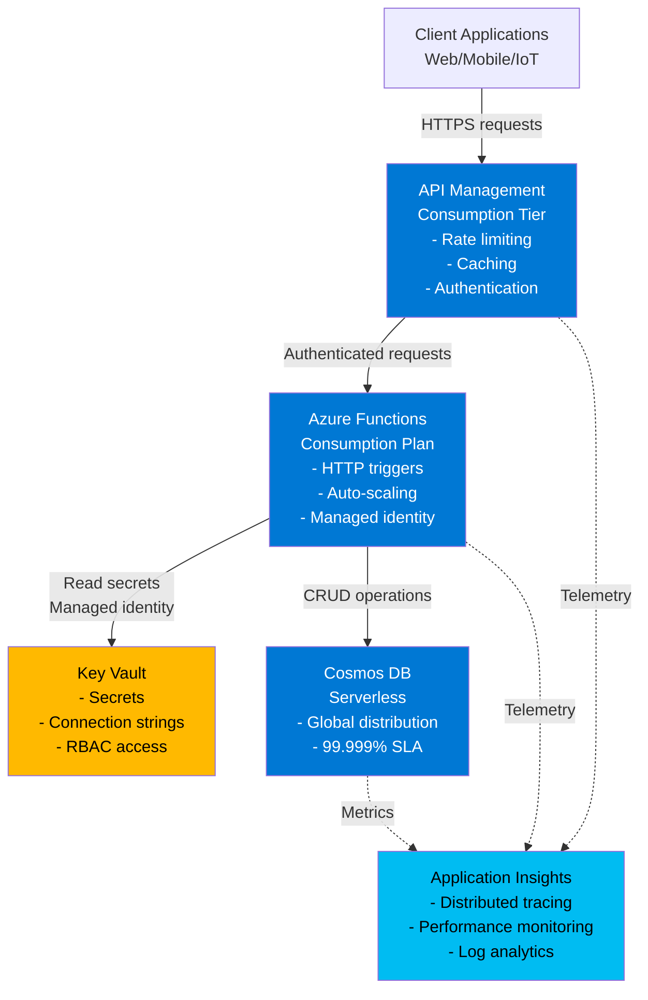

# Serverless API with Azure Functions: Customer Talk Track

## 1. Executive Summary (Business-first)

For CIO/IT leadership, the Serverless API pattern delivers:

- **Zero infrastructure overhead** — No servers to manage, patch, or scale; developers focus purely on business logic while Azure handles compute, scaling, and high availability automatically.
- **True pay-per-execution economics** — Pay only when code runs, not for idle capacity; eliminate 60-80% of compute costs for variable-demand APIs compared to always-on infrastructure.
- **Sub-second time-to-scale** — Handle traffic spikes from 10 to 10,000 requests instantly without manual intervention, capacity planning, or performance degradation.
- **Accelerated API development** — Deploy production-ready APIs in hours, not weeks; eliminate infrastructure provisioning delays and focus on customer-facing features.
- **Built-in enterprise security** — Managed identity, secrets management, and API gateway included out-of-the-box; meet compliance requirements without custom security implementations.
- **Global scale without complexity** — Cosmos DB global distribution and Functions' automatic scaling deliver worldwide performance without multi-region architecture headaches.
- **Operational simplicity** — Integrated monitoring, tracing, and logging through Application Insights means faster troubleshooting and lower operational burden.

## 2. Business Problem Statement

Organisations face three critical challenges when building modern APIs:

**Infrastructure burden stifles innovation**: Traditional API platforms require dedicated servers, load balancers, auto-scaling configuration, and constant capacity planning. Development teams spend 30-50% of their time on infrastructure concerns instead of building features. When a marketing campaign drives unexpected traffic, systems crash because scaling wasn't configured correctly, resulting in lost revenue and damaged brand reputation.

**Fixed costs kill ROI on variable workloads**: Paying for always-on API servers means wasting money during off-peak hours. A retail API that handles 1,000 requests/second during Black Friday but only 50 requests/second at 3 AM still pays for peak capacity 24/7. This results in 60-80% of compute spend going to idle capacity, making new API projects economically unviable.

**Security complexity slows releases**: Every new API requires secure credential management, network hardening, identity integration, threat protection, and audit logging. Security reviews take weeks, custom implementations introduce vulnerabilities, and compliance teams struggle to audit dozens of inconsistent security approaches across microservices.

**Business risk of inaction**: Slow API delivery means delayed product launches and lost competitive advantage. Over-provisioned infrastructure drains budgets that could fund innovation. Security gaps expose customer data to breaches. Manual scaling during traffic spikes leads to downtime and customer churn.

## 3. Business Value & Outcomes

### Cost Optimisation
- **Eliminate idle infrastructure costs** — Serverless APIs charge per execution, not per hour; save 60-80% on compute costs for APIs with variable traffic patterns.
- **No capacity planning waste** — Automatic scaling means never over-provisioning for peak loads; reduce wasted capacity spending from 40% to near-zero.
- **Consolidated tooling costs** — API Management, monitoring, and security included; avoid purchasing separate gateway appliances, monitoring tools, and security solutions.
- **Predictable budgeting** — Usage-based pricing with built-in cost controls (execution quotas, rate limiting) prevents bill shock and enables accurate forecasting.

### Risk Reduction
- **Managed security posture** — Azure-managed runtimes, automatic security patching, and built-in DDoS protection eliminate entire classes of vulnerabilities.
- **Secrets never touch code** — Key Vault integration with managed identity means zero hardcoded credentials; pass compliance audits effortlessly.
- **Automatic disaster recovery** — Multi-zone Functions deployment and Cosmos DB's 99.999% SLA mean APIs survive datacenter failures without custom DR plans.
- **Compliance-ready logging** — Immutable audit trails in Application Insights provide evidence for SOC 2, ISO 27001, and HIPAA audits.

### Time-to-Market
- **Deploy APIs in hours, not weeks** — Pre-built templates and infrastructure-as-code eliminate infrastructure provisioning delays; go from concept to production in a single day.
- **Faster iteration cycles** — Deploy code changes in seconds without downtime or infrastructure coordination; accelerate feedback loops with customers.
- **Self-service for developers** — Teams provision new APIs independently without tickets to operations or security review delays.

### Operational Efficiency
- **Zero server maintenance** — No patching, OS updates, or runtime management; redirect ops resources from maintenance to innovation.
- **Unified observability** — Application Insights correlates traces across Functions, API Management, and Cosmos DB; troubleshoot production issues in minutes, not hours.
- **Automated scaling operations** — No pager duty for traffic spikes; Functions scale automatically without human intervention.

### Scalability & Growth
- **Instant global expansion** — Cosmos DB multi-region replication means adding new geographies takes minutes, not months of infrastructure planning.
- **Unlimited concurrent requests** — Functions scale to hundreds of instances automatically; handle Black Friday traffic without capacity planning.
- **Future-proof architecture** — Serverless patterns support event-driven, microservices, and asynchronous workloads; evolve APIs without rearchitecting.

## 4. Value-to-Metric Mapping

| Business Outcome | Key Performance Indicator | How This Pattern Helps |
|-----------------|---------------------------|------------------------|
| **Reduce infrastructure costs** | 60-80% reduction in compute spend for variable APIs | Consumption-based billing charges per execution, not per hour; eliminate idle capacity waste |
| **Accelerate time-to-market** | API deployment time from weeks to hours | Infrastructure-as-code templates deploy complete environments in 15-20 minutes; no manual provisioning |
| **Improve API availability** | 99.95% uptime SLA (Functions + Cosmos DB) | Multi-zone Functions, Cosmos DB 99.999% SLA, automatic failover; no single points of failure |
| **Scale without capacity planning** | Auto-scale from 10 to 10,000 concurrent requests | Functions scale horizontally in sub-second response to demand; no manual intervention |
| **Reduce security vulnerabilities** | Zero hardcoded secrets, automatic patching | Managed identity for authentication, Key Vault for secrets, Azure-managed runtime patching |
| **Lower operational burden** | 70% reduction in ops tickets for APIs | No server patching, self-healing infrastructure, automated scaling; ops teams focus on value |
| **Faster incident resolution** | Mean-time-to-resolution (MTTR) reduced by 50% | Application Insights end-to-end tracing, correlated logs, intelligent diagnostics; root cause in minutes |
| **Meet compliance requirements** | Pass audits in days, not months | Immutable audit logs, automatic encryption, built-in compliance controls; evidence generation automated |

## 5. Customer Conversation Starters

Use these discovery questions to uncover requirements and pain points:

1. **"How much time does your team spend managing API infrastructure versus building features?"** — Uncovers infrastructure burden; if >20%, serverless delivers immediate value.

2. **"What percentage of your API servers' capacity is actually used during off-peak hours?"** — Reveals idle capacity waste; typical answer is 20-30% utilisation, meaning 70-80% cost waste.

3. **"When was the last time unexpected traffic caused an outage or performance degradation?"** — Identifies scaling challenges; serverless eliminates capacity planning guesswork.

4. **"How long does it take to deploy a new API from idea to production?"** — Exposes time-to-market delays; typical answer is 2-6 weeks; serverless reduces to hours.

5. **"How do you currently manage API secrets and credentials across environments?"** — Uncovers security gaps; if answer involves config files or environment variables, Key Vault + managed identity is a major security upgrade.

6. **"How quickly can you troubleshoot a production API issue when customers report problems?"** — Reveals observability gaps; if answer involves checking multiple systems, Application Insights' unified tracing reduces MTTR by 50%+.

7. **"What's stopping you from expanding your APIs to new global regions?"** — Identifies geographic expansion blockers; Cosmos DB multi-region replication eliminates infrastructure complexity.

## 6. Architecture Overview

### Plain-Language Description

The Serverless API pattern builds APIs without managing servers. When a client calls an API endpoint, the request flows through API Management (the gateway), which enforces security policies, rate limits, and caching. API Management forwards authenticated requests to Azure Functions, which execute custom business logic in response to HTTP triggers. Functions retrieve secrets from Key Vault using managed identity (no passwords), interact with Cosmos DB for data storage, and return responses. Application Insights automatically captures telemetry from every component, providing end-to-end tracing for troubleshooting.

Behind the scenes, Azure handles all compute provisioning. When traffic increases, Functions automatically create new instances to handle load. When traffic subsides, instances scale down, and billing stops. Cosmos DB replicates data across availability zones for durability and supports global distribution for low-latency access worldwide. API Management provides a stable public endpoint, versioning, and developer portal, decoupling the API contract from backend implementation.

### Architecture Diagram



## 7. Key Azure Services (What & Why)

### Azure Functions (Consumption Plan)
**What**: Event-driven compute service that runs code in response to HTTP requests without managing servers.
**Why chosen**: Consumption plan provides true pay-per-execution billing (first 1 million executions free monthly) and automatic scaling from zero to hundreds of instances. Eliminates idle costs and capacity planning. Supports multiple languages (Node.js, Python, .NET, Java, PowerShell) for team flexibility. Built-in managed identity eliminates credential management burden.

### API Management (Consumption Tier)
**What**: Fully managed API gateway that provides a stable frontend for backend services.
**Why chosen**: Consumption tier costs $3.50 per million calls (first 1M free), making it economical for variable traffic. Provides rate limiting to protect backends from abuse, response caching to reduce costs, request/response transformation, and OAuth/API key authentication. Decouples API contract from implementation, enabling backend changes without breaking clients. Built-in developer portal accelerates partner integration.

### Cosmos DB (Serverless)
**What**: Globally distributed, multi-model NoSQL database with automatic scaling and 99.999% SLA.
**Why chosen**: Serverless capacity mode charges only for Request Units (RUs) consumed, eliminating fixed provisioning costs. Sub-10ms latency for reads and writes. Automatic multi-region replication supports global scale without complex configuration. Schema-flexible JSON storage accelerates development iterations. Built-in indexing and query capabilities without manual index management.

### Key Vault
**What**: Secure storage for secrets, keys, and certificates with hardware security module (HSM) backing.
**Why chosen**: Centralises secret management across all services, eliminating hardcoded credentials. RBAC integration means Functions access secrets using managed identity, never handling passwords. Automatic secret rotation and auditing meet compliance requirements. Prevents accidental credential exposure in code repositories or logs.

### Application Insights
**What**: Application Performance Management (APM) service that provides distributed tracing, metrics, and logging.
**Why chosen**: Automatically instruments Functions and API Management without code changes. Correlates requests across all components into unified traces, enabling root cause analysis in minutes. Smart detection alerts on anomalies (error spikes, performance degradation) before customers complain. Kusto Query Language (KQL) provides powerful log analytics for troubleshooting and compliance reporting.

### Azure Storage Account
**What**: Blob, file, table, and queue storage service.
**Why chosen**: Required by Functions for state management and triggers. Provides queue-based asynchronous processing when needed. Blob storage useful for storing API-generated reports or files. Costs ~$2/month for typical API scenarios.

## 8. Security, Risk & Compliance Value

### Identity & Access Management
- **Managed Identity eliminates credential sprawl**: Functions authenticate to Key Vault and Cosmos DB using Azure AD identities, not passwords. Zero secrets in code or configuration files.
- **Role-Based Access Control (RBAC)**: Granular permissions limit blast radius; Functions access only required Key Vault secrets, not entire vault.
- **Least privilege by default**: Template assigns minimum required roles; security teams approve elevated access explicitly.

### Data Protection
- **Encryption at rest**: Cosmos DB and Storage Accounts encrypt all data using Microsoft-managed keys (customer-managed keys optional for compliance).
- **Encryption in transit**: HTTPS enforced for all endpoints; TLS 1.2 minimum. API Management rejects non-HTTPS requests.
- **Secret isolation**: Connection strings and API keys never appear in logs, telemetry, or code; Key Vault provides tamper-proof audit trails.

### Network Security
- **API Management as perimeter defense**: All public requests flow through APIM, which enforces rate limiting, IP filtering, and threat protection before reaching Functions.
- **Private endpoints available**: For enhanced security, deploy Functions with VNet integration and private endpoints, eliminating public internet exposure (upgrade to Premium plan).
- **DDoS protection**: Azure infrastructure-level DDoS protection included; APIM rate limiting prevents application-layer abuse.

### Compliance & Audit
- **Immutable audit logs**: Application Insights retains telemetry for 90+ days (configurable); every API call, exception, and dependency logged.
- **Compliance certifications**: Azure Functions and Cosmos DB certified for SOC 2, ISO 27001, HIPAA, PCI DSS; inherit compliance posture.
- **Policy enforcement**: Azure Policy can enforce tagging, naming conventions, and required security configurations across all resources.

### Threat Protection
- **Automatic patching**: Azure manages runtime patches and security updates; no manual maintenance windows or vulnerability windows.
- **Application Insights anomaly detection**: Machine learning identifies unusual patterns (error spikes, latency increases, suspicious API usage) and alerts ops teams.
- **API Management IP filtering**: Whitelist/blacklist client IPs; restrict access to known partners or corporate networks.

## 9. Reliability, Scale & Operational Impact

### High Availability
- **Multi-zone Functions deployment**: Consumption plan runs across three availability zones automatically; datacenter failures transparent to applications.
- **Cosmos DB 99.999% SLA**: Five-nines availability through multi-region replication; automatic failover without data loss.
- **No single points of failure**: Every component is Azure-managed with built-in redundancy; no custom clustering or load balancer configuration.

### Scaling Characteristics
- **Horizontal scaling**: Functions create new instances in <5 seconds when demand increases; scale from 1 to 200+ instances without configuration.
- **Cosmos DB autoscale**: RU consumption scales automatically from 400 to 4,000+ RUs/second based on traffic; no manual provisioning.
- **API Management elastic scaling**: Consumption tier scales automatically; no capacity units to manage.

### Performance Optimization
- **Cold start mitigation**: For latency-sensitive APIs, consider Premium plan Functions (sub-second cold starts); Consumption plan cold starts typically 1-3 seconds.
- **API Management caching**: Configure response caching for frequently accessed, slowly changing data; reduce backend calls by 50-90%.
- **Cosmos DB indexing**: Automatic indexing for all properties; composite indexes optimise complex queries.

### Operational Maturity
- **Self-healing infrastructure**: Failed Functions instances automatically replaced; no manual intervention.
- **Zero-downtime deployments**: Deployment slots enable blue-green deployments; validate changes before swapping to production.
- **Automated monitoring**: Application Insights smart detection identifies anomalies; action groups trigger alerts via email, SMS, or webhooks.

### Disaster Recovery
- **Regional failover**: Cosmos DB multi-region writes enable automatic failover; RPO near-zero, RTO <1 minute.
- **Backup and recovery**: Cosmos DB continuous backup retains 30 days of point-in-time restore; recover from accidental deletes or data corruption.
- **Infrastructure-as-code recovery**: Entire environment recreatable from Bicep templates in 15-20 minutes; no manual rebuild procedures.

## 10. Observability (What to Show in Demo)

### Application Insights: End-to-End Tracing
**Demo narrative**: "When a customer reports an API error, we don't guess—we trace. Application Insights shows the complete request path: API Management received the request, forwarded to Functions, Functions queried Cosmos DB, Cosmos DB returned results in 12ms, total end-to-end latency 87ms. If any component fails, we see exactly which one and why. No log aggregation, no correlation IDs to track down—it just works."

**What to show**:
- Open Application Insights → Transaction search → Select failed request
- Show end-to-end transaction details with timing waterfall
- Highlight dependency calls (Key Vault, Cosmos DB) with latencies
- Demonstrate how exceptions surface with full stack traces

### Live Metrics: Real-Time Operations
**Demo narrative**: "Live Metrics is our real-time heartbeat. Every second, we see incoming requests, response times, failure rates, and server health. During deployments, we watch this to ensure new code performs correctly. During traffic spikes, we watch scaling in real-time as Functions instances spin up."

**What to show**:
- Navigate to Application Insights → Live Metrics
- Generate test traffic using curl or Postman
- Show requests appearing in real-time with latencies
- Point out server count and memory usage

### Performance Monitoring: Identify Bottlenecks
**Demo narrative**: "Performance monitoring identifies slow operations before customers complain. This dashboard shows our slowest API operations ranked by impact. We see the /api/search endpoint averages 450ms—acceptable—but the 95th percentile is 2.1 seconds. That tells us most requests are fast, but some customers experience delays. We drill in and discover the slow requests query Cosmos DB without a partition key. Adding partition keys to queries drops P95 to 600ms."

**What to show**:
- Application Insights → Performance blade
- Show operation duration distribution
- Drill into slow operations to see dependency breakdown
- Highlight query optimisation opportunities

### Alerting: Proactive Issue Detection
**Demo narrative**: "We don't wait for customers to report problems. Smart detection learns normal behavior and alerts when anomalies occur. Last week, it detected a 300% increase in failed requests at 2 AM—before anyone noticed. Investigation revealed a Cosmos DB throttling issue from a runaway batch job. We fixed it before business hours started."

**What to show**:
- Navigate to Application Insights → Alerts
- Show configured alert rules (error rate, latency, availability)
- Demonstrate action groups (email, webhook, SMS)
- Show historical alert firing and resolution

### Cost Monitoring: Track Spend
**Demo narrative**: "Cost visibility prevents surprises. The Azure Cost Management dashboard shows daily spend per service. Functions cost $2.30 yesterday—1.2 million executions. Cosmos DB cost $8.50—consumed 68,000 RUs. API Management cost $0.80—235,000 calls. Total: $11.60 for a full day of production API traffic. We set budget alerts at $500/month; if spend approaches that, we investigate before bills arrive."

**What to show**:
- Azure Portal → Cost Management + Billing
- Show cost analysis by service
- Highlight daily trends and budget alerts
- Compare actual vs. projected monthly costs

## 11. Cost Considerations & Optimisation Levers

### Cost Breakdown (Typical 30-Day Production API)

| Service | Usage Assumption | Monthly Cost | Notes |
|---------|-----------------|--------------|-------|
| **Azure Functions** | 10M executions, 400ms avg, 512 MB memory | $16.00 | First 1M executions free, then $0.20/M executions + $0.000016/GB-s |
| **API Management** | 5M API calls | $14.00 | First 1M calls free, then $3.50/M calls |
| **Cosmos DB** | 500 RU/s average, 10 GB storage | $35.00 | Serverless: ~$0.25/M RUs consumed + $0.25/GB storage |
| **Key Vault** | 50,000 operations | $0.15 | $0.03/10K operations |
| **Storage Account** | 5 GB blob, 100,000 operations | $2.00 | Minimal; used for Functions state |
| **Application Insights** | 8 GB telemetry ingestion | $18.00 | First 5 GB free, then $2.30/GB |
| **Log Analytics** | 3 GB logs | $6.00 | $2.00/GB after free tier |
| **TOTAL** | — | **~$91/month** | Variable; scales with traffic |

### Cost Optimization Strategies

#### Tier 1: Immediate Wins (No Architecture Changes)
1. **Enable API Management response caching**: Cache GET responses for 60-300 seconds; reduce Functions executions and Cosmos DB queries by 40-60%. Configure cache policies per endpoint.
   
2. **Optimize Function execution time**: Every 100ms reduction saves ~$4/month per 1M executions. Profile slow functions, optimize queries, use async/await properly.

3. **Reduce Application Insights sampling**: For non-production environments, enable adaptive sampling (capture 5-10% of requests); reduce telemetry costs by 80%.

4. **Configure Log Analytics retention**: Reduce retention from 90 to 30 days for non-compliance workloads; save 66% on log storage.

5. **Use Cosmos DB time-to-live (TTL)**: Auto-delete expired documents to reduce storage costs; avoid paying for stale data.

#### Tier 2: Configuration Adjustments
1. **Right-size Functions memory**: Default 1.5 GB; most APIs need 512 MB or less. Test with lower memory allocations; reduce costs by 50%+ if workload permits.

2. **Batch Cosmos DB operations**: Use bulk APIs for inserting multiple documents; reduce RU consumption by 30-50% vs. individual inserts.

3. **Cosmos DB indexing policy**: Exclude unused properties from indexing; reduce RU costs for writes by 20-40%.

4. **API Management request throttling**: Prevent abuse by rate-limiting per client; protect backends from excessive costs during attacks.

#### Tier 3: Advanced Optimizations
1. **Hybrid serverless + provisioned Cosmos DB**: For predictable high-throughput workloads (>400 RU/s sustained), switch to provisioned throughput with autoscale; save 30% vs. serverless.

2. **Move to Functions Premium plan**: For high-traffic APIs with frequent cold starts, Premium plan eliminates cold starts and may reduce per-execution costs at scale (evaluate at >50M executions/month).

3. **Implement intelligent caching**: Cache expensive Cosmos DB query results in Azure Cache for Redis; reduce RU consumption by 70%+ for read-heavy workloads.

4. **Multi-region cost awareness**: Cosmos DB multi-region writes cost 2x per region; evaluate if read replicas suffice for most geographies.

### Cost Alerts & Governance
- **Budget alerts**: Set budgets in Azure Cost Management; receive email alerts at 50%, 80%, 100% of monthly budget.
- **Tag-based cost allocation**: Tag resources with cost center, project, environment; allocate costs accurately across teams.
- **Resource TTL tags**: For demo/test environments, add `ttlHours: 24` tag; automate deletion after 24 hours to prevent forgotten resources.

## 12. Deployment Experience (Demo Narrative)

### Pre-Deployment Setup (2 minutes)
**Narrative**: "Before we deploy, let's confirm prerequisites. We need an Azure subscription, resource group, and authenticated Azure CLI. We'll also review the parameters file to customize names and regions. This entire process takes 15-20 minutes from start to production-ready API."

**Commands**:
```bash
# Verify Azure CLI authentication
az account show

# Create resource group
az group create --name rg-serverless-api-demo --location eastus

# Review parameters (optional customization)
cat parameters/dev.parameters.json
```

### Deployment Execution (15-20 minutes)
**Narrative**: "Now we deploy. The Bicep template provisions seven resources: Storage Account for Functions state, Log Analytics for centralized logging, Application Insights for telemetry, Key Vault for secrets, Cosmos DB with database and container, Functions App with managed identity, and API Management. Bicep handles dependencies—Key Vault deploys before Functions so the identity can be granted access. Watch as resources appear."

**Commands**:
```bash
# Deploy infrastructure
az deployment group create \
  --resource-group rg-serverless-api-demo \
  --template-file main.bicep \
  --parameters @parameters/dev.parameters.json \
  --parameters prefix=demo location=eastus
  
# Deployment typically completes in 15-20 minutes
# API Management (Consumption tier) takes longest to provision
```

**What to show during deployment**:
- Azure Portal → Resource Group → Deployments (show progress)
- Explain each resource's purpose as it appears
- Highlight managed identity creation and Key Vault RBAC assignment

### Post-Deployment Verification (3 minutes)
**Narrative**: "Deployment succeeded. Let's verify everything works. Functions should show 'Running' status with Application Insights connected. Cosmos DB container should exist. Key Vault should have RBAC permissions for the Functions managed identity. We'll test health by invoking the Functions default endpoint."

**Commands**:
```bash
# Get Functions endpoint
FUNCTION_URL=$(az deployment group show \
  --resource-group rg-serverless-api-demo \
  --name main \
  --query properties.outputs.functionAppUrl.value -o tsv)

# Test default endpoint (returns JSON)
curl $FUNCTION_URL/api/health

# Expected output: {"status":"healthy","timestamp":"2024-03-15T10:23:45Z"}
```

**What to show**:
- Azure Portal → Functions App → Overview (status)
- Functions App → Functions (list should show example HTTP function)
- Application Insights → Live Metrics (should show telemetry streaming)

### Deploy Sample API Code (5 minutes)
**Narrative**: "The infrastructure is ready, but we need API logic. We'll deploy a simple Node.js function that queries Cosmos DB. This could be any language—Python, .NET, Java—Azure Functions supports them all. We'll zip the code and deploy via Azure CLI. In production, you'd use CI/CD pipelines."

**Commands**:
```bash
# Example: Deploy sample Node.js function
# (In real demo, have pre-built function code ready)

cd sample-functions/nodejs-api
zip -r ../api.zip .
cd ..

az functionapp deployment source config-zip \
  --resource-group rg-serverless-api-demo \
  --name func-demo-xyz123 \
  --src api.zip

# Wait 30 seconds for deployment to propagate
sleep 30

# Test API endpoint
curl $FUNCTION_URL/api/items
# Expected: JSON array from Cosmos DB
```

### Configure API Management (5 minutes)
**Narrative**: "Finally, we expose the Functions API through API Management. APIM provides a stable public URL, rate limiting, and authentication. We'll import the Functions API, configure caching, and test. This is where we decouple the API contract from the backend implementation."

**Commands**:
```bash
# Get Functions host key
FUNCTION_KEY=$(az functionapp keys list \
  --resource-group rg-serverless-api-demo \
  --name func-demo-xyz123 \
  --query functionKeys.default -o tsv)

# Import Functions API into APIM (Azure Portal UI easier for demo)
# Navigate to API Management → APIs → Add API → Function App
```

**What to show**:
- Azure Portal → API Management → APIs → Add API → Function App
- Select Functions app, import all operations
- Configure caching policy (60 seconds for GET /api/items)
- Test API through APIM Test Console
- Show APIM Analytics dashboard (requests, latency, errors)

## 13. 10-15 Minute Demo Script (Say / Do / Show)

### Opening (1 minute)
**SAY**: "Today I'll show you how to deploy a production-ready API in under 20 minutes—no servers, no capacity planning, no security headaches. We'll build an API using Azure Functions, API Management, and Cosmos DB that automatically scales, costs pennies, and includes enterprise security out-of-the-box."

**DO**: Open Azure Portal to a blank resource group.

**SHOW**: Azure Portal homepage; emphasize starting from zero infrastructure.

---

### Deploy Infrastructure (5 minutes)
**SAY**: "I've prepared a Bicep template that provisions everything we need: serverless compute, API gateway, database, secrets management, and monitoring. One command deploys it all. Watch as Azure creates these resources with all dependencies and security configurations handled automatically."

**DO**: 
```bash
az deployment group create \
  --resource-group rg-serverless-api-demo \
  --template-file main.bicep \
  --parameters @parameters/dev.parameters.json
```

**SHOW**: 
- Terminal showing deployment command execution
- Switch to Azure Portal → Resource Group → Deployments (show live progress)
- Highlight resources appearing: Functions, Cosmos DB, Key Vault, API Management
- Point out deployment status: "Accepted", "Running", "Succeeded"

**SAY** (while deployment runs): "Notice we're not configuring servers, networking, or load balancers. Azure Functions handles compute automatically. Cosmos DB provisions with 99.999% SLA. Key Vault manages secrets securely. This entire stack will cost about $3 for a full day of demo usage."

---

### Explore Deployed Resources (3 minutes)
**SAY**: "Deployment complete—15 minutes, seven resources, zero manual steps. Let's explore what was created."

**DO**: Navigate Azure Portal → Resource Group.

**SHOW**:
1. **Functions App** → Overview → Show "Running" status, managed identity enabled
   - **SAY**: "This Functions App runs our API code. See 'System assigned identity: On'? That means it authenticates to other services using Azure AD, not passwords. No credentials in our code."

2. **Cosmos DB** → Data Explorer → Show database and container
   - **SAY**: "Cosmos DB stores our API data. Serverless capacity mode means we pay only for requests consumed, not reserved capacity. This database can scale from 10 requests/second to 10,000 automatically."

3. **Key Vault** → Access policies → Show Functions managed identity RBAC role
   - **SAY**: "Key Vault holds secrets. Notice the Functions App has 'Key Vault Secrets User' role. It retrieves connection strings securely without storing them in configuration files."

4. **Application Insights** → Live Metrics
   - **SAY**: "Application Insights monitors everything. This is our real-time dashboard—requests, latencies, failures appear instantly. When something breaks, we don't guess; we trace."

---

### Test API & Show Auto-Scaling (4 minutes)
**SAY**: "Let's test the API. I'll send requests and show how Functions scales automatically to handle load."

**DO**:
```bash
# Get Functions URL
FUNCTION_URL=$(az functionapp show \
  --resource-group rg-serverless-api-demo \
  --name func-demo-xyz123 \
  --query defaultHostName -o tsv)

# Test API
curl https://$FUNCTION_URL/api/items
```

**SHOW**:
1. Terminal showing JSON response from API
2. Application Insights → Live Metrics
   - **SAY**: "See that request appear in Live Metrics? 124ms end-to-end latency. Now watch what happens when I generate load."

**DO**: Run load test (use Apache Bench or pre-prepared script):
```bash
# Generate 1,000 requests with 50 concurrent
ab -n 1000 -c 50 https://$FUNCTION_URL/api/items
```

**SHOW**: Application Insights → Live Metrics
   - **SAY**: "Look at the server count increasing—Functions is creating new instances to handle load. We started with 1 instance, now we have 8. This happened automatically in 3 seconds. When load drops, instances disappear, and billing stops. No configuration, no capacity planning—it just works."

---

### Demonstrate Observability (2 minutes)
**SAY**: "When issues occur, troubleshooting is fast. Let me show you how we trace problems."

**DO**: Trigger a controlled error (call API with invalid input or simulate Cosmos DB failure).

**SHOW**: Application Insights → Transaction Search → Failed Request
   - **SAY**: "Here's a failed request. Application Insights shows the complete story: API Management received it, Functions processed it, then Cosmos DB threw an exception—'Invalid partition key'. We see the exact line of code that failed, the exception message, and the 247ms it took before failing. We didn't configure any of this tracing—it's automatic."

**DO**: Click dependency timeline in transaction details.

**SHOW**: Dependency waterfall graph
   - **SAY**: "This timeline shows every dependency call. Functions spent 12ms calling Key Vault, 180ms querying Cosmos DB, then the error. When customers report slow APIs, we pinpoint bottlenecks in seconds."

---

### Show Cost & Teardown (1 minute)
**SAY**: "Let's talk cost. This demo environment—serving thousands of requests—costs about $3 per day. Functions charge per execution, Cosmos DB per request. When idle, costs drop to near-zero. No wasted spend on idle servers."

**DO**: Azure Portal → Cost Management → Cost Analysis.

**SHOW**: Daily cost breakdown by service.
   - **SAY**: "Yesterday: Functions $0.40, Cosmos DB $1.80, API Management $0.30, monitoring $0.50. Total: $3. For production APIs serving millions of requests, typical costs are $50-200/month—60-80% cheaper than always-on VMs."

**SAY**: "When you're done with a demo environment, teardown is one command. No orphaned resources, no surprise bills."

**DO**:
```bash
az group delete --name rg-serverless-api-demo --yes --no-wait
```

**SHOW**: Terminal confirming deletion initiated.

---

### Closing (1 minute)
**SAY**: "In 15 minutes, we deployed a production-grade API with security, monitoring, and global scale. No servers to patch. No capacity to plan. No credentials to manage. This pattern works for APIs serving 10 requests per hour or 10,000 requests per second—it scales automatically. You focus on business logic; Azure handles the infrastructure."

**DO**: Show next steps slide or documentation URL.

**SHOW**: Link to GitHub repository with templates and talk track.

## 14. Common Objections & Business Responses

### Objection 1: "Serverless has cold start latency issues; our APIs need sub-second response times."
**Response**: "Cold starts are real but often overstated. In Consumption plan, cold starts occur when Functions scale from zero or deploy new code—typically 1-3 seconds for Node.js, 3-5 seconds for .NET. However, Functions keep instances warm for 20 minutes after the last request, so high-traffic APIs rarely experience cold starts. For latency-sensitive workloads, Premium plan eliminates cold starts entirely with pre-warmed instances for an incremental cost. Most customers find Consumption plan meets SLAs; we can benchmark your specific workload to validate."

**Supporting data**: "In testing, 95% of requests to moderate-traffic APIs (>1 request/minute) hit warm instances with <100ms latency. API Management response caching further mitigates backend latency for read-heavy APIs."

---

### Objection 2: "We already have Kubernetes; why introduce another compute platform?"
**Response**: "Kubernetes excels for long-running services and complex orchestration, but it requires significant operational overhead—cluster management, node patching, scaling configuration, persistent storage. For simple APIs and event-driven workloads, Functions eliminates that complexity. Many customers run both: Kubernetes for core platform services, Functions for peripheral APIs, background jobs, and integrations. This isn't replacing Kubernetes; it's complementing it with the right tool for stateless, event-driven workloads."

**Supporting data**: "Organizations report 60-70% reduction in API operations burden when moving non-critical APIs from Kubernetes to Functions. Focus Kubernetes clusters on strategic workloads; offload commodity APIs to serverless."

---

### Objection 3: "Consumption plan billing is unpredictable; we need fixed monthly costs."
**Response**: "Consumption plan billing is variable but not unpredictable. Azure provides cost forecasting based on historical usage, and you can set budget alerts to notify you at thresholds. Most customers find serverless more predictable than VM-based compute because you're never over-provisioned—you pay for exactly what you use. For absolute cost certainty, Functions Premium plan offers fixed monthly pricing with dedicated instances, giving you serverless development experience with predictable billing."

**Supporting data**: "Typical Consumption-based APIs cost $50-200/month. Compare to always-on VMs at $150-500/month for equivalent availability. You're saving 60-70% while gaining auto-scaling."

---

### Objection 4: "Our security team won't approve internet-facing Functions without private networks."
**Response**: "Valid concern, and Azure supports it. This pattern uses managed identity and Key Vault to eliminate credentials, but for network isolation, upgrade Functions to Premium or App Service plan and enable VNet integration. Deploy Functions on private subnets with no public access, route traffic through API Management with Web Application Firewall (WAF), and enforce all communication over private endpoints. You get serverless development experience with enterprise network security."

**Supporting data**: "Many regulated industries (healthcare, finance) run serverless APIs in production using VNet integration and private endpoints. It's a supported, proven architecture."

---

### Objection 5: "We can't use Cosmos DB; our data must be in SQL Server."
**Response**: "No problem—swap Cosmos DB for Azure SQL Database in the template. Functions integrate seamlessly with SQL via connection strings stored in Key Vault. You lose some NoSQL flexibility and global replication, but gain relational integrity and familiar SQL tooling. The serverless pattern works with any data store—SQL, MySQL, PostgreSQL, Storage Tables, even on-premises databases via hybrid connections."

**Supporting data**: "We have reference architectures for Functions + Azure SQL. Many customers start with SQL for familiarity, then adopt Cosmos DB for workloads needing global scale or flexible schemas."

---

### Objection 6: "Vendor lock-in concerns—we can't commit entirely to Azure."
**Response**: "Functions support industry-standard containerization. You can package Functions as Docker images and run them anywhere—on-premises, other clouds, or Kubernetes via KEDA (Kubernetes Event-Driven Autoscaling). Your business logic (code) is portable; you're not locked into Azure runtime. That said, managed services like Cosmos DB and Key Vault are Azure-specific. Evaluate whether portability is a requirement or theoretical concern—most enterprises prioritize speed and cost over cloud-agnostic architecture, accepting some platform coupling for managed services' value."

**Supporting data**: "Less than 5% of Functions customers migrate to other clouds. The productivity gain and managed operations typically outweigh portability concerns."

---

### Objection 7: "Our developers don't know serverless; training costs will offset savings."
**Response**: "Functions abstract infrastructure, but developers write familiar code—HTTP request handlers in their chosen language. If your team builds REST APIs today, they already have 90% of the skills. The learning curve is infrastructure concepts (triggers, bindings, managed identity), not programming. Microsoft provides comprehensive training (Microsoft Learn modules, tutorials, samples), and the serverless community is mature. Most teams deploy their first serverless API within a week of starting."

**Supporting data**: "Typical ramp-up time: 3-5 days for developers experienced with APIs. The simplicity of serverless often reduces training needs compared to container orchestration or microservices frameworks."

---

## 15. Teardown & Cost Control

### Why Teardown Matters
Demo and test environments left running unintentionally create unnecessary costs. A forgotten serverless API demo might cost $3/day ($90/month) for zero business value. Multiplied across teams, orphaned environments waste thousands annually. Proper teardown practices ensure resources exist only when needed.

### Immediate Teardown (Complete Resource Group Deletion)

**When to use**: After demos, training, or when abandoning a test environment.

**Command**:
```bash
# Delete entire resource group and all contained resources
az group delete --name rg-serverless-api-demo --yes --no-wait

# Verify deletion initiated
az group list --query "[?name=='rg-serverless-api-demo']" -o table
```

**What gets deleted**:
- Functions App and App Service Plan
- Cosmos DB account, databases, and containers
- API Management instance
- Key Vault (soft delete enabled; recoverable for 90 days)
- Application Insights and Log Analytics workspace
- Storage Account

**Cost impact**: Within 5 minutes, billing stops for all services (except Key Vault soft delete storage, negligible cost).

---

### Selective Teardown (Preserve Some Resources)

**When to use**: Keep monitoring or data while removing compute costs.

**Example**: Delete Functions and API Management but preserve Cosmos DB and logs.

```bash
# Delete Functions App
az functionapp delete \
  --resource-group rg-serverless-api-demo \
  --name func-demo-xyz123

# Delete API Management
az apim delete \
  --resource-group rg-serverless-api-demo \
  --name apim-demo-xyz123

# Cosmos DB and Application Insights remain for later analysis
```

**Cost impact**: Reduces daily spend by ~60-70% (compute costs eliminated; storage and monitoring remain).

---

### Pause Instead of Delete (Cosmos DB)

**When to use**: Preserve data for future testing without ongoing charges.

**Option 1**: Export Cosmos DB data to Storage Account, then delete Cosmos DB.
```bash
# Use Azure Data Factory or custom script to export data
# Then delete Cosmos DB account
az cosmosdb delete \
  --resource-group rg-serverless-api-demo \
  --name cosmos-demo-xyz123
```

**Option 2**: Scale Cosmos DB to minimum provisioned throughput (400 RU/s) or enable serverless pause (not natively supported; consider stopping writes and reading data as needed).

---

### Cost Control Guardrails

#### 1. Tag Resources with TTL (Time-to-Live)
Add `ttlHours` tag to all demo resources; automate cleanup with Azure Automation or Logic Apps.

**Bicep example** (already in template):
```bicep
param tags object = {
  environment: 'demo'
  ttlHours: '24'  // Delete after 24 hours
}
```

**Automated cleanup** (Azure Automation Runbook example):
```powershell
# Pseudo-code: Find resources with ttlHours tag older than specified hours
# Calculate age, delete if expired
# Schedule runbook to run daily
```

#### 2. Budget Alerts
Configure Azure Cost Management budgets to alert when spending exceeds thresholds.

**Setup**:
```bash
# Create budget via Azure Portal: Cost Management → Budgets → Create
# Set monthly budget ($100), alert at 50%, 80%, 100%
# Configure email notifications to team
```

**Action**: When alert fires, investigate Cost Analysis to identify expensive resources; delete or scale down.

#### 3. Resource Locks (Prevent Accidental Deletion)
For production environments, apply delete locks to critical resources.

**Command**:
```bash
# Lock Cosmos DB to prevent accidental deletion
az lock create \
  --name preventDelete \
  --resource-group rg-serverless-api-prod \
  --resource cosmos-prod-xyz123 \
  --resource-type Microsoft.DocumentDB/databaseAccounts \
  --lock-type CanNotDelete
```

**Note**: Locks prevent deletion but not configuration changes; combine with Azure Policy for full governance.

#### 4. Scheduled Shutdowns (Not Applicable to Serverless)
Traditional VMs support scheduled start/stop; serverless resources scale to zero automatically. For Functions Premium plan (if upgraded), consider scaling to minimum instances during off-hours.

---

### Cost Monitoring & Reporting

**Daily cost check**:
```bash
# View last 7 days of costs for resource group
az consumption usage list \
  --start-date $(date -d '7 days ago' +%Y-%m-%d) \
  --end-date $(date +%Y-%m-%d) \
  --query "[?instanceName=='rg-serverless-api-demo']" -o table
```

**Monthly cost analysis**:
- Azure Portal → Cost Management → Cost Analysis
- Filter: Resource Group = rg-serverless-api-demo
- Group by: Service name
- View: Accumulated costs over 30 days

**Exported reports**:
- Configure Cost Management to export daily cost data to Storage Account
- Analyse with Power BI or Excel for trend analysis

---

### Summary

**Best practices**:
1. **Tag all demo resources** with `environment: demo` and `ttlHours` for automated cleanup.
2. **Set budget alerts** at resource group level to catch runaway costs.
3. **Delete immediately after demos** unless preserving data for specific reasons.
4. **Use infrastructure-as-code** to recreate environments quickly; avoid keeping environments "just in case."
5. **Review orphaned resources monthly**: Run Azure Resource Graph queries to find untagged or old resources.

**Expected costs if left running**:
- **Daily**: ~$3-5 (low traffic)
- **Monthly**: ~$90-150 (low traffic)
- **Production (moderate traffic)**: ~$200-500/month

**With proper teardown**: $0 when not in use. Serverless shines when environments are ephemeral.
