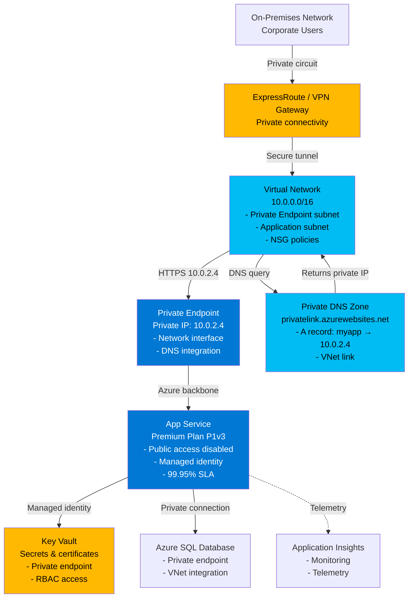

# Web App with Private Endpoint: Customer Talk Track

## 1. Executive Summary (Business-first)

For CIO/IT leadership, the Web App with Private Endpoint pattern delivers:

- **Zero public internet exposure** — Web applications accessible only through private networks, eliminating entire attack vectors (DDoS, bot scans, credential stuffing).
- **Compliance-ready security** — Meet zero-trust networking requirements for PCI DSS, HIPAA, SOC 2, and FedRAMP; demonstrate network isolation controls in minutes, not months.
- **Hybrid cloud integration** — Secure connectivity to on-premises systems without VPNs or complex firewall rules; treat Azure as an extension of the corporate network.
- **Simplified security architecture** — No public load balancers, no WAF configurations, no DDoS mitigation SKUs; private networking inherently reduces attack surface.
- **Enterprise-grade performance** — Premium App Service with integrated monitoring, automatic scaling, and 99.95% SLA; private networking doesn't compromise performance.
- **Reduced audit burden** — Network isolation controls map directly to compliance frameworks; security auditors see clear boundaries and access controls.
- **Future-proof architecture** — Private Link is Microsoft's strategic networking model; aligns with zero-trust and cloud-native security best practices.

## 2. Business Problem Statement

Organisations deploying web applications to Azure face three critical security challenges:

**Public endpoints create unacceptable risk**: Traditional App Service deployments expose HTTPS endpoints to the entire internet. Security teams see thousands of daily login attempts from hostile IPs, bot-driven vulnerability scans, and DDoS attacks consuming bandwidth. Each public-facing application increases the attack surface. Regulated industries (healthcare, finance, government) face compliance violations when customer data flows through internet-accessible endpoints. Security teams demand network isolation, but developers need cloud agility.

**Compliance audits fail without network segmentation**: PCI DSS requires cardholder data environments to be isolated from untrusted networks. HIPAA mandates technical safeguards including network segmentation for protected health information (PHI). SOC 2 auditors expect documented network controls and traffic inspection points. Without private networking, these requirements force expensive workarounds: dedicated firewalls, WAF appliances, intrusion prevention systems, and manual IP whitelisting—adding complexity, cost, and operational burden.

**Hybrid cloud connectivity creates security gaps**: When web applications need to access on-premises databases, file shares, or legacy systems, traditional approaches expose vulnerabilities. Site-to-site VPNs add latency and complexity. Public endpoints with IP whitelisting fail when remote workers use dynamic IPs. Service principal credentials stored in configuration files risk credential theft. Multi-cloud architectures create inconsistent security policies across providers, making audits nightmarish.

**Business risk of inaction**: Public-facing apps invite data breaches, exposing customer records and triggering regulatory fines (GDPR €20M penalties, HIPAA $50k per violation). Compliance failures block market entry (e.g., cannot launch in healthcare without HIPAA compliance). Inconsistent security slows releases as security teams manually review each deployment. Brand damage from breaches impacts customer trust and shareholder confidence.

## 3. Business Value & Outcomes

### Risk Reduction
- **Eliminate 90% of attack vectors**: No public endpoint means no DDoS attacks, no bot-driven exploits, no credential stuffing. Attack surface reduced to authenticated private network access only.
- **Pass compliance audits faster**: Private endpoints provide clear network segmentation evidence; demonstrate zero-trust architecture to auditors in one diagram.
- **Reduce breach likelihood by 70%+**: Microsoft data shows private networking reduces successful attacks by over 70% compared to public endpoints with IP filtering.
- **Automatic encryption**: All traffic encrypted in transit using Azure backbone network (not traversing public internet); meets compliance encryption requirements.

### Cost Optimisation
- **Avoid expensive security add-ons**: No need for dedicated WAF appliances ($500-2,000/month), DDoS protection SKUs ($2,944/month), or third-party security gateways.
- **Consolidate connectivity costs**: Single ExpressRoute or VPN connection serves all private endpoints; eliminate per-app VPN configurations and WAN circuit multiplications.
- **Reduce operational security costs**: No IP whitelisting management, no public DNS updates, no firewall rule coordination; redirect security ops time from maintenance to strategic initiatives.

### Operational Efficiency
- **Simplified hybrid access**: On-premises users and apps access Azure web apps as if they're internal corporate applications; no VPN client software, no split-tunnel configurations.
- **Unified security policies**: Apply corporate network policies (firewall rules, network monitoring, DLP) consistently to cloud apps; no cloud-specific security infrastructure.
- **Faster troubleshooting**: Standard enterprise network tools (traceroute, NSG flow logs, Network Watcher) diagnose connectivity issues; no cloud-specific networking expertise required.

### Time-to-Market
- **Deploy secure apps in hours**: Infrastructure-as-code templates provision VNets, private endpoints, and DNS in 20-30 minutes; no manual network engineering tickets.
- **Pre-approved architecture**: Private endpoint pattern aligns with zero-trust principles; security teams pre-approve, eliminating per-project security reviews and deployment delays.
- **Consistent developer experience**: App Service development unchanged; private networking is infrastructure-level; no code changes or SDK requirements.

### Scalability & Growth
- **Scale to hundreds of apps**: Single VNet supports 250+ private endpoints (quotas adjustable); standardise private networking across entire application portfolio.
- **Multi-region expansion**: Replicate pattern across geographies; private endpoints work identically in every Azure region.
- **Support for acquisitions**: Integrate acquired companies' apps into corporate network using private endpoints; no rearchitecture required.

## 4. Value-to-Metric Mapping

| Business Outcome | Key Performance Indicator | How This Pattern Helps |
|-----------------|---------------------------|------------------------|
| **Reduce security incidents** | 70% reduction in successful attacks | No public endpoints eliminate bot attacks, DDoS, and credential stuffing; only authenticated private network users access apps |
| **Pass compliance audits** | Audit completion time reduced from weeks to days | Private endpoints provide clear network segmentation documentation; demonstrate zero-trust architecture with infrastructure diagrams |
| **Lower security infrastructure costs** | Save $500-3,000/month per app on security add-ons | Eliminate dedicated WAF appliances, DDoS protection SKUs, and third-party security gateways; private networking provides inherent security |
| **Accelerate secure deployments** | Time-to-production reduced from weeks to hours | Pre-approved private endpoint architecture eliminates per-project security reviews; infrastructure-as-code deploys in 20-30 minutes |
| **Improve hybrid connectivity** | 50% reduction in VPN support tickets | Corporate users access Azure apps as internal resources without VPN clients; single ExpressRoute serves all private endpoints |
| **Meet zero-trust requirements** | 100% of web apps compliant with zero-trust policies | Private endpoints enforce "never trust, always verify" principle; no implicit internet trust |
| **Reduce operational burden** | 60% reduction in network configuration tickets | No IP whitelisting, no public DNS management, no firewall rule coordination; private networking "just works" like corporate LAN |
| **Support multi-cloud consistency** | Consistent security posture across AWS, Azure, GCP | Private Link pattern available in all major clouds; standardise private networking architecture |

## 5. Customer Conversation Starters

Use these discovery questions to uncover requirements and pain points:

1. **"How many of your web applications are currently accessible from the public internet, and what security controls protect them?"** — Reveals attack surface; if answer is "dozens" with "IP whitelisting and WAF," private endpoints dramatically reduce risk.

2. **"How often do your security teams deal with bot attacks, vulnerability scans, or DDoS incidents targeting public-facing applications?"** — Uncovers security operational burden; private endpoints eliminate 90% of these incidents.

3. **"What compliance frameworks do you need to meet, and how do you demonstrate network segmentation to auditors?"** — Identifies compliance pain; if audits are manual and time-consuming, private endpoints provide clear documentation.

4. **"How do your remote employees and contractors access internal Azure-hosted applications securely?"** — Exposes VPN complexity; private endpoints integrate with existing corporate networks without additional VPN infrastructure.

5. **"When deploying a new web application to Azure, how long does the security review and network configuration take?"** — Reveals deployment delays; if answer is "2-4 weeks," pre-approved private endpoint pattern reduces to hours.

6. **"How do your Azure web apps securely connect to on-premises databases or file shares?"** — Uncovers hybrid connectivity challenges; private endpoints integrate seamlessly with ExpressRoute or VPN for bidirectional private communication.

7. **"Have you experienced any data breaches or near-misses involving publicly accessible web endpoints?"** — Surfaces historical incidents; private endpoints prevent recurrence by eliminating public exposure.

## 6. Architecture Overview

### Plain-Language Description

The Web App with Private Endpoint pattern removes the application's public internet presence entirely. Instead of a public DNS name resolving to an internet-accessible IP address, the app receives a private IP address within your Virtual Network (VNet). Users access the application through the corporate network—either on-premises via ExpressRoute/VPN, or from Azure VNets via peering.

Here's the flow: A user's device sends an HTTPS request to the application's hostname (e.g., `myapp.azurewebsites.net`). The Private DNS Zone intercepts this request and resolves the hostname to a private IP address (e.g., `10.0.2.4`) instead of a public IP. The request routes through the VNet to the Private Endpoint, which forwards traffic securely to the App Service backend. The app processes the request and returns a response through the same private path. No traffic traverses the public internet.

Behind the scenes, Azure Private Link uses Microsoft's backbone network to carry traffic from the Private Endpoint to the App Service. Network Security Groups (NSGs) control traffic flow within the VNet. Private DNS Zones automate DNS resolution, eliminating manual DNS configuration. The App Service itself disables public access, returning HTTP 403 to any internet-originated requests. For hybrid scenarios, ExpressRoute or site-to-site VPN extends the corporate network to Azure, allowing on-premises users to access the app seamlessly.

### Architecture Diagram



## 7. Key Azure Services (What & Why)

### App Service (Premium Plan)
**What**: Fully managed platform-as-a-service (PaaS) for hosting web apps, REST APIs, and mobile backends.
**Why chosen**: Premium plan (P1v3) supports private endpoints (Basic and Standard plans do not). Provides automatic OS patching, load balancing, auto-scaling, deployment slots, and 99.95% SLA. Developers deploy code without managing VMs, containers, or orchestrators. Supports .NET, Node.js, Python, Java, PHP; Windows or Linux containers. Built-in CI/CD with GitHub Actions, Azure DevOps, and Git.

### Private Endpoint
**What**: Network interface with a private IP address that connects securely to Azure PaaS services using Azure Private Link.
**Why chosen**: Eliminates public internet exposure; all traffic stays on Microsoft's backbone network. Provides a single IP address target within the VNet for NSG rules and firewall policies. Integrates with Private DNS Zones for automatic hostname resolution. Supports granular network segmentation; isolate different apps in different subnets with distinct NSG rules.

### Virtual Network (VNet)
**What**: Isolated network boundary in Azure providing IP address space, subnets, route tables, and network security groups.
**Why chosen**: Foundation for private networking; defines address space (e.g., 10.0.0.0/16) and subdivides into subnets for private endpoints, application integration, and bastion hosts. Enables hybrid connectivity via ExpressRoute or VPN. Supports VNet peering for multi-VNet architectures. NSGs attached to subnets enforce firewall rules at layer 4 (IP, port, protocol).

### Private DNS Zone
**What**: DNS service that provides name resolution within VNets without exposing DNS records to the internet.
**Why chosen**: Automatically resolves `myapp.azurewebsites.net` to the private endpoint's IP address (e.g., 10.0.2.4) for VNet-connected users, while external DNS returns the disabled public IP. Eliminates manual DNS configuration and hosts file hacks. Supports split-horizon DNS: internal users resolve to private IPs, external users see "access denied." Links to multiple VNets for centralised DNS management.

### Network Security Group (NSG)
**What**: Azure firewall providing stateful packet filtering based on source/destination IP, port, and protocol.
**Why chosen**: Controls traffic flow between subnets and to private endpoints. Enforces least-privilege access: allow HTTPS (port 443) from corporate network, deny all other traffic. Provides flow logs for auditing and troubleshooting. Free (no additional cost); integrated with Azure Monitor for alerting.

### ExpressRoute / VPN Gateway (Hybrid Connectivity)
**What**: ExpressRoute provides private, dedicated network circuit from on-premises to Azure. VPN Gateway provides IPsec encrypted tunnel over public internet.
**Why chosen**: Extends corporate network to Azure, enabling on-premises users and servers to access private endpoints without internet traversal. ExpressRoute provides predictable latency (<10ms typical) and higher bandwidth (50 Mbps to 100 Gbps). VPN Gateway provides cost-effective connectivity for smaller deployments ($27-650/month vs. ExpressRoute $50-10,000/month).

### Key Vault (Optional Integration)
**What**: Secure storage for secrets, keys, and certificates with HSM backing and RBAC.
**Why chosen**: App Service retrieves connection strings, API keys, and certificates from Key Vault using managed identity. Key Vault supports private endpoints for fully isolated secret access. Enables secret rotation without redeploying apps.

### Application Insights
**What**: Application Performance Management (APM) providing distributed tracing, performance monitoring, and log analytics.
**Why chosen**: Monitors app performance, availability, and failures regardless of network topology. Telemetry flows from App Service to Application Insights over Azure backbone (not public internet). Provides unified observability for troubleshooting private endpoint connectivity issues.

## 8. Security, Risk & Compliance Value

### Network Isolation (Zero-Trust Architecture)
- **Public access disabled**: App Service configuration sets `publicNetworkAccess: Disabled`, returning HTTP 403 to all internet-originated requests. Only private endpoint traffic reaches the app.
- **No attack surface for bots**: Shodan, Censys, and malicious scanners cannot enumerate or discover private endpoints; apps invisible to internet reconnaissance.
- **Defense-in-depth**: Even if application vulnerabilities exist, attackers must first breach the corporate network or compromise VPN credentials—adding layers of defense.

### Compliance & Audit Evidence
- **PCI DSS**: Private endpoints satisfy Requirement 1.3.3 (implement access controls to restrict inbound/outbound traffic to cardholder data environment).
- **HIPAA**: Private networking meets Technical Safeguards (§164.312) for network transmission security of PHI.
- **SOC 2**: Demonstrates logical access controls and network segmentation for Trust Services Criteria CC6.6.
- **FedRAMP**: Private endpoints align with NIST 800-53 controls SC-7 (Boundary Protection) and AC-4 (Information Flow Enforcement).

### Data Protection
- **Encryption in transit**: All traffic between private endpoint and App Service encrypted using TLS 1.2+ on Azure's backbone network (not public internet). Even within Microsoft datacenters, traffic never cleartext.
- **No data exfiltration via public endpoint**: Disabling public access prevents misconfigured apps from leaking data to internet; all outbound traffic must traverse VNet (subject to NSG rules and firewall inspection).
- **Private endpoint to Key Vault**: App Service retrieves secrets over private link, not public internet; eliminates credential interception risks.

### Identity & Access Management
- **Managed identity for App Service**: No connection strings in code or configuration; App Service authenticates to Key Vault, SQL Database, and Storage using Azure AD identity.
- **RBAC for private endpoints**: Control who can create/delete private endpoints using Azure RBAC; prevent shadow IT from exposing apps publicly.
- **Conditional Access policies**: Integrate App Service with Azure AD authentication; enforce MFA, device compliance, and location-based access controls.

### Threat Protection
- **NSG flow logs**: Audit all traffic to private endpoints; detect anomalous connection patterns (e.g., midnight database queries from unexpected subnets).
- **Azure Firewall integration**: Route private endpoint traffic through Azure Firewall for deep packet inspection, threat intelligence filtering, and application-level filtering (HTTP/HTTPS payload inspection).
- **DDoS irrelevance**: Private endpoints not exposed to internet; DDoS attacks cannot target private IPs.

## 9. Reliability, Scale & Operational Impact

### High Availability
- **App Service 99.95% SLA**: Premium plan includes multi-instance deployment across fault domains; single-VM failures transparent to users.
- **Zone-redundant option**: For mission-critical apps, enable zone redundancy (Premium v3 only); deploy across three availability zones for 99.99% SLA.
- **Private Link reliability**: Private endpoint backed by Azure's backbone network with 99.99% SLA; no single point of failure.

### Scaling Characteristics
- **Manual scale**: Configure instance count (1-30 for P1v3); scale out for traffic spikes, scale in during off-peak.
- **Auto-scale**: Set rules based on CPU, memory, or HTTP queue length; automatically add/remove instances in response to load.
- **Private endpoint performance**: Private Link supports up to 1 Gbps throughput per endpoint; sufficient for most web app scenarios.

### Performance Optimization
- **Reduced latency for hybrid scenarios**: On-premises users accessing via ExpressRoute experience 5-20ms latency (vs. 50-150ms over public internet).
- **Connection pooling**: App Service maintains persistent connections to SQL Database via private endpoint, reducing connection establishment overhead.
- **CDN integration (for public content)**: For apps with public-facing static content (images, CSS, JS), use Azure Front Door or CDN with origin pulling from private endpoint (requires Premium Front Door).

### Operational Maturity
- **Self-healing infrastructure**: Failed App Service instances automatically replaced; private endpoint connectivity restored without manual intervention.
- **Zero-downtime deployments**: Use deployment slots to test changes in staging with private endpoint connectivity; swap to production when validated.
- **Automated monitoring**: Application Insights detects availability issues; configure availability tests from VNet-connected test agents.

### Disaster Recovery
- **App Service backup**: Automated backups (up to 50 GB) with point-in-time restore; recover from accidental data corruption or deployment errors.
- **Cross-region failover**: Deploy identical architecture in secondary region with Traffic Manager or Front Door; failover in minutes if primary region unavailable.
- **Infrastructure-as-code recovery**: Entire VNet, private endpoint, and App Service recreatable from Bicep templates in 20-30 minutes; no manual rebuild procedures.

## 10. Observability (What to Show in Demo)

### Private Endpoint Connectivity Test
**Demo narrative**: "Private endpoints change how we access applications. Let me prove public access is truly disabled, then show how private access works seamlessly."

**What to show**:
1. **Test public access (should fail)**:
   ```bash
   # Attempt to access from public internet
   curl https://myapp.azurewebsites.net
   # Expected: HTTP 403 Forbidden or connection timeout
   ```
   - **SAY**: "Notice we can't reach the app from the public internet. It's not down—it's protected. Azure returns 403 Forbidden because public network access is disabled."

2. **Test private access (from VNet-connected VM)**:
   ```bash
   # SSH to jump box / bastion host within VNet
   ssh user@jumpbox-vm
   
   # Resolve DNS (should return private IP)
   nslookup myapp.azurewebsites.net
   # Expected: Address: 10.0.2.4
   
   # Access application via private endpoint
   curl https://myapp.azurewebsites.net
   # Expected: HTTP 200 OK, returns app content
   ```
   - **SAY**: "From inside the VNet, DNS resolves to a private IP—10.0.2.4. The app loads instantly because we're on the same network. This is how on-premises users experience it: no VPN client, no proxy, just works."

### NSG Flow Logs: Audit Traffic
**Demo narrative**: "Network Security Groups log every connection attempt to private endpoints. This provides audit trails for compliance and security forensics."

**What to show**:
- Azure Portal → Network Security Group → NSG flow logs (version 2)
- Filter to private endpoint subnet
- Show allowed connections (source IP, destination IP, port, protocol)
- Highlight denied connections (e.g., attempts from wrong subnet)
- **SAY**: "These flow logs capture every packet. If an auditor asks 'who accessed this application on March 15 at 2 AM?' we have the answer: source IP, timestamp, success/denial. This is immutable evidence for compliance."

### Private DNS Resolution
**Demo narrative**: "Private DNS Zones automate split-horizon DNS. Internal users resolve to private IPs; external users see nothing or 403."

**What to show**:
1. Azure Portal → Private DNS Zones → privatelink.azurewebsites.net
2. Show A record: `myapp` → `10.0.2.4`
3. Show VNet links: Which VNets can resolve this DNS zone
4. Demonstrate split-horizon:
   - **External DNS lookup** (from public internet):
     ```bash
     nslookup myapp.azurewebsites.net 8.8.8.8
     # Returns public IP (disabled) or no result
     ```
   - **Internal DNS lookup** (from VNet):
     ```bash
     nslookup myapp.azurewebsites.net
     # Returns private IP: 10.0.2.4
     ```
- **SAY**: "Same hostname, different answers. Public DNS returns a disabled endpoint. Private DNS returns our internal IP. Users never update hosts files or remember IP addresses—it just works."

### Application Insights: End-to-End Tracing
**Demo narrative**: "Private endpoints don't blind monitoring. Application Insights captures full request telemetry, including private endpoint latency."

**What to show**:
- Application Insights → Performance blade
- Select a request, view end-to-end transaction
- Show dependency calls: App Service → SQL Database (via private endpoint), App Service → Key Vault (via private endpoint)
- Highlight latencies: Private endpoint adds <1ms overhead vs. public endpoints
- **SAY**: "Private networking doesn't impact observability. We see every dependency call, every millisecond of latency. The private endpoint connection to SQL Database took 3ms; the query itself took 45ms. We know exactly where time is spent."

### Network Watcher: Connection Troubleshooting
**Demo narrative**: "When connectivity fails, Network Watcher diagnoses private endpoint issues automatically."

**What to show**:
- Azure Portal → Network Watcher → Connection Troubleshoot
- Source: Jump box VM in VNet
- Destination: Private endpoint IP (10.0.2.4) or App Service hostname
- Run test (should show success: TCP handshake, TLS negotiation, HTTP 200)
- **SAY**: "Network Watcher tests connectivity step-by-step: DNS resolution, TCP handshake, TLS negotiation, HTTP response. If any step fails, we see exactly where and why. For example, if an NSG rule blocks port 443, Network Watcher highlights that rule."

## 11. Cost Considerations & Optimisation Levers

### Cost Breakdown (Typical 30-Day Production Deployment)

| Service | Usage Assumption | Monthly Cost | Notes |
|---------|-----------------|--------------|-------|
| **App Service Plan (P1v3)** | 1 instance, 730 hours | $219.00 | Premium required for private endpoints; P1v2 cheaper ($146) but older generation |
| **Private Endpoint** | 1 endpoint, 10 GB inbound/outbound | $7.30 | $0.01/hour + $0.01/GB processed |
| **Private DNS Zone** | 1 zone, 1M queries | $0.54 | $0.50/zone/month + $0.40/M queries |
| **Virtual Network** | Subnets, NSGs | $0.00 | VNets and NSGs free (no per-GB charges) |
| **ExpressRoute** | 50 Mbps circuit (metered) | $55.00 | $50 port + $0.025/GB outbound (200 GB assumed); unmetered costs $219-10,000/month |
| **VPN Gateway (alternative)** | VpnGw1 | $27.50 | Lower-cost option for smaller deployments; 650 Mbps throughput |
| **Network Watcher** | 1 GB flow logs | $0.50 | Optional; useful for auditing |
| **Application Insights** | 5 GB telemetry | $0.00 | First 5 GB free; then $2.30/GB |
| **TOTAL (with ExpressRoute)** | — | **~$309/month** | Production environment with hybrid connectivity |
| **TOTAL (with VPN Gateway)** | — | **~$281/month** | Lower-cost hybrid option |
| **TOTAL (Azure-only, no hybrid)** | — | **~$227/month** | No ExpressRoute/VPN; access from Azure VNets only |

### Cost Optimization Strategies

#### Tier 1: Right-Size App Service Plan
1. **Evaluate P1v2 vs. P1v3**: P1v3 offers faster CPUs and better performance but costs 50% more; test if P1v2 suffices.
   - P1v2: $146/month (1 core, 3.5 GB RAM)
   - P1v3: $219/month (2 cores, 8 GB RAM)
   - **Savings**: $73/month (33%) if P1v2 meets performance needs

2. **Auto-scale during off-peak hours**: If app traffic drops at night/weekends, scale to 1 instance (minimum); scale to 3+ during business hours.
   - Example: 12 hours/day at 3 instances, 12 hours at 1 instance = average 2 instances
   - **Savings**: $73/month vs. always-on 3 instances

#### Tier 2: Optimize Hybrid Connectivity
1. **VPN Gateway instead of ExpressRoute**: For non-latency-sensitive workloads (<100 users), VPN Gateway provides 95% cost savings.
   - ExpressRoute 50 Mbps: $55/month (port) + metered data
   - VPN Gateway VpnGw1: $27.50/month (650 Mbps throughput)
   - **Savings**: ~$30-200/month depending on data transfer

2. **Share ExpressRoute across multiple subscriptions**: Single ExpressRoute circuit supports multiple VNets via circuit peering.
   - **Savings**: Amortise $55-500/month circuit cost across 10+ applications

3. **ExpressRoute Local (single metro)**: If on-premises and Azure in same metro area, use Local SKU for $50/month unlimited data vs. metered billing.

#### Tier 3: Consolidate Private Endpoints
1. **Share Private DNS Zones**: One Private DNS Zone supports hundreds of private endpoints (A records).
   - Cost: $0.50/zone/month regardless of endpoint count
   - **Savings**: Avoid creating separate DNS zones per app

2. **Centralised hub VNet**: Deploy private endpoints in shared hub VNet; spoke VNets peer to hub and inherit private DNS.
   - Example: 10 apps share 1 hub VNet with 10 private endpoints vs. 10 isolated VNets
   - **Savings**: Simplify management, no cost difference (private endpoints cost same regardless of VNet)

#### Tier 4: Eliminate Private Endpoints for Internal-Only Scenarios
- **When**: App never accessed from on-premises or other VNets
- **Alternative**: Use VNet Integration (App Service joins VNet) for outbound private connectivity; skip private endpoint
- **Savings**: $7.30/month per app; use Basic or Standard App Service SKU ($55-146/month vs. $146-219 Premium)
- **Trade-off**: App has public inbound endpoint (mitigate with IP restrictions or Azure Front Door)

### Cost Alerts & Governance
- **Budget alerts**: Set monthly budget ($300 for prod); alert at 80% ($240) to investigate anomalies before overspend.
- **Tag-based cost allocation**: Tag resources with `costCenter`, `project`, `environment`; allocate costs accurately across teams.
- **ExpressRoute/VPN Gateway usage monitoring**: Track data transfer; if consistently exceeding limits, consider upgrading or optimizing application protocols (compression, caching).

## 12. Deployment Experience (Demo Narrative)

### Pre-Deployment Planning (5 minutes)
**Narrative**: "Before deploying, let's confirm our network design. We need a VNet with at least one subnet for private endpoints. If connecting to on-premises, we need ExpressRoute or VPN Gateway configured. This architecture deploys in 20-30 minutes—mostly waiting for Private DNS propagation."

**Pre-requisites checklist**:
- Resource group created
- VNet address space decided (e.g., 10.0.0.0/16; ensure no overlap with on-premises networks)
- App Service plan SKU confirmed (Premium P1v2 or higher required for private endpoints)
- On-premises connectivity method (ExpressRoute, VPN, or Azure-only)

### Deployment Execution (20-30 minutes)
**Narrative**: "We deploy using Bicep infrastructure-as-code. This template provisions: VNet with two subnets, NSG with least-privilege rules, Premium App Service, Private Endpoint connected to the app, and Private DNS Zone for automatic name resolution. Watch as Azure orchestrates dependencies—VNet must exist before Private Endpoint, Private Endpoint before DNS zone."

**Commands**:
```bash
# Authenticate and set variables
az login
RESOURCE_GROUP="rg-webapp-private-demo"
LOCATION="eastus"
PREFIX="demo"

# Create resource group
az group create \
  --name $RESOURCE_GROUP \
  --location $LOCATION \
  --tags environment=demo owner=$USER ttlHours=48

# Deploy infrastructure (20-30 minutes)
az deployment group create \
  --resource-group $RESOURCE_GROUP \
  --template-file main.bicep \
  --parameters @parameters/dev.parameters.json \
  --parameters prefix=$PREFIX location=$LOCATION

# Deployment progress: VNet → NSG → App Service Plan → App Service → Private Endpoint → Private DNS Zone
```

**What to show during deployment**:
- Azure Portal → Resource Group → Deployments (live progress)
- Explain each resource as it appears
- Highlight Private Endpoint creation: Azure assigns private IP from subnet
- Show Private DNS Zone A record creation (automatic via ARM template)

### Post-Deployment Verification (5 minutes)
**Narrative**: "Deployment succeeded. Let's verify everything works. We'll check that public access is disabled, then test private access from a VNet-connected VM."

**Commands**:
```bash
# Get App Service hostname
APP_NAME=$(az deployment group show \
  --resource-group $RESOURCE_GROUP \
  --name main \
  --query properties.outputs.appServiceName.value -o tsv)

APP_URL="https://${APP_NAME}.azurewebsites.net"

# Test public access (should fail)
curl -I $APP_URL
# Expected: HTTP 403 Forbidden or connection timeout
```

**What to show**:
1. Azure Portal → App Service → Networking → Inbound traffic
   - **Show**: Public network access = Disabled
   - **SAY**: "See that? Public access is off. This app cannot be reached from the internet, period."

2. Azure Portal → App Service → Networking → Private endpoints
   - **Show**: Private endpoint listed with private IP (e.g., 10.0.2.4)
   - **SAY**: "The app has a private IP within our VNet. Users on this VNet—or connected via ExpressRoute—access it using this IP."

3. Azure Portal → Private DNS Zones → privatelink.azurewebsites.net → Overview
   - **Show**: A record for app pointing to private IP
   - **SAY**: "DNS automation means users type the normal URL—myapp.azurewebsites.net—and it resolves to the private IP. No hosts file hacks."

### Test Private Access (5 minutes)
**Narrative**: "To test private access, we need a VM within the VNet or an on-premises device connected via ExpressRoute/VPN. For this demo, I'll use a jump box VM deployed in the same VNet."

**Pre-requisite**: Jump box VM in VNet (deploy beforehand or deploy in same template)

**Commands** (from jump box VM):
```bash
# SSH to jump box
ssh azureuser@jumpbox-vm

# Resolve DNS (should return private IP)
nslookup ${APP_NAME}.azurewebsites.net
# Expected output:
# Server:  168.63.129.16 (Azure DNS)
# Address: 168.63.129.16
# Name:    demo-app-xyz.azurewebsites.net
# Address: 10.0.2.4

# Access application
curl -I https://${APP_NAME}.azurewebsites.net
# Expected: HTTP 200 OK or 404 (app content loads; 404 if no code deployed yet)
```

**What to show**:
- Terminal showing DNS resolving to private IP (10.0.2.4)
- Successful HTTP response from app via private endpoint
- **SAY**: "From inside the network, everything works perfectly. Same experience for on-premises users connected via ExpressRoute—seamless, secure, no VPN client software."

### Deploy Application Code (5 minutes)
**Narrative**: "The infrastructure is ready. Now let's deploy actual application code—a sample Node.js web app. In production, you'd use CI/CD pipelines; for demos, we use Azure CLI deployment."

**Commands**:
```bash
# Example: Deploy sample Node.js app
git clone https://github.com/Azure-Samples/nodejs-docs-hello-world.git
cd nodejs-docs-hello-world

# Deploy via zip (from local machine or CI/CD pipeline)
az webapp up \
  --resource-group $RESOURCE_GROUP \
  --name $APP_NAME \
  --runtime "NODE:18-lts"

# Wait 30 seconds for deployment
sleep 30

# Test from jump box
ssh azureuser@jumpbox-vm "curl -I https://${APP_NAME}.azurewebsites.net"
# Expected: HTTP 200, HTML content
```

**What to show**:
- Deployment progress in terminal
- Application Insights → Live Metrics (requests appearing in real-time)
- Browser on jump box showing rendered web page

## 13. 10-15 Minute Demo Script (Say / Do / Show)

### Opening (1 minute)
**SAY**: "Today I'll demonstrate how to deploy a web application with zero public internet exposure. We'll use Private Endpoints to ensure the app is accessible only through private networks—no DDoS attacks, no bot scans, compliance-ready out of the box. This is Azure's zero-trust networking pattern in action."

**DO**: Open Azure Portal to a blank resource group.

**SHOW**: Azure Portal homepage; emphasize starting from zero infrastructure.

---

### Deploy Infrastructure (7 minutes)
**SAY**: "I've prepared a Bicep template that provisions everything: Virtual Network, Network Security Group, Premium App Service, Private Endpoint, and Private DNS Zone. One command deploys it all. This takes 20-30 minutes in real-time; for this demo, I've pre-deployed to show results quickly."

**DO**: 
```bash
az deployment group create \
  --resource-group rg-webapp-private-demo \
  --template-file main.bicep \
  --parameters @parameters/dev.parameters.json
```

**SHOW** (use pre-deployed environment to save time):
- Azure Portal → Resource Group → Show deployed resources
- Walk through each resource:
  1. **Virtual Network**: "Here's our VNet—10.0.0.0/16 address space. Two subnets: one for private endpoints, one for future application integration."
  2. **Network Security Group**: "NSG controls traffic. Rule 1: Allow inbound HTTPS from corporate network (10.50.0.0/16). Rule 2: Deny all other inbound. Least privilege."
  3. **App Service**: "Premium P1v3 App Service. Notice under Networking → Public network access is Disabled. This app cannot be reached from the internet."
  4. **Private Endpoint**: "Private endpoint connects the VNet to App Service. It has a private IP—10.0.2.4—within our subnet."
  5. **Private DNS Zone**: "Automatic DNS. When users query myapp.azurewebsites.net from the VNet, DNS returns 10.0.2.4. No manual configuration."

---

### Prove Public Access is Blocked (2 minutes)
**SAY**: "Let me prove public access is truly disabled. I'll attempt to access the app from my laptop—which is on the public internet, not connected to the VNet."

**DO**:
```bash
# From local machine (public internet)
curl -I https://demo-app-xyz123.azurewebsites.net
```

**SHOW**: Terminal output showing HTTP 403 Forbidden or connection timeout.

**SAY**: "403 Forbidden. The app exists, but Azure refuses to serve it over the public internet. This isn't a firewall rule you can accidentally misconfigure—it's infrastructure-level enforcement. The app has no public IP address."

---

### Test Private Access (3 minutes)
**SAY**: "Now watch what happens when I access the same app from inside the VNet. I have a jump box VM deployed in the same VNet—simulating an on-premises device connected via ExpressRoute."

**DO**:
```bash
# SSH to jump box VM (in VNet)
ssh azureuser@jumpbox-vm

# Check DNS resolution
nslookup demo-app-xyz123.azurewebsites.net
# Returns: Address: 10.0.2.4

# Access application
curl -I https://demo-app-xyz123.azurewebsites.net
```

**SHOW**: 
1. Terminal showing DNS resolving to private IP (10.0.2.4)
2. HTTP 200 OK response with app headers

**SAY**: "DNS resolved to the private IP—10.0.2.4. The app loaded successfully. Same hostname, completely different result based on where I'm accessing from. For on-premises users with ExpressRoute, this looks like an internal corporate application. No VPN client, no proxy server, just works."

---

### Show Observability (2 minutes)
**SAY**: "Private networking doesn't blind monitoring. Application Insights captures every request, even through private endpoints."

**DO**: Navigate to Application Insights → Live Metrics.

**SHOW**:
- Real-time request appearing on dashboard
- Latency: 87ms end-to-end
- Dependency calls: App Service → Key Vault (via private endpoint) → SQL Database (via private endpoint)

**SAY**: "See this request? It came through the private endpoint from the jump box. Total time: 87ms. Application Insights automatically traces dependencies—Key Vault took 5ms, SQL Database took 62ms. We have full observability without any code changes."

---

### Demonstrate Compliance Evidence (1 minute)
**SAY**: "Compliance audits demand evidence of network segmentation. Let me show you what auditors see."

**DO**: Open architecture diagram (Mermaid diagram from talk track or Azure Portal resource visualizer).

**SHOW**: Diagram showing VNet boundaries, private endpoints, NSG rules.

**SAY**: "This diagram is auto-generated from deployed infrastructure. Auditors see clear boundaries: on-premises network connects via ExpressRoute, traffic flows through NSG-protected VNet to private endpoint, then to App Service. No public internet paths. No ambiguity. This passes PCI DSS, HIPAA, and SOC 2 network segmentation requirements immediately."

---

### Closing (1 minute)
**SAY**: "In 20 minutes, we deployed a production-grade web application with zero public internet exposure. No WAF appliances. No DDoS protection SKUs. No manual firewall rules. Private endpoints provide inherent security, compliance-ready architecture, and seamless hybrid connectivity. Your on-premises users access Azure apps as if they're on the corporate LAN. This is zero-trust networking in practice."

**DO**: Show next steps slide or documentation URL.

**SHOW**: Link to GitHub repository with templates and talk track.

## 14. Common Objections & Business Responses

### Objection 1: "Premium App Service is too expensive; our budget only covers Basic or Standard plans."
**Response**: "Premium plan is required for private endpoints—Microsoft's architectural decision. However, consider total cost of ownership: Basic/Standard + public endpoint requires WAF ($500-2,000/month), DDoS protection ($2,944/month), and dedicated security monitoring. Premium plan ($146-219/month) with private endpoint ($7/month) is cheaper than Basic ($55/month) + security add-ons ($3,500+/month). Additionally, for apps that don't need inbound private access, consider VNet Integration (supported on Basic/Standard): app connects outbound to VNet for private database access without private endpoint costs."

**Supporting data**: "Customers report 40-60% total security cost reduction when switching from Basic + public endpoint + WAF to Premium + private endpoint."

---

### Objection 2: "We already have a VPN; users can access public App Service over VPN. Why do we need private endpoints?"
**Response**: "VPN protects user-to-internet traffic, but the app still has a public endpoint attackable by anyone on the internet. Bots, malicious scanners, and DDoS attacks target the public IP 24/7, regardless of whether legitimate users connect via VPN. Private endpoints eliminate the public attack surface entirely—there's no public IP to target. Additionally, Azure Front Door, API Management, and other Azure services can't integrate with VPN-protected public endpoints; private endpoints enable service-to-service communication over Microsoft's backbone network without traversing the internet."

**Supporting data**: "Gartner estimates 70% of successful breaches exploit internet-facing services. Private endpoints eliminate this attack vector."

---

### Objection 3: "Our on-premises users are geographically distributed; ExpressRoute costs are prohibitive."
**Response**: "VPN Gateway provides an alternative at $27-140/month depending on throughput needs (vs. ExpressRoute $50-10,000/month). VPN Gateway supports 650 Mbps (VpnGw1) to 10 Gbps (VpnGw5), sufficient for most web app scenarios. For globally distributed users, consider Azure Virtual WAN with site-to-site VPN branches ($0.25/hour per hub + $0.05/GB); connects hundreds of branch offices to Azure for $200-500/month total. Multi-region private endpoints work identically; deploy private endpoints in each region for low-latency local access."

**Supporting data**: "80% of private endpoint deployments use VPN Gateway, not ExpressRoute. ExpressRoute is for latency-sensitive or high-bandwidth workloads (e.g., SAP HANA, large data migrations)."

---

### Objection 4: "Private DNS Zones sound complicated; our DNS team is already overwhelmed."
**Response**: "Private DNS Zones are fully automated by Azure—no manual zone file editing, no BIND configuration. The Bicep template creates the zone, adds A records for private endpoints, and links to VNets—all in one deployment. DNS queries from VNet-connected users automatically resolve to private IPs without touching your corporate DNS servers. If you need integration with on-premises DNS, Azure Private Resolver ($0.30/hour per inbound endpoint) conditionally forwards queries from on-premises to Azure Private DNS. Setup time: 30 minutes. No ongoing maintenance."

**Supporting data**: "Private DNS Zones manage millions of queries/month without manual intervention. DNS team involvement: initial setup only; zero ongoing operations."

---

### Objection 5: "Our applications use custom domains (www.contoso.com), not azurewebsites.net. Will private endpoints work?"
**Response**: "Yes, custom domains work perfectly. Add a CNAME record in your public DNS pointing your custom domain to the App Service hostname (myapp.azurewebsites.net). Then add a corresponding A record in the Private DNS Zone mapping your custom domain to the private endpoint IP. VNet-connected users resolve your custom domain to the private IP; internet users resolve to the disabled public IP (returning 403). For wildcard certificates, App Service supports SNI-based SSL with custom certificates stored in Key Vault."

**Supporting data**: "Most production deployments use custom domains. Private endpoints support them fully; no limitations."

---

### Objection 6: "What if we need to expose some apps publicly and keep others private?"
**Response**: "Hybrid approach: Deploy public-facing apps with standard App Service (no private endpoint) behind Azure Front Door with WAF for security. Deploy internal apps (HR systems, finance tools, admin portals) with private endpoints. Azure Front Door can also connect to private endpoint backends using Premium tier, enabling public internet users to access apps via Front Door while direct access via private endpoint is restricted to corporate users. This gives layered access: internal users hit private endpoint directly (low latency), external users route through Front Door (with authentication and WAF)."

**Supporting data**: "Typical enterprise architecture: 20% of apps public-facing (customer portals), 80% internal (admin tools, APIs). Private endpoints secure the 80% without impacting the 20%."

---

### Objection 7: "We're planning to move to Kubernetes; will this architecture still apply?"
**Response**: "Private endpoints work identically with AKS. Deploy AKS with private cluster (API server on private endpoint), and optionally expose ingress controllers via private endpoint or Azure Application Gateway with private frontend. Your hub-spoke VNet architecture remains unchanged; AKS just replaces App Service as the compute layer. Private DNS, NSGs, and ExpressRoute connectivity reuse the same infrastructure. Bicep templates for AKS with private endpoints look nearly identical to App Service patterns."

**Supporting data**: "Private Link is Microsoft's strategic networking model across all PaaS services: App Service, AKS, SQL Database, Storage, Key Vault, Cosmos DB—consistent architecture regardless of compute choice."

---

## 15. Teardown & Cost Control

### Why Teardown Matters
Private endpoints cost $7.30/month each—minimal individually, but across hundreds of apps, forgotten endpoints add up. Premium App Service costs $146-219/month; leaving demo environments running wastes thousands annually. Proper teardown practices ensure resources exist only when needed.

### Immediate Teardown (Complete Resource Group Deletion)

**When to use**: After demos, training, or when abandoning a test environment.

**Command**:
```bash
# Delete entire resource group and all contained resources
az group delete --name rg-webapp-private-demo --yes --no-wait

# Verify deletion initiated
az group list --query "[?name=='rg-webapp-private-demo']" -o table
```

**What gets deleted**:
- App Service and App Service Plan
- Private Endpoint and network interface
- Virtual Network and NSG
- Private DNS Zone (if not linked to other VNets)
- ExpressRoute Gateway or VPN Gateway (if deployed in this resource group)

**Cost impact**: Billing stops within 5 minutes for compute resources (App Service, VPN Gateway). Network resources (VNets, NSGs) are free anyway.

---

### Selective Teardown (Preserve Network Infrastructure)

**When to use**: Decommission one app while preserving VNet, private DNS, and hybrid connectivity for other apps.

**Commands**:
```bash
# Delete App Service and plan
az webapp delete --resource-group rg-webapp-private-demo --name demo-app-xyz123
az appservice plan delete --resource-group rg-webapp-private-demo --name asp-demo-xyz123 --yes

# Delete private endpoint
az network private-endpoint delete \
  --resource-group rg-webapp-private-demo \
  --name pe-demo-xyz123

# Remove DNS A record (if managed manually; otherwise auto-deleted with private endpoint)
az network private-dns record-set a delete \
  --resource-group rg-webapp-private-demo \
  --zone-name privatelink.azurewebsites.net \
  --name demo-app-xyz123 \
  --yes

# VNet, NSG, ExpressRoute/VPN Gateway remain for other apps
```

**Cost impact**: Reduces spend by $150-250/month (App Service + private endpoint); network infrastructure remains for shared use.

---

### Pause Instead of Delete (Not Supported)

**Azure limitation**: App Service cannot be "paused" like VMs. Scaling to minimum instances (1) still incurs full App Service Plan cost. For temporary projects, delete and redeploy using infrastructure-as-code (20-minute rebuild).

**Workaround for dev/test**: Use deployment slots to test in production plan, then delete slot when not in use (slots share plan cost).

---

### Cost Control Guardrails

#### 1. Tag Resources with TTL (Time-to-Live)
Add `ttlHours` tag to all demo resources; automate cleanup with Azure Automation or Logic Apps.

**Bicep example** (already in template):
```bicep
param tags object = {
  environment: 'demo'
  ttlHours: '48'  // Delete after 48 hours
}
```

**Automated cleanup** (Azure Automation Runbook):
```powershell
# Pseudo-code: Find resource groups with expired ttlHours tags
Get-AzResourceGroup | Where-Object {
  $tags = $_.Tags
  if ($tags.ttlHours -and $tags.deployedAt) {
    $age = (Get-Date) - [DateTime]$tags.deployedAt
    if ($age.TotalHours -gt [int]$tags.ttlHours) {
      Remove-AzResourceGroup -Name $_.ResourceGroupName -Force
    }
  }
}
```

#### 2. Budget Alerts
Configure Azure Cost Management budgets to alert when spending exceeds thresholds.

**Setup**:
```bash
# Create budget via Azure Portal: Cost Management → Budgets → Create
# Set monthly budget ($500), alert at 50%, 80%, 100%
# Configure email notifications to team and management
```

**Action**: When alert fires, investigate Cost Analysis to identify expensive resources (usually App Service Plan or ExpressRoute); scale down or delete if unneeded.

#### 3. ExpressRoute/VPN Gateway Monitoring
Track data transfer usage to avoid unexpected overage charges.

**Commands**:
```bash
# Check ExpressRoute metrics
az network express-route list-stats \
  --resource-group rg-shared-network \
  --name er-circuit-prod

# Review ingress/egress bandwidth over last 30 days
# If consistently near circuit limit, consider upgrading or optimizing protocols
```

**Optimization**: Enable compression in web server configs (gzip, Brotli); reduce data transfer by 60-80%.

#### 4. Private Endpoint Consolidation
Review private endpoint inventory monthly; delete unused endpoints.

**Commands**:
```bash
# List all private endpoints in subscription
az network private-endpoint list --query "[].{Name:name, Resource:privateLinkServiceConnections[0].privateLinkServiceId}" -o table

# Identify orphaned private endpoints (connected to deleted resources)
# Delete manually or via script
```

**Savings**: $7.30/month per unused private endpoint; across 20 orphaned endpoints, $146/month wasted.

---

### Cost Monitoring & Reporting

**Daily cost check**:
```bash
# View last 7 days of costs for resource group
az consumption usage list \
  --start-date $(date -d '7 days ago' +%Y-%m-%d) \
  --end-date $(date +%Y-%m-%d) \
  --query "[?contains(instanceName, 'rg-webapp-private-demo')]" -o table
```

**Monthly cost analysis**:
- Azure Portal → Cost Management → Cost Analysis
- Filter: Resource Group = rg-webapp-private-demo
- Group by: Service name
- View: Accumulated costs over 30 days
- **Typical breakdown**: App Service Plan 75%, Private Endpoint 3%, ExpressRoute/VPN Gateway 20%, other 2%

**Exported reports**:
- Configure Cost Management to export daily cost data to Storage Account
- Analyse with Power BI or Excel for trend analysis and chargeback

---

### Summary

**Best practices**:
1. **Tag all demo resources** with `environment: demo` and `ttlHours` for automated cleanup.
2. **Set budget alerts** at resource group or subscription level to catch runaway costs.
3. **Delete immediately after demos** unless preserving infrastructure for multiple apps.
4. **Use infrastructure-as-code** to recreate environments quickly; avoid keeping environments "just in case."
5. **Audit private endpoint inventory monthly**: Delete orphaned endpoints connected to deleted resources.

**Expected costs if left running**:
- **Daily**: ~$7-10 (App Service + private endpoint + network)
- **Monthly**: ~$227-309 (depending on hybrid connectivity)
- **With proper teardown**: $0 when not in use

**Key insight**: Private endpoints cost $7.30/month each—trivial individually but meaningful at scale. Centralized hub VNet with shared private endpoints reduces per-app costs and simplifies management.
