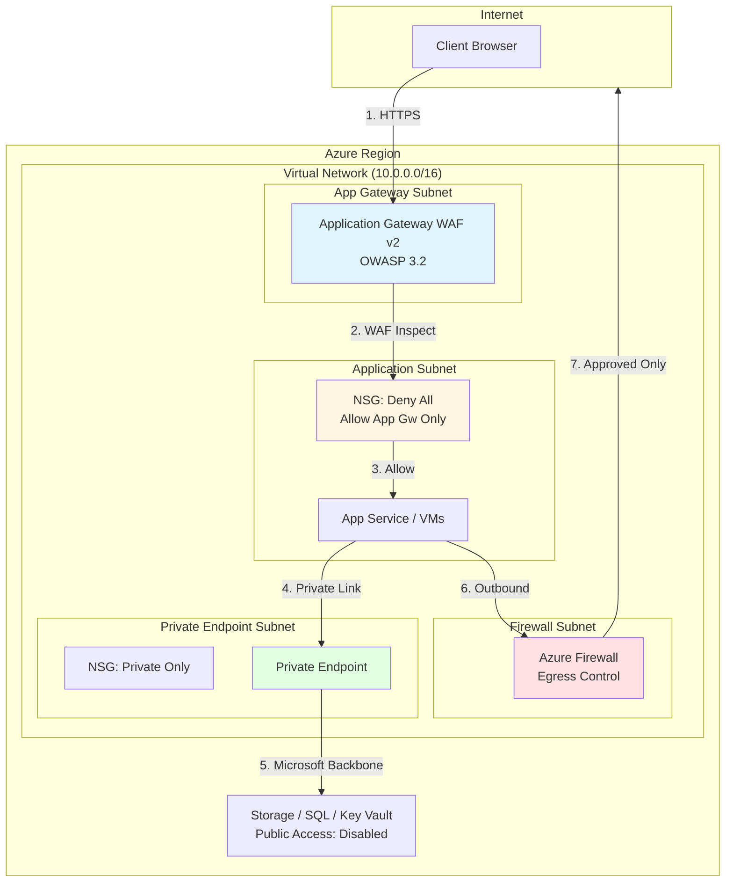

# Zero Trust Network Access

Eliminate implicit trust with defense-in-depth network security. This pattern implements Azure zero trust principles using Application Gateway WAF, Azure Firewall, Network Security Groups, and Private Link to verify every access request, inspect all traffic, and enforce micro-segmentation.

**Pattern Type**: Security & Compliance  
**Complexity**: Advanced  
**Deployment Time**: 15-20 minutes  
**Estimated Cost**: $35-60/day ($1,050-1,800/month)

## 🎯 What This Pattern Solves

**Problem**: Traditional perimeter-based security assumes everything inside the network is trustworthy. Once attackers breach the perimeter, they move laterally across your environment unchecked.

**Solution**: Zero trust network architecture that:
- Verifies and inspects every network request (no implicit trust)
- Blocks web application attacks at the edge (OWASP Top 10)
- Prevents lateral movement through micro-segmentation
- Eliminates public internet exposure for PaaS services
- Provides complete audit trail for compliance

**Who This Is For**: Organizations with compliance requirements (SOC 2, PCI-DSS, HIPAA, FedRAMP), enterprises migrating from VPN-based architectures, security-conscious teams deploying regulated workloads to Azure.

## 🏗️ Architecture



**Traffic Flow**:
1. Client requests hit Application Gateway WAF (edge security)
2. WAF inspects for SQL injection, XSS, command injection (OWASP Top 10)
3. NSG allows only Application Gateway subnet as source (deny all else)
4. Application accesses PaaS services via Private Endpoint (no internet traversal)
5. Outbound traffic routes through Azure Firewall for egress inspection
6. All traffic logged to Log Analytics (compliance audit trail)

## 📋 Prerequisites

- **Azure Subscription**: Owner or Contributor role on target resource group
- **Azure CLI**: Version 2.40+ (`az --version` to check)
- **Networking Knowledge**: Understanding of subnets, NSGs, and routing
- **Budget Approval**: $35-60/day for production deployment
- **Quota Check**: Verify Application Gateway quota (minimum 2 instances for WAF_v2)

**Check Your Quota**:
```bash
az vm list-usage --location eastus --query "[?localName=='Standard WAFv2 Load Balancer']" -o table
```

## 🚀 Quick Start

### Deploy to Azure (Portal)

[](https://portal.azure.com/#create/Microsoft.Template/uri/https%3A%2F%2Fraw.githubusercontent.com%2Fyour-org%2FAzure-Infra-Demos%2Fmain%2Fpatterns%2Fzero-trust-network%2Fmain.bicep)

Click the button above, fill in parameters, and deploy (15-20 minutes).

### Deploy via Azure CLI

```bash
# Step 1: Set variables
RESOURCE_GROUP="rg-zero-trust-prod"
LOCATION="eastus"
PREFIX="prod"  # Prefix for resource names
DEPLOY_FIREWALL="true"  # Set to "false" for dev/test to save $30/day

# Step 2: Create resource group
az group create \
  --name $RESOURCE_GROUP \
  --location $LOCATION

# Step 3: Deploy infrastructure (15-20 minutes)
az deployment group create \
  --resource-group $RESOURCE_GROUP \
  --template-file main.bicep \
  --parameters prefix=$PREFIX \
               location=$LOCATION \
               deployFirewall=$DEPLOY_FIREWALL

# Step 4: Get outputs
az deployment group show \
  --resource-group $RESOURCE_GROUP \
  --name main \
  --query properties.outputs
```

**Deployment creates**:
- Virtual Network with 4 subnets (Application Gateway, Firewall, App, Private Endpoints)
- Application Gateway WAF v2 with OWASP 3.2 rules
- Azure Firewall (if `deployFirewall=true`)
- Network Security Groups on all subnets
- Private DNS Zones for Private Link integration
- Log Analytics Workspace for centralized logging

## ⚙️ Configuration Parameters

| Parameter | Type | Default | Description | When to Change |
|-----------|------|---------|-------------|----------------|
| `prefix` | string | `demo` | Prefix for all resource names | Use environment identifier (e.g., `prod`, `dev`) |
| `location` | string | `eastus` | Azure region for deployment | Choose region closest to users |
| `vnetAddressPrefix` | string | `10.0.0.0/16` | Virtual Network CIDR | Change if conflicts with existing networks |
| `appGwSubnetPrefix` | string | `10.0.1.0/24` | Application Gateway subnet | Requires /24 or larger for WAF_v2 |
| `firewallSubnetPrefix` | string | `10.0.2.0/24` | Azure Firewall subnet | Must be named `AzureFirewallSubnet` |
| `applicationSubnetPrefix` | string | `10.0.4.0/24` | Application workload subnet | Size based on VM/container count |
| `privateEndpointSubnetPrefix` | string | `10.0.3.0/24` | Private Endpoint subnet | /27 supports ~30 endpoints |
| `deployFirewall` | bool | `false` | Deploy Azure Firewall | Set `true` for egress control (+$30/day) |
| `enableZoneRedundancy` | bool | `true` | Deploy across availability zones | Set `false` in regions without zones |
| `tags` | object | `{}` | Resource tags | Add cost center, environment, owner |

**Example: Dev Environment (Minimal Cost)**:
```bash
az deployment group create \
  --resource-group rg-zero-trust-dev \
  --template-file main.bicep \
  --parameters prefix=dev \
               deployFirewall=false \
               enableZoneRedundancy=false
# Cost: ~$11/day (Application Gateway only)
```

**Example: Production Environment (Full Security)**:
```bash
az deployment group create \
  --resource-group rg-zero-trust-prod \
  --template-file main.bicep \
  --parameters prefix=prod \
               deployFirewall=true \
               enableZoneRedundancy=true \
               tags='{"Environment":"Production","CostCenter":"Security"}'
# Cost: ~$41/day (Application Gateway + Firewall)
```

## 💰 Cost Breakdown

| Component | Daily Cost | Monthly Cost | Can Disable? |
|-----------|------------|--------------|--------------|
| **Application Gateway WAF_v2** (2 units) | $11.00 | $330 | ❌ Required |
| **Public IP (Standard)** | $0.13 | $4 | ❌ Required |
| **Private Endpoints** (3 services) | $0.72 | $22 | ⚠️ Per service |
| **Private DNS Zones** (3 zones) | $0.05 | $1.50 | ❌ Required |
| **Azure Firewall (Standard)** | $29.50 | $885 | ✅ Dev/test |
| **Firewall Public IP** | $0.13 | $4 | ✅ With firewall |
| **NSGs & VNet** | $0.00 | Free | - |
| **TOTAL (no Firewall)** | **$11.90** | **$357** | - |
| **TOTAL (with Firewall)** | **$41.53** | **$1,246** | - |

**Cost Optimization Strategies**:

1. **Disable Firewall in Non-Prod**: Save $30/day by setting `deployFirewall=false` in dev/test
2. **Use Autoscaling**: Application Gateway scales 2-10 units based on load (save 50% during off-hours)
3. **Share Application Gateway**: Route multiple applications through one gateway (amortize cost)
4. **Consolidate Private Endpoints**: One endpoint per storage account (not per container)
5. **Reserved Capacity**: 1-year reservation saves 33% on Application Gateway

**ROI Analysis**:
- Zero trust annual cost: ~$15,000 (full deployment)
- Average data breach cost: $4.45M (IBM 2023)
- Risk reduction: 4% lower breach probability = $178K expected savings
- **Net benefit: $163K/year**

## 🔐 Security Features

This pattern implements Microsoft's [Zero Trust security model](https://learn.microsoft.com/security/zero-trust/):

**Verify Explicitly** ✅
- Application Gateway WAF inspects every HTTP request
- NSGs verify source IP on every packet
- Private Link validates network path cryptographically

**Least Privilege Access** ✅
- NSGs deny all traffic by default (explicit allow only)
- Firewall allows only approved destinations (FQDN/IP allow list)
- Private Endpoints disable public PaaS access

**Assume Breach** ✅
- Micro-segmentation limits lateral movement to single subnet
- Egress filtering prevents data exfiltration
- Centralized logging detects anomalies

**Compliance Mappings**:
- **SOC 2 Type II**: CC6.6 (logical access controls)
- **PCI-DSS v4**: Requirement 1 (firewall configuration)
- **HIPAA**: 164.312(e)(1) (transmission security)
- **FedRAMP**: AC-4 (information flow enforcement)
- **ISO 27001**: A.13.1.1 (network controls)

## 📊 Monitoring & Operations

**Key Metrics to Track**:

| Metric | Source | Healthy Range | Alert Threshold |
|--------|--------|---------------|-----------------|
| WAF Block Rate | Application Gateway | 1-5% of requests | >10% (possible attack) |
| Backend Health | Application Gateway | 100% healthy | <100% (service degradation) |
| NSG Deny Events | NSG Flow Logs | <100/hour | >500/hour (scan/attack) |
| Firewall Threat Intel Matches | Firewall Logs | 0 | >0 (compromised resource) |
| Private Endpoint Failures | Diagnostic Logs | 0 | >10/hour (connectivity issue) |

**Log Analytics Queries**:

**Top WAF Blocked Requests**:
```kusto
AzureDiagnostics
| where ResourceType == "APPLICATIONGATEWAYS" and action_s == "Blocked"
| summarize Count=count() by clientIp_s, ruleId_s
| top 20 by Count desc
```

**NSG Denied Traffic**:
```kusto
AzureNetworkAnalytics_CL
| where FlowStatus_s == "D"  // Denied
| summarize Count=count() by SrcIP_s, DestIP_s, DestPort_d
| order by Count desc
```

**Firewall Top Blocked Destinations**:
```kusto
AzureDiagnostics
| where ResourceType == "AZUREFIREWALLS" and msg_s contains "Deny"
| summarize Count=count() by DestinationIp, DestinationPort
| top 20 by Count desc
```

**Set Up Alerts**:
```bash
# Alert on high WAF block rate
az monitor metrics alert create \
  --name "High-WAF-Block-Rate" \
  --resource-group $RESOURCE_GROUP \
  --scopes $(az network application-gateway show -g $RESOURCE_GROUP -n ${PREFIX}-appgw --query id -o tsv) \
  --condition "avg Percentage CPU > 80" \
  --window-size 5m \
  --evaluation-frequency 1m
```

## 🧪 Post-Deployment Validation

**Test 1: Verify WAF Blocks Attacks**
```bash
# Get Application Gateway IP
APP_GW_IP=$(az network public-ip show \
  --resource-group $RESOURCE_GROUP \
  --name ${PREFIX}-appgw-pip \
  --query ipAddress -o tsv)

# Test legitimate request (should succeed)
curl -v "http://$APP_GW_IP/"

# Test SQL injection (should be blocked with 403)
curl -v "http://$APP_GW_IP/?id=1' OR '1'='1"

# Test XSS (should be blocked with 403)
curl -v "http://$APP_GW_IP/?search=<script>alert('XSS')</script>"
```

**Test 2: Verify NSG Blocks Lateral Movement**
```bash
# Attempt to connect from application subnet to private endpoint subnet
# (Should timeout due to NSG deny rule)
# This requires SSH access to a VM in application subnet
```

**Test 3: Verify Private Endpoint DNS Resolution**
```bash
# From within VNet, check Private Endpoint resolves to private IP
nslookup mystorageaccount.blob.core.windows.net
# Should return 10.0.3.x (private IP), not public IP
```

**Test 4: Review Logs**
```bash
# Query WAF logs in Log Analytics
az monitor log-analytics query \
  --workspace $(az monitor log-analytics workspace show -g $RESOURCE_GROUP -n ${PREFIX}-logs --query customerId -o tsv) \
  --analytics-query "AzureDiagnostics | where ResourceType == 'APPLICATIONGATEWAYS' | take 10" \
  --timespan PT1H
```

## 🔧 Common Configuration Tasks

### Add Application to Backend Pool

```bash
# Add App Service to Application Gateway backend
APP_SERVICE_FQDN="myapp.azurewebsites.net"

az network application-gateway address-pool update \
  --resource-group $RESOURCE_GROUP \
  --gateway-name ${PREFIX}-appgw \
  --name appServiceBackendPool \
  --servers $APP_SERVICE_FQDN
```

### Create Private Endpoint for SQL Database

```bash
# Create SQL Server Private Endpoint
SQL_SERVER_NAME="myserver"

az network private-endpoint create \
  --resource-group $RESOURCE_GROUP \
  --name ${SQL_SERVER_NAME}-pe \
  --vnet-name ${PREFIX}-vnet \
  --subnet privateEndpointSubnet \
  --private-connection-resource-id $(az sql server show -g $RESOURCE_GROUP -n $SQL_SERVER_NAME --query id -o tsv) \
  --group-id sqlServer \
  --connection-name ${SQL_SERVER_NAME}-connection
```

### Add Custom WAF Rule

```bash
# Block requests with specific user agent
az network application-gateway waf-policy custom-rule create \
  --policy-name ${PREFIX}-waf-policy \
  --resource-group $RESOURCE_GROUP \
  --name BlockBadUserAgent \
  --priority 100 \
  --rule-type MatchRule \
  --action Block \
  --match-conditions RequestHeaders UserAgent Contains "BadBot"
```

### Enable NSG Flow Logs

```bash
# Enable NSG Flow Logs for traffic analysis
STORAGE_ACCOUNT="${PREFIX}nsgflowlogs"

az network watcher flow-log create \
  --resource-group $RESOURCE_GROUP \
  --nsg ${PREFIX}-app-nsg \
  --storage-account $STORAGE_ACCOUNT \
  --name ${PREFIX}-app-nsg-flow-log \
  --enabled true \
  --retention 30
```

## 🗑️ Cleanup

**Remove all resources**:
```bash
# Delete resource group (removes all resources in ~10 minutes)
az group delete \
  --name $RESOURCE_GROUP \
  --yes \
  --no-wait

# Verify deletion
az group exists --name $RESOURCE_GROUP
# Returns: false (when complete)
```

**Billing stops immediately** upon resource deletion. Prorated charges apply for partial month.

**Before deleting**:
1. Export NSG, Firewall, WAF configurations for future reference
2. Archive logs if compliance requires retention >30 days
3. Document lessons learned for next deployment

## 📚 Additional Resources

**Microsoft Documentation**:
- [Zero Trust Security Overview](https://learn.microsoft.com/security/zero-trust/)
- [Zero Trust Network Architecture](https://learn.microsoft.com/azure/architecture/guide/security/zero-trust-landing-zone)
- [Application Gateway WAF](https://learn.microsoft.com/azure/web-application-firewall/ag/ag-overview)
- [Azure Firewall Documentation](https://learn.microsoft.com/azure/firewall/)
- [Private Link Overview](https://learn.microsoft.com/azure/private-link/)

**Training & Certification**:
- [Microsoft Learn: Implement Network Security](https://learn.microsoft.com/training/paths/implement-network-security/)
- [AZ-500: Azure Security Technologies](https://learn.microsoft.com/certifications/exams/az-500)

**Related Patterns**:
- Hub-Spoke Network Topology (enterprise network segmentation)
- Web App with Private Endpoint (PaaS-focused zero trust)
- Landing Zone Foundation (organization-wide governance)

## 🆘 Support & Troubleshooting

**Common Issues**:

| Issue | Cause | Solution |
|-------|-------|----------|
| Deployment fails: "WAF_v2 not available" | Region doesn't support WAF_v2 SKU | Choose different region (eastus, westus2, northeurope) |
| Application Gateway subnet too small | Requires /24 or larger for WAF_v2 | Update `appGwSubnetPrefix` to /24 |
| Private Endpoint connection fails | NSG blocking traffic | Verify NSG allows source subnet to PE subnet |
| Backend shows unhealthy | WAF blocking health probes | Add custom health probe or allow probe IP in backend |

**Get Help**:
- Review `talk-track.md` for detailed explanations of each component
- Open an issue in this repository
- Contact Microsoft support (Premier/Unified customers)
- Engage Microsoft FastTrack (free for eligible deployments)

**Useful Commands**:
```bash
# Check Application Gateway backend health
az network application-gateway show-backend-health \
  --resource-group $RESOURCE_GROUP \
  --name ${PREFIX}-appgw

# View NSG effective rules on a network interface
az network nic show-effective-nsg \
  --resource-group $RESOURCE_GROUP \
  --name myVM-nic

# Test connectivity from VM to Private Endpoint
az network watcher test-connectivity \
  --resource-group $RESOURCE_GROUP \
  --source-resource myVM \
  --dest-address 10.0.3.10 \
  --dest-port 443
```

---

**⭐ Star this repository** if this pattern helped secure your Azure workloads!

**Questions?** Open an issue or reach out to the repository maintainers.
